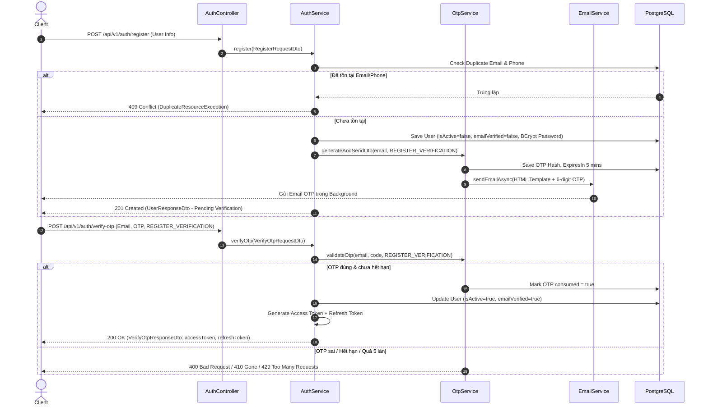
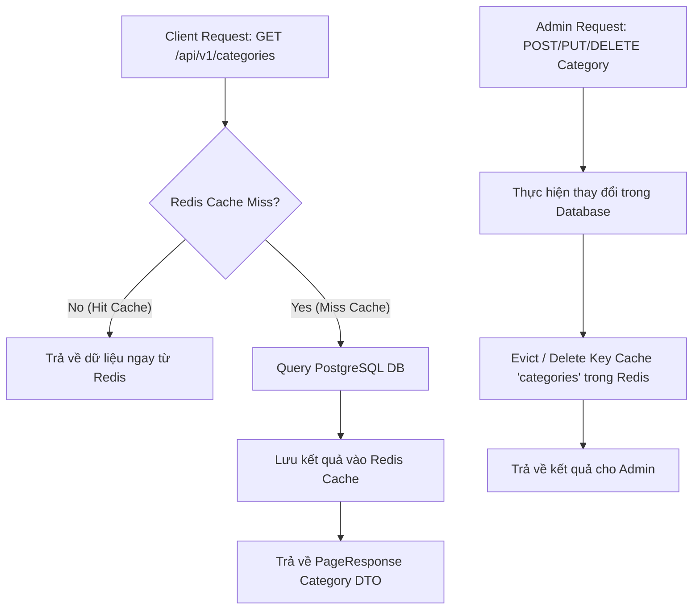
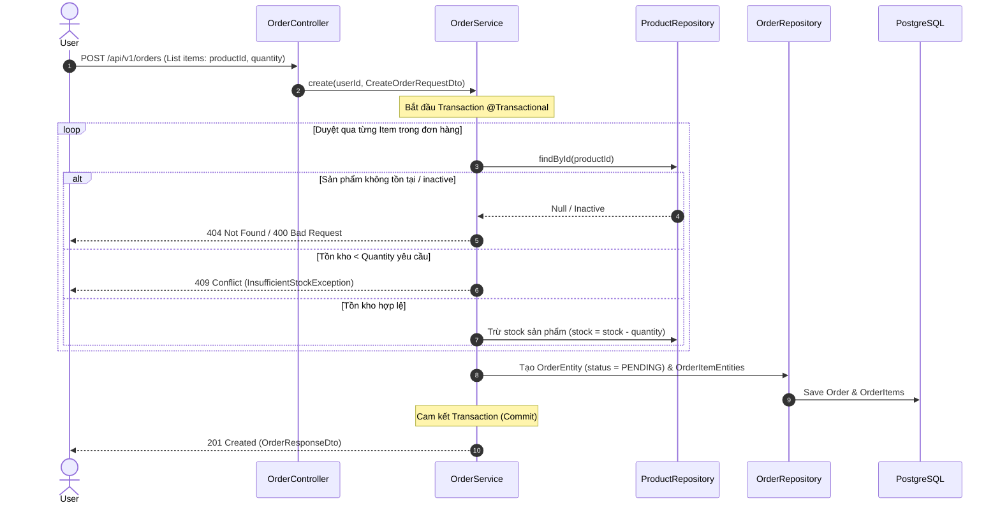
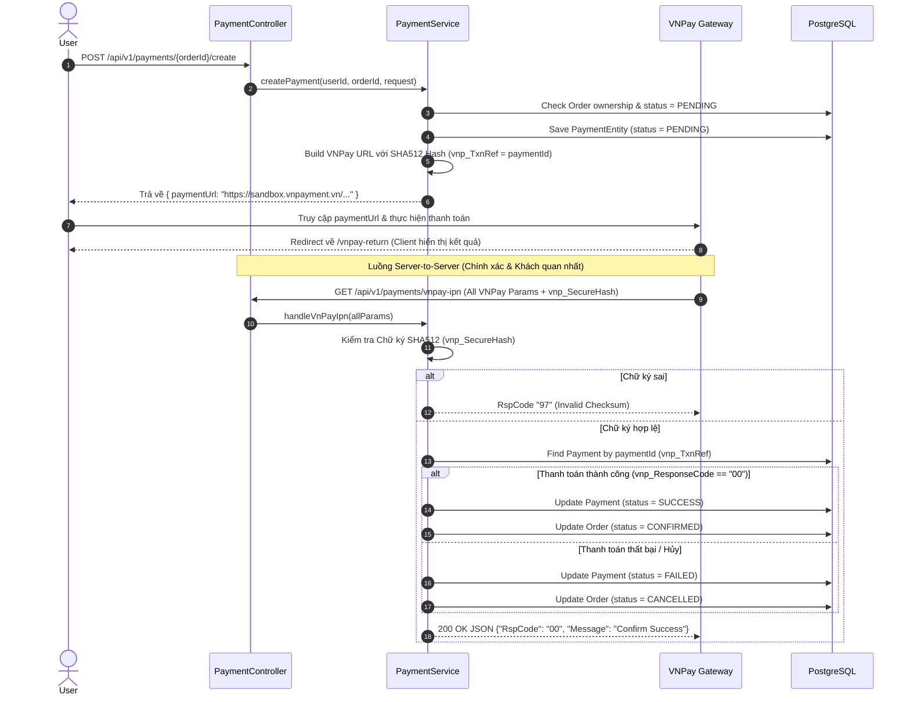

# 📘 TÀI LIỆU HƯỚNG DẪN SỬ DỤNG VÀ QUY TRÌNH HOẠT ĐỘNG CÁC API ENDPOINTS
## 🛒 DỰ ÁN MINI E-COMMERCE (BÁN HẢI SẢN TƯƠI SỐNG & CHẾ BIẾN)

> **Mục đích tài liệu:** Cung cấp hướng dẫn toàn diện, cực kỳ chi tiết về **chuẩn API Response, quy trình hoạt động (Execution Flow) của từng Module**, và **chi tiết từng API Endpoint** trong dự án Mini E-commerce. Tài liệu phục vụ trực tiếp cho Developers (Frontend, Backend, Mobile, Full-stack) và AI Agents trong quá trình tích hợp và phát triển hệ thống.
>
> **Cập nhật lần cuối:** 2026-07-28  
> **Local Base URL:** `http://localhost:8085/api/v1`  
> **Production Base URL (Render):** `https://java-mini-project-ecommerce.onrender.com/api/v1`  
> **Swagger UI (Production):** [https://java-mini-project-ecommerce.onrender.com/swagger-ui/index.html#/](https://java-mini-project-ecommerce.onrender.com/swagger-ui/index.html#/)  
> **Kiến trúc API:** RESTful Stateless, JSON Payload, JWT Bearer Token.

---

## 📋 MỤC LỤC
1. [Quy chuẩn Chung của API (Global API Conventions)](#1-quy-chuẩn-chung-của-api-global-api-conventions)
   - 1.1. Cấu trúc Response Chuẩn (`ApiResponse<T>`)
   - 1.2. Cấu trúc Phân trang Chuẩn (`PageResponse<T>`)
   - 1.3. Cơ chế Xác thực Security Filter & JWT Bearer Token
   - 1.4. Bảng mã Lỗi HTTP & Exception Handling
2. [Sơ đồ & Quy trình Hoạt động từng Module (Module Execution Flows)](#2-sơ-đồ--quy-trình-hoạt-động-từng-module-module-execution-flows)
   - 2.1. Module Auth & Verification (OTP Email, Authentication & Password Management)
   - 2.2. Module User (Quản lý Hồ sơ & Phân quyền Người dùng)
   - 2.3. Module Category (Quản lý Danh mục Hải Sản & Caching)
   - 2.4. Module Product (Quản lý Sản phẩm, Tồn kho & Thống kê Revenue)
   - 2.5. Module Order (Xử lý Đơn hàng & Transactional Stock Check)
   - 2.6. Module Payment (Tích hợp Thanh toán VNPay Webhook IPN)
   - 2.7. Module System & Utility (Health Check & Storage Test)
3. [Chi tiết Chi tiết Các API Endpoints (38+ Endpoints)](#3-chi-tiết-các-api-endpoints)
   - 3.1. Auth Module (`/api/v1/auth/**`)
   - 3.2. User Module (`/api/v1/users/**`)
   - 3.3. Category Module (`/api/v1/categories/**`)
   - 3.4. Product Module (`/api/v1/products/**`)
   - 3.5. Order Module (`/api/v1/orders/**`)
   - 3.6. Payment Module (`/api/v1/payments/**`)
   - 3.7. System & Utility Module (`/api/v1/health`, `/api/v1/test/**`)
4. [Hướng dẫn Tích hợp & Best Practices dành cho Frontend](#4-hướng-dẫn-tích-hợp--best-practices-dành-cho-frontend)

---

## 1. Quy chuẩn Chung của API (Global API Conventions)

### 1.1. Cấu trúc Response Chuẩn (`ApiResponse<T>`)
Mọi API trong hệ thống (trừ các webhook trả về dạng đặc thù của bên thứ 3 như VNPay IPN) đều bọc kết quả trả về trong đối tượng `ApiResponse<T>` với định dạng JSON:

```json
{
  "success": true,
  "message": "Thành công!",
  "data": { ... },
  "timestamp": "2026-07-28T10:15:30.123456"
}
```

* **`success`** (`boolean`): `true` nếu xử lý thành công (HTTP Status 2xx), `false` nếu phát sinh lỗi (HTTP Status 4xx/5xx).
* **`message`** (`string`): Thông báo ngắn gọn giải thích kết quả hoặc lý do lỗi.
* **`data`** (`T`): Dữ liệu trả về (Object, Array, PageResponse...). Khi `success = false`, trường `data` thường là `null` hoặc chứa danh sách các lỗi validation (`Map<String, String>`).
* **`timestamp`** (`string` ISO-8601): Thời điểm máy chủ xử lý xong request.

### 1.2. Cấu trúc Phân trang Chuẩn (`PageResponse<T>`)
Đối với các API trả về danh sách có phân trang (như danh sách sản phẩm, danh mục, người dùng), trường `data` sẽ chứa đối tượng `PageResponse<T>`:

```json
{
  "success": true,
  "message": "Get product successfully",
  "data": {
    "content": [ ... ],
    "page": 0,
    "size": 10,
    "totalElements": 25,
    "totalPages": 3,
    "last": false
  },
  "timestamp": "2026-07-28T10:15:30.123456"
}
```
* `content` (`List<T>`): Danh sách các item thuộc trang hiện tại.
* `page` (`int`): Chỉ số trang hiện tại (bắt đầu từ `0`).
* `size` (`int`): Số lượng item trên một trang.
* `totalElements` (`long`): Tổng số bản ghi khớp với điều kiện tìm kiếm.
* `totalPages` (`int`): Tổng số trang.
* `last` (`boolean`): Trả về `true` nếu đây là trang cuối cùng.

Các Request Query Parameter chuẩn dùng cho phân trang:
* `page`: Chỉ số trang cần lấy (Default: `0`).
* `size`: Số bản ghi trên 1 trang (Default: `10` hoặc theo cấu hình Spring).
* `sort`: Cú pháp `property,asc|desc` (Ví dụ: `sort=price,desc`).

---

### 1.3. Cơ chế Xác thực Security Filter & JWT Bearer Token

Hệ thống áp dụng kiến trúc **Stateless Security** với Spring Security & JWT:
1. Client đính kèm Access Token vào Header của HTTP Request:
   ```http
   Authorization: Bearer <accessToken>
   ```
2. Mỗi Request khi gửi tới Server sẽ đi qua chuỗi Filter:
   `Client Request` ➔ `JwtAuthenticationFilter` ➔ `DispatcherServlet` ➔ `Controller`
3. Tại `JwtAuthenticationFilter`:
   * Đọc Header `Authorization`. Nếu hợp lệ và không hết hạn, giải mã JWT để trích xuất `userId`, `email`, và `role`.
   * Tạo đối tượng `UserPrincipal` nạp vào `SecurityContextHolder`.
   * Các endpoint hoặc method có annotation `@PreAuthorize("hasRole('ADMIN')")` sẽ tự động kiểm tra role từ `UserPrincipal`.

---

### 1.4. Bảng mã Lỗi HTTP & Exception Handling

Hệ thống xử lý ngoại lệ tập trung thông qua `@RestControllerAdvice` trong `GlobalExceptionHandler`:

| HTTP Code | Enum Response Status | Custom Exception Class | Nguyên nhân & Nguyện cảnh xảy ra |
|---|---|---|---|
| **400** | `BAD_REQUEST` | `BadRequestException`<br>`OtpInvalidException`<br>`InvalidActionTokenException` | Dữ liệu đầu vào sai định dạng, mã OTP sai, token hành động đổi mật khẩu không hợp lệ. |
| **400** | `BAD_REQUEST` | `MethodArgumentNotValidException` | Vi phạm ràng buộc `@Valid` (`@NotBlank`, `@Email`, `@Size`...). Response `data` trả về chi tiết Map chứa lỗi từng trường. |
| **401** | `UNAUTHORIZED` | `BadCredentialsException`<br>`InvalidRefreshTokenException` | Email/Mật khẩu đăng nhập không đúng, hoặc Refresh Token đã hết hạn / bị thu hồi / không khớp hash. |
| **403** | `FORBIDDEN` | `AccountNotVerifiedException`<br>`DisabledException`<br>`AccessDeniedException` | Tài khoản chưa xác thực OTP Email, tài khoản bị khóa (`isActive = false`), hoặc User truy cập API chỉ dành cho Admin. |
| **404** | `NOT_FOUND` | `ResourceNotFoundException`<br>`OtpNotFoundException` | Không tìm thấy Product, Category, User, Order hoặc mã OTP tương ứng trong Database. |
| **409** | `CONFLICT` | `DuplicateResourceException`<br>`InsufficientStockException`<br>`InvalidStatusTransitionException`<br>`CategoryHasProductsException`<br>`ObjectOptimisticLockingFailureException` | Trùng lặp Email/Số điện thoại; Tồn kho sản phẩm không đủ; Chuyển trạng thái đơn hàng không hợp lệ; Xóa danh mục đang chứa sản phẩm; Tranh chấp dữ liệu (Optimistic Lock). |
| **410** | `GONE` | `OtpExpiredException` | Mã OTP đã quá thời gian hiệu lực (quá 5 phút). |
| **429** | `TOO_MANY_REQUESTS` | `OtpAttemptsExceededException`<br>`ResendCooldownException` | Nhập sai OTP quá 5 lần (bị khóa mã OTP); Hoặc yêu cầu gửi lại OTP quá nhanh (chưa hết thời gian cooldown 60 giây). |
| **500** | `INTERNAL_SERVER_ERROR` | `Exception` | Lỗi máy chủ không xác định (Database connection timeout, MinIO connection error, v.v.). |

---

## 2. Sơ đồ & Quy trình Hoạt động từng Module (Module Execution Flows)

### 2.1. Module Auth & Verification (OTP Email, Authentication & Password Management)

Module Auth quản lý toàn bộ vòng đời tài khoản người dùng, mã hóa BCrypt, phát hành chuỗi mã OTP 6 chữ số, gửi mail qua SMTP HTML Template, cấp phát JWT Tokens và Action Token.

#### A. Flow Đăng ký & Kích thực Tài Khoản (Registration & OTP Account Verification)



#### B. Flow Đăng nhập & Cấp lại Token (Login & Token Refresh)

1. **Đăng nhập (`/api/v1/auth/login`):**
   - Client gửi `email` và `password`.
   - Spring Security `AuthenticationManager` gọi `CustomUserDetailsService` để nạp `UserEntity`.
   - So sánh password bằng `PasswordEncoder.matches()`. Nếu sai ➔ Quăng `BadCredentialsException` (401).
   - Kiểm tra `emailVerified`: Nếu `false` ➔ Quăng `AccountNotVerifiedException` (403).
   - Kiểm tra `isActive`: Nếu `false` ➔ Quăng `DisabledException` (403).
   - Sinh JWT Access Token (hạn 15 phút) và Refresh Token (hạn 7 ngày). Lưu Hash của Refresh Token vào Database (`users.refresh_token_hash`).
   - Trả về `AuthResponseDto`.

2. **Cấp lại Token (`/api/v1/auth/refresh-token`):**
   - Client gửi `refreshToken`.
   - Backend giải mã JWT Refresh Token, trích xuất `userId`.
   - Tra cứu User trong Database, băm Refresh Token gửi lên và so sánh với `refresh_token_hash`.
   - Nếu hợp lệ: Cấp Access Token mới và quay vòng (Rotate) Refresh Token mới, cập nhật lại DB.

3. **Quên Mật Khẩu (`/forgot-password` ➔ `/verify-otp` ➔ `/password`):**
   - Client gọi `/forgot-password` ➔ Hệ thống sinh OTP `RESET_PASSWORD` gửi về Email.
   - Client gọi `/verify-otp` với purpose `RESET_PASSWORD` ➔ Nhận về một `actionToken` ngẫu nhiên (UUID) có thời hạn ngắn (10 phút).
   - Client dùng `actionToken` này để gọi API đổi mật khẩu an toàn mà không cần nhập lại mật khẩu cũ.

---

### 2.2. Module User (Quản lý Hồ sơ & Phân quyền Người dùng)

Module User xử lý các tác vụ liên quan đến tài khoản cá nhân của người dùng đã xác thực và chức năng quản trị viên (Admin Management).

* **Lấy thông tin cá nhân (`GET /users/me`):** Lấy `userId` trực tiếp từ JWT `UserPrincipal`, query DB và trả về `UserResponseDto` (bao gồm avatarUrl từ MinIO).
* **Cập nhật Profile (`PATCH /users/me/update`):** Cập nhật `fullName`, `phoneNumber`.
* **Đổi Mật khẩu (`PATCH /users/password`):** Yêu cầu `oldPassword` và `newPassword`. Kiểm tra băm BCrypt mật khẩu cũ trước khi cập nhật mật khẩu mới.
* **Upload Avatar (`POST /users/me/avatar`):** Nhận file hình ảnh (`MultipartFile`), gửi sang `StorageService` để lưu trữ lên MinIO Bucket. Trả về Pre-signed URL hoặc Public URL của ảnh đại diện.
* **Admin Quản lý Users (`GET /users`, `PATCH /users/{userId}/status`):** Cho phép Admin xem danh sách người dùng phân trang và bật/tắt trạng thái hoạt động (`isActive`) của tài khoản.

---

### 2.3. Module Category (Quản lý Danh mục Hải Sản & Caching)

Module Category quản lý cấu trúc phân loại sản phẩm hải sản (Tôm, Cua, Cá, Mực, Set tiệc...).



* **Xoá Danh Mục An Toàn (`DELETE /categories/{id}`):** Kiểm tra xem danh mục có đang chứa sản phẩm hay không. Nếu có sản phẩm ➔ Quăng `CategoryHasProductsException` (409 Conflict) để tránh vi phạm khóa ngoại.

---

### 2.4. Module Product (Quản lý Sản phẩm, Tồn kho & Thống kê Revenue)

Module Product quản lý chi tiết mặt hàng hải sản, giá cả, số lượng tồn kho (Stock), hình ảnh sản phẩm và các báo cáo doanh thu.

* **Optimistic Locking (Khóa Lạc Quan):** Entity `ProductEntity` sử dụng annotation `@Version private Long version;`. Khi Admin gọi API tăng/giảm tồn kho (`/products/increase/{id}`, `/products/decrease/{id}`), JPA sẽ tự động kiểm tra `version`. Nếu có 2 request đồng thời sửa cùng một sản phẩm, request thứ 2 sẽ bị chặn với `ObjectOptimisticLockingFailureException` (409 Conflict), đảm bảo tồn kho không bị đè dữ liệu sai lệch.
* **Upload Ảnh Sản phẩm (`POST /products/{id}/image`):** Upload ảnh sản phẩm hải sản lên MinIO Storage dưới thư mục `/products`.
* **Soft Delete (`DELETE /products/{id}`):** Không xóa cứng bản ghi trong DB mà cập nhật `active = false` để giữ toàn vẹn dữ liệu cho các đơn hàng cũ.
* **Báo cáo & Thống kê Admin:**
  - `GET /products/top-buy`: Thống kê Top sản phẩm bán chạy nhất dựa trên tổng số lượng trong `order_items`.
  - `GET /products/revenue-by-category`: Thống kê tổng doanh thu theo từng danh mục hải sản.
  - `GET /products/revenue-in-month`: Thống kê doanh thu theo từng tháng trong năm.

---

### 2.5. Module Order (Xử lý Đơn hàng & Transactional Stock Check)

Module Order là trái tim của hệ thống E-commerce, đảm bảo tính toàn vẹn giao dịch (ACID) khi khách hàng đặt mua hải sản.



* **Chuyển Trạng Thái Đơn Hàng (`PATCH /orders/{id}/status`):**
  Quy định luồng chuyển trạng thái hợp lệ:  
  `PENDING` ➔ `CONFIRMED` ➔ `SHIPPING` ➔ `DELIVERED`  
  `PENDING` / `CONFIRMED` ➔ `CANCELLED`  
  Nếu chuyển trạng thái trái quy tắc (ví dụ: `DELIVERED` ➔ `PENDING`), hệ thống sẽ ném `InvalidStatusTransitionException` (409 Conflict).

---

### 2.6. Module Payment (Tích hợp Thanh toán VNPay Webhook IPN)

Module Payment cho phép thanh toán trực tuyến qua cổng VNPay (Sandbox / Production).

#### 💳 Thông tin Thẻ Test VNPay Sandbox
Dành cho Developers / Testers thực hiện giao dịch thử nghiệm trên môi trường Sandbox:

| Trường thông tin | Giá trị Test Sandbox | Ghi chú |
|---|---|---|
| **Ngân hàng** | **NCB** | Ngân hàng Quốc Dân |
| **Số thẻ (Card Number)** | `9704198526191432198` | Thẻ test mặc định VNPay Sandbox |
| **Tên chủ thẻ (Card Holder)** | `NGUYEN VAN A` | Viết hoa không dấu |
| **Ngày phát hành (Release Date)** | `07/15` | Tháng 07 năm 2015 |
| **Mật khẩu OTP** | `123456` | Nhập ở màn hình xác thực OTP VNPay |



---

### 2.7. Module System & Utility (Health Check & Storage Test)

* **Health Check (`GET /api/v1/health`):** Endpoint public trả về chuỗi văn bản `"pong"` dùng cho Docker / Render Health Check Probe để biết ứng dụng đã sẵn sàng nhận request.
* **Test Storage Upload (`POST /api/v1/test/upload`):** Endpoint dành riêng cho Admin để kiểm tra kết nối và tính năng upload file lên MinIO Object Storage.

---

## 3. Chi tiết Các API Endpoints

### 3.1. Auth Module (`/api/v1/auth/**`)

---

#### 1. `POST /api/v1/auth/register` — Đăng ký Tài khoản Mới
* **Quyền truy cập:** Public
* **Tác dụng:** Đăng ký tài khoản người dùng mới. Tài khoản tạo ra sẽ ở trạng thái chờ kích hoạt (`isActive = false`, `emailVerified = false`). Hệ thống tự động sinh và gửi mã OTP 6 chữ số qua Email.
* **Luồng xử lý:** Check trùng email/sđt ➔ Hash mật khẩu BCrypt ➔ Lưu User vào DB ➔ Sinh OTP 5 phút ➔ Gửi Email Async ➔ Trả về User DTO.
* **Request Body:**
  ```json
  {
    "fullName": "Nguyễn Văn Hải",
    "email": "nguyenvanhai@example.com",
    "phoneNumber": "0987654321",
    "password": "Password123@"
  }
  ```
  * `fullName` (`String`, `@NotBlank`): Họ và tên đầy đủ của người dùng.
  * `email` (`String`, `@NotBlank`, `@Email`, `@Size(min=5, max=255)`): Địa chỉ email dùng làm tài khoản đăng nhập.
  * `phoneNumber` (`String`, `@NotBlank`, `@Pattern("^[0-9]{10,11}$")`): Số điện thoại liên hệ (10-11 chữ số).
  * `password` (`String`, `@NotBlank`, `@Size(min=8, max=100)`): Mật khẩu đăng nhập.
* **Response Thành công (201 Created):**
  ```json
  {
    "success": true,
    "message": "Create User Successfully!",
    "data": {
      "userId": 12,
      "fullName": "Nguyễn Văn Hải",
      "avatarUrl": null,
      "email": "nguyenvanhai@example.com",
      "phoneNumber": "0987654321",
      "role": "USER",
      "isActive": false,
      "createdAt": "2026-07-28T10:30:00"
    },
    "timestamp": "2026-07-28T10:30:00"
  }
  ```
* **Lỗi có thể gặp:**
  * `409 Conflict`: Email hoặc Số điện thoại đã được đăng ký (`DuplicateResourceException`).
  * `400 Bad Request`: Sai định dạng Validation (`MethodArgumentNotValidException`).

---

#### 2. `POST /api/v1/auth/verify-otp` — Xác thực OTP (Kích hoạt Account hoặc Quên Password)
* **Quyền truy cập:** Public
* **Tác dụng:** Xác minh mã OTP 6 chữ số được gửi qua email. Dùng cho cả kích hoạt tài khoản (`REGISTER_VERIFICATION`) và xác thực quên mật khẩu (`RESET_PASSWORD`).
* **Luồng xử lý:** Kiểm tra OTP ➔ Check số lần thử (< 5 lần) ➔ Check hết hạn (5 phút) ➔ Đánh dấu OTP đã dùng. If `REGISTER_VERIFICATION`: Active user, trả về Access/Refresh Token. If `RESET_PASSWORD`: Trả về `actionToken`.
* **Request Body:**
  ```json
  {
    "email": "nguyenvanhai@example.com",
    "otpCode": "123456",
    "purpose": "REGISTER_VERIFICATION"
  }
  ```
  * `email` (`String`, `@NotBlank`, `@Email`): Email nhận mã OTP.
  * `otpCode` (`String`, `@NotBlank`, `@Pattern("\\d{6}")`): Mã OTP 6 chữ số.
  * `purpose` (`OtpPurpose` Enum, `@NotNull`): Mục đích OTP (`REGISTER_VERIFICATION` hoặc `RESET_PASSWORD`).
* **Response Thành công (200 OK - Khi Kích hoạt tài khoản):**
  ```json
  {
    "success": true,
    "message": "Verify Otp Successfully!",
    "data": {
      "accessToken": "eyJhbGciOiJIUzUxMiJ9...",
      "refreshToken": "d8e7f6a5-...",
      "actionToken": null
    },
    "timestamp": "2026-07-28T10:35:00"
  }
  ```
* **Response Thành công (200 OK - Khi Quên mật khẩu):**
  ```json
  {
    "success": true,
    "message": "Verify Otp Successfully!",
    "data": {
      "accessToken": null,
      "refreshToken": null,
      "actionToken": "550e8400-e29b-41d4-a716-446655440000"
    },
    "timestamp": "2026-07-28T10:35:00"
  }
  ```
* **Lỗi có thể gặp:**
  * `400 Bad Request`: Mã OTP không chính xác (`OtpInvalidException`).
  * `410 Gone`: Mã OTP đã hết hạn (`OtpExpiredException`).
  * `429 Too Many Requests`: Nhập sai quá 5 lần (`OtpAttemptsExceededException`).

---

#### 3. `POST /api/v1/auth/resend-otp` — Gửi lại Mã OTP
* **Quyền truy cập:** Public
* **Tác dụng:** Yêu cầu hệ thống tạo và gửi lại mã OTP mới qua email. Áp dụng cơ chế Cooldown 60 giây chống spam.
* **Request Body:**
  ```json
  {
    "email": "nguyenvanhai@example.com",
    "purpose": "REGISTER_VERIFICATION"
  }
  ```
  * `email` (`String`, `@NotBlank`, `@Email`): Email nhận OTP.
  * `purpose` (`OtpPurpose` Enum, `@NotNull`): Mục đích gửi lại OTP.
* **Response Thành công (200 OK):**
  ```json
  {
    "success": true,
    "message": "Resend Otp Successfully!",
    "data": {
      "cooldownSeconds": 60
    },
    "timestamp": "2026-07-28T10:36:00"
  }
  ```
* **Lỗi có thể gặp:**
  * `429 Too Many Requests`: Gọi lại OTP quá nhanh khi chưa hết 60 giây cooldown (`ResendCooldownException`).

---

#### 4. `POST /api/v1/auth/login` — Đăng nhập Hệ thống
* **Quyền truy cập:** Public
* **Tác dụng:** Xác thực thông tin đăng nhập, kiểm tra trạng thái kích hoạt tài khoản và phát hành JWT tokens.
* **Request Body:**
  ```json
  {
    "email": "nguyenvanhai@example.com",
    "password": "Password123@"
  }
  ```
  * `email` (`String`, `@NotBlank`, `@Email`): Email tài khoản.
  * `password` (`String`, `@NotBlank`): Mật khẩu.
* **Response Thành công (200 OK):**
  ```json
  {
    "success": true,
    "message": "Login Successfully!",
    "data": {
      "accessToken": "eyJhbGciOiJIUzUxMiJ9...",
      "refreshToken": "a1b2c3d4-...",
      "tokenType": "Bearer",
      "expiresIn": 900000
    },
    "timestamp": "2026-07-28T10:40:00"
  }
  ```
* **Lỗi có thể gặp:**
  * `401 Unauthorized`: Mật khẩu hoặc Email không chính xác (`BadCredentialsException`).
  * `403 Forbidden`: Tài khoản chưa kích thực OTP Email (`AccountNotVerifiedException`) hoặc bị vô hiệu hóa (`DisabledException`).

---

#### 5. `POST /api/v1/auth/refresh-token` — Đổi Access Token Mới
* **Quyền truy cập:** Public
* **Tác dụng:** Sử dụng Refresh Token còn hạn để lấy Access Token mới mà không cần đăng nhập lại.
* **Request Body:**
  ```json
  {
    "refreshToken": "a1b2c3d4-..."
  }
  ```
* **Response Thành công (200 OK):**
  ```json
  {
    "success": true,
    "message": "Refresh Token Successfully!",
    "data": {
      "accessToken": "eyJhbGciOiJIUzUxMiJ9...",
      "refreshToken": "e5f6g7h8-..."
    },
    "timestamp": "2026-07-28T10:45:00"
  }
  ```
* **Lỗi có thể gặp:**
  * `401 Unauthorized`: Refresh Token không hợp lệ hoặc đã hết hạn (`InvalidRefreshTokenException`).

---

#### 6. `POST /api/v1/auth/forgot-password` — Yêu cầu Quên Mật Khẩu
* **Quyền truy cập:** Public
* **Tác dụng:** Nhập email tài khoản để nhận mã OTP khôi phục mật khẩu.
* **Request Body:**
  ```json
  {
    "email": "nguyenvanhai@example.com"
  }
  ```
* **Response Thành công (200 OK):**
  ```json
  {
    "success": true,
    "message": "Forgot Password Successfully!",
    "data": null,
    "timestamp": "2026-07-28T10:50:00"
  }
  ```

---

#### 7. `POST /api/v1/auth/logout` — Đăng xuất
* **Quyền truy cập:** Public (khuyên dùng kèm Header Authorization)
* **Tác dụng:** Thu hồi Refresh Token trong Database để ngăn chặn việc sử dụng lại.
* **Request Body:**
  ```json
  {
    "refreshToken": "e5f6g7h8-..."
  }
  ```
* **Response Thành công (200 OK):**
  ```json
  {
    "success": true,
    "message": "Logout Successfully!",
    "data": null,
    "timestamp": "2026-07-28T10:55:00"
  }
  ```

---

### 3.2. User Module (`/api/v1/users/**`)

---

#### 8. `GET /api/v1/users/me` — Lấy Hồ sơ Cá nhân
* **Quyền truy cập:** Authenticated (User / Admin)
* **Tác dụng:** Trả về thông tin chi tiết của người dùng đang đăng nhập dựa vào JWT Access Token.
* **Headers:** `Authorization: Bearer <accessToken>`
* **Response Thành công (200 OK):**
  ```json
  {
    "success": true,
    "message": "Get User Successfully!",
    "data": {
      "userId": 12,
      "fullName": "Nguyễn Văn Hải",
      "avatarUrl": "http://localhost:9000/mini-ecommerce/avatars/user-12.jpg",
      "email": "nguyenvanhai@example.com",
      "phoneNumber": "0987654321",
      "role": "USER",
      "isActive": true,
      "createdAt": "2026-07-28T10:30:00"
    },
    "timestamp": "2026-07-28T11:00:00"
  }
  ```

---

#### 9. `PATCH /api/v1/users/me/update` — Cập nhật Hồ sơ Cá nhân
* **Quyền truy cập:** Authenticated
* **Tác dụng:** Thay đổi họ tên và số điện thoại cá nhân.
* **Request Body:**
  ```json
  {
    "fullName": "Nguyễn Văn Hải Đăng",
    "phoneNumber": "0912345678"
  }
  ```
  * `fullName` (`String`, `@NotBlank`): Họ tên mới.
  * `phoneNumber` (`String`, `@NotBlank`, `@Pattern`): Số điện thoại mới.
* **Response Thành công (204 No Content):** Không có response body.

---

#### 10. `POST /api/v1/users/me/avatar` — Upload Ảnh Đại diện (Avatar)
* **Quyền truy cập:** Authenticated
* **Content-Type:** `multipart/form-data`
* **Tác dụng:** Tải file ảnh đại diện lên MinIO Object Storage và cập nhật URL vào hồ sơ user.
* **Request Form Data:**
  * `file` (`MultipartFile`): File hình ảnh (JPG, PNG, WEBP, tối đa 5MB).
* **Response Thành công (200 OK):**
  ```json
  {
    "success": true,
    "message": "Upload User Successfully!",
    "data": {
      "userId": 12,
      "fullName": "Nguyễn Văn Hải",
      "avatarUrl": "http://localhost:9000/mini-ecommerce/avatars/12-avatar.png",
      "email": "nguyenvanhai@example.com",
      "phoneNumber": "0987654321",
      "role": "USER",
      "isActive": true,
      "createdAt": "2026-07-28T10:30:00"
    },
    "timestamp": "2026-07-28T11:05:00"
  }
  ```

---

#### 11. `PATCH /api/v1/users/password` — Đổi Mật khẩu
* **Quyền truy cập:** Authenticated
* **Tác dụng:** Cho phép người dùng đã đăng nhập thay đổi mật khẩu tài khoản.
* **Request Body:**
  ```json
  {
    "oldPassword": "Password123@",
    "newPassword": "NewPassword456@"
  }
  ```
  * `oldPassword` (`String`, `@NotBlank`, `@Size(min=8, max=100)`): Mật khẩu hiện tại.
  * `newPassword` (`String`, `@NotBlank`, `@Size(min=8, max=100)`): Mật khẩu mới.
* **Response Thành công (204 No Content):** Không có response body.
* **Lỗi có thể gặp:** `400 Bad Request` nếu mật khẩu cũ không đúng.

---

#### 12. `GET /api/v1/users` — Quản lý Danh sách Người dùng (Admin)
* **Quyền truy cập:** Admin (`hasRole('ADMIN')`)
* **Tác dụng:** Lấy danh sách toàn bộ người dùng trong hệ thống có phân trang.
* **Query Parameters:** `page` (Default: `0`), `size` (Default: `10`), `sort` (Ví dụ: `createdAt,desc`).
* **Response Thành công (200 OK):**
  ```json
  {
    "success": true,
    "message": "Get All User Successfully!",
    "data": {
      "content": [
        {
          "userId": 1,
          "fullName": "Admin System",
          "avatarUrl": null,
          "email": "admin@seafood.com",
          "phoneNumber": "0900000000",
          "role": "ADMIN",
          "isActive": true,
          "createdAt": "2026-01-01T00:00:00"
        }
      ],
      "page": 0,
      "size": 10,
      "totalElements": 1,
      "totalPages": 1,
      "last": true
    },
    "timestamp": "2026-07-28T11:10:00"
  }
  ```

---

#### 13. `PATCH /api/v1/users/{userId}/status` — Khóa / Mở khóa Tài khoản (Admin)
* **Quyền truy cập:** Admin (`hasRole('ADMIN')`)
* **Tác dụng:** Kích hoạt (`isActive = true`) hoặc Vô hiệu hóa (`isActive = false`) một tài khoản người dùng. Admin không thể tự khóa chính mình.
* **Path Parameter:** `userId` (`Long`): ID người dùng cần thay đổi trạng thái.
* **Query Parameter:** `isActive` (`boolean`): `true` để mở khóa, `false` để khóa.
* **Response Thành công (204 No Content):** Không có response body.

---

### 3.3. Category Module (`/api/v1/categories/**`)

---

#### 14. `POST /api/v1/categories` — Tạo Danh mục Hải Sản Mới (Admin)
* **Quyền truy cập:** Admin (`hasRole('ADMIN')`)
* **Tác dụng:** Thêm danh mục sản phẩm mới (Ví dụ: Tôm tươi sống, Cá biển, Nước mắm...). Tự động xoá Cache Redis.
* **Request Body:**
  ```json
  {
    "name": "Cua & Ghẹ Chắc Thịt"
  }
  ```
  * `name` (`String`, `@NotNull`, `@NotBlank`): Tên danh mục hải sản.
* **Response Thành công (201 Created):**
  ```json
  {
    "success": true,
    "message": "Create Category Successfully!",
    "data": {
      "id": 4,
      "name": "Cua & Ghẹ Chắc Thịt"
    },
    "timestamp": "2026-07-28T11:15:00"
  }
  ```

---

#### 15. `GET /api/v1/categories` — Lấy Danh sách Danh mục (Public)
* **Quyền truy cập:** Public
* **Tác dụng:** Tra cứu danh sách danh mục có lọc theo tên và phân trang. Kết quả được Cache tại Redis.
* **Query Parameters:**
  * `search` (`String`, tùy chọn): Từ khóa tìm kiếm tên danh mục.
  * `page`, `size`, `sort` (Phân trang).
* **Response Thành công (200 OK):**
  ```json
  {
    "success": true,
    "message": "Get Category Successfully!",
    "data": {
      "content": [
        { "id": 1, "name": "Cá biển tươi & Phile" },
        { "id": 2, "name": "Tôm tươi sống & Cao cấp" }
      ],
      "page": 0,
      "size": 10,
      "totalElements": 2,
      "totalPages": 1,
      "last": true
    },
    "timestamp": "2026-07-28T11:20:00"
  }
  ```

---

#### 16. `GET /api/v1/categories/{id}` — Lấy Chi tiết Danh mục (Public)
* **Quyền truy cập:** Public
* **Path Parameter:** `id` (`Long`): ID của danh mục.
* **Response Thành công (200 OK):**
  ```json
  {
    "success": true,
    "message": "Get Category Successfully!",
    "data": {
      "id": 2,
      "name": "Tôm tươi sống & Cao cấp"
    },
    "timestamp": "2026-07-28T11:22:00"
  }
  ```

---

#### 17. `PUT /api/v1/categories/{id}` — Cập nhật Danh mục (Admin)
* **Quyền truy cập:** Admin (`hasRole('ADMIN')`)
* **Path Parameter:** `id` (`Long`): ID danh mục.
* **Request Body:**
  ```json
  {
    "name": "Tôm Tươi Sống Cao Cấp (Cập nhật)"
  }
  ```
* **Response Thành công (200 OK):** Trả về `CategoryResponseDto` đã sửa.

---

#### 18. `DELETE /api/v1/categories/{id}` — Xóa Danh mục (Admin)
* **Quyền truy cập:** Admin (`hasRole('ADMIN')`)
* **Tác dụng:** Xóa danh mục khỏi hệ thống. Nếu danh mục đang có chứa sản phẩm, hệ thống từ chối xóa để đảm bảo toàn vẹn dữ liệu.
* **Path Parameter:** `id` (`Long`): ID danh mục.
* **Response Thành công (200 OK):**
  ```json
  {
    "success": true,
    "message": "Delete Category Successfully!",
    "data": true,
    "timestamp": "2026-07-28T11:25:00"
  }
  ```
* **Lỗi có thể gặp:** `409 Conflict` (`CategoryHasProductsException`).

---

### 3.4. Product Module (`/api/v1/products/**`)

---

#### 19. `POST /api/v1/products` — Tạo Sản phẩm Mới (Admin)
* **Quyền truy cập:** Admin (`hasRole('ADMIN')`)
* **Tác dụng:** Thêm món hải sản mới vào cửa hàng.
* **Request Body:**
  ```json
  {
    "name": "Tôm Sú Biển Size Lớn (20-30 con/kg)",
    "description": "Tôm sú đánh bắt tự nhiên, thịt săn chắc ngọt đậm đà.",
    "price": 350000.00,
    "stock": 50,
    "categoryId": 2,
    "isActive": true
  }
  ```
  * `name` (`String`, `@NotBlank`): Tên sản phẩm hải sản.
  * `description` (`String`, `@NotBlank`): Mô tả chi tiết sản phẩm.
  * `price` (`BigDecimal`, `@NotNull`, `@DecimalMin("0")`): Đơn giá (VND).
  * `stock` (`Integer`, `@NotNull`, `@Min(1)`): Số lượng tồn kho ban đầu.
  * `categoryId` (`Long`, `@NotNull`): ID của danh mục hải sản liên quan.
  * `isActive` (`boolean`): Trạng thái hiển thị sản phẩm.
* **Response Thành công (201 Created):**
  ```json
  {
    "success": true,
    "message": "Create Product Successfully!",
    "data": {
      "id": 101,
      "name": "Tôm Sú Biển Size Lớn (20-30 con/kg)",
      "price": 350000.00,
      "stock": 50,
      "description": "Tôm sú đánh bắt tự nhiên, thịt săn chắc ngọt đậm đà.",
      "imageUrl": null,
      "active": true,
      "category": { "id": 2, "name": "Tôm tươi sống & Cao cấp" }
    },
    "timestamp": "2026-07-28T11:30:00"
  }
  ```

---

#### 20. `GET /api/v1/products` — Danh sách Sản phẩm (Public)
* **Quyền truy cập:** Public
* **Tác dụng:** Tra cứu danh sách hải sản cho trang chủ / trang cửa hàng.
* **Query Parameters:**
  * `search` (`String`, tùy chọn): Tìm kiếm theo tên sản phẩm.
  * `page`, `size`, `sort` (Phân trang & Sắp xếp).
* **Response Thành công (200 OK):** Trả về `PageResponse<ProductResponseDto>`.

---

#### 21. `GET /api/v1/products/{id}` — Chi tiết Sản phẩm (Public)
* **Quyền truy cập:** Public
* **Path Parameter:** `id` (`Long`): ID sản phẩm.
* **Response Thành công (200 OK):** Trả về `ProductResponseDto`.

---

#### 22. `PATCH /api/v1/products/{id}` — Cập nhật Thông tin Sản phẩm (Admin)
* **Quyền truy cập:** Admin (`hasRole('ADMIN')`)
* **Tác dụng:** Cập nhật một hoặc nhiều trường của sản phẩm (Patch partial update).
* **Request Body:**
  ```json
  {
    "price": 340000.00,
    "stock": 60
  }
  ```
  *(Các trường không truyền sẽ giữ nguyên giá trị cũ).*

---

#### 23. `DELETE /api/v1/products/{id}` — Xóa Mềm Sản phẩm (Admin)
* **Quyền truy cập:** Admin (`hasRole('ADMIN')`)
* **Tác dụng:** Ẩn sản phẩm khỏi cửa hàng (`active = false`), giữ dữ liệu lịch sử mua hàng.
* **Path Parameter:** `id` (`Long`): ID sản phẩm.
* **Response Thành công (200 OK):** Trả về `data: true`.

---

#### 24. `PATCH /api/v1/products/increase/{id}` — Tăng Tồn Kho (Admin)
* **Quyền truy cập:** Admin (`hasRole('ADMIN')`)
* **Tác dụng:** Nhập thêm số lượng hải sản về kho. Áp dụng khóa lạc quan `@Version`.
* **Path Parameter:** `id` (`Long`): ID sản phẩm.
* **Query Parameter:** `quantity` (`int`): Số lượng nhập thêm (Ví dụ: `quantity=20`).
* **Response Thành công (200 OK):** Trả về `ProductResponseDto` với số tồn kho mới.

---

#### 25. `PATCH /api/v1/products/decrease/{id}` — Giảm Tồn Kho (Admin)
* **Quyền truy cập:** Admin (`hasRole('ADMIN')`)
* **Tác dụng:** Giảm số lượng tồn kho thủ công (xuất kho / hao hụt).
* **Path Parameter:** `id` (`Long`): ID sản phẩm.
* **Query Parameter:** `quantity` (`int`): Số lượng giảm.
* **Response Thành công (200 OK):** Trả về `ProductResponseDto`.

---

#### 26. `GET /api/v1/products/top-buy` — Thống kê Top Sản phẩm Bán Chạy (Admin)
* **Quyền truy cập:** Admin (`hasRole('ADMIN')`)
* **Query Parameter:** `limit` (`int`, Default: `10`): Số lượng top món ăn cần lấy.
* **Response Thành công (200 OK):** Trả về danh sách projection chứa `productId`, `productName`, `totalQuantitySold`.

---

#### 27. `GET /api/v1/products/revenue-by-category` — Thống kê Doanh thu theo Danh mục (Admin)
* **Quyền truy cập:** Admin (`hasRole('ADMIN')`)
* **Response Thành công (200 OK):** Trả về danh sách projection chứa `categoryId`, `categoryName`, `totalRevenue`.

---

#### 28. `GET /api/v1/products/revenue-in-month` — Thống kê Doanh thu Theo Tháng (Admin)
* **Quyền truy cập:** Admin (`hasRole('ADMIN')`)
* **Response Thành công (200 OK):** Trả về danh sách projection chứa `year`, `month`, `totalRevenue`.

---

#### 29. `POST /api/v1/products/{id}/image` — Upload Ảnh Sản phẩm (Admin)
* **Quyền truy cập:** Admin (`hasRole('ADMIN')`)
* **Content-Type:** `multipart/form-data`
* **Path Parameter:** `id` (`Long`): ID sản phẩm.
* **Request Form Data:** `file` (`MultipartFile`): File hình ảnh sản phẩm.
* **Response Thành công (200 OK):** Trả về `ProductResponseDto` đã cập nhật `imageUrl`.

---

### 3.5. Order Module (`/api/v1/orders/**`)

---

#### 30. `POST /api/v1/orders` — Đặt Hàng Mới (Create Order)
* **Quyền truy cập:** Authenticated (`USER` / `ADMIN`)
* **Tác dụng:** Tạo đơn hàng hải sản. Hệ thống tự động xác định `userId` từ JWT Token, kiểm tra tồn kho từng sản phẩm, trừ kho tự động và tạo đơn ở trạng thái `PENDING`.
* **Headers:** `Authorization: Bearer <accessToken>`
* **Request Body:**
  ```json
  {
    "items": [
      {
        "productId": 101,
        "quantity": 2
      },
      {
        "productId": 102,
        "quantity": 1
      }
    ]
  }
  ```
  * `items` (`List<OrderItemRequest>`, `@NotEmpty`, `@Valid`): Danh sách sản phẩm và số lượng mua.
    * `productId` (`Long`, `@NotNull`): ID sản phẩm hải sản.
    * `quantity` (`Integer`, `@Min(1)`): Số lượng đặt mua.
* **Response Thành công (201 Created):**
  ```json
  {
    "success": true,
    "message": "Create Order Successfully!",
    "data": {
      "id": 5001,
      "status": "PENDING",
      "totalAmount": 950000.00,
      "createdAt": "2026-07-28T11:40:00",
      "orderItems": [
        {
          "id": 1,
          "productId": 101,
          "productName": "Tôm Sú Biển Size Lớn",
          "quantity": 2,
          "price": 350000.00
        }
      ]
    },
    "timestamp": "2026-07-28T11:40:00"
  }
  ```
* **Lỗi có thể gặp:**
  * `409 Conflict`: Tồn kho sản phẩm không đủ (`InsufficientStockException`).

---

#### 31. `GET /api/v1/orders/user/{userId}` — Lấy Lịch sử Đơn hàng của User
* **Quyền truy cập:** Authenticated (Chính chủ User hoặc Admin)
* **Tác dụng:** Xem toàn bộ danh sách đơn hàng đã mua của một người dùng.
* **Path Parameter:** `userId` (`Long`): ID người dùng.
* **Response Thành công (200 OK):** Trả về `List<OrderResponseDto>`.

---

#### 32. `GET /api/v1/orders/{id}` — Lấy Chi tiết Một Đơn hàng
* **Quyền truy cập:** Authenticated (Chính chủ User sở hữu đơn hoặc Admin)
* **Path Parameter:** `id` (`Long`): ID đơn hàng.
* **Response Thành công (200 OK):** Trả về `OrderResponseDto`.

---

#### 33. `PATCH /api/v1/orders/{id}/status` — Cập nhật Trạng thái Đơn hàng (Admin)
* **Quyền truy cập:** Admin (`hasRole('ADMIN')`)
* **Tác dụng:** Chuyển trạng thái đơn hàng (PENDING ➔ CONFIRMED ➔ SHIPPING ➔ DELIVERED / CANCELLED).
* **Path Parameter:** `id` (`Long`): ID đơn hàng.
* **Request Body:**
  ```json
  {
    "orderStatus": "CONFIRMED"
  }
  ```
  * `orderStatus` (`OrderStatus` Enum: `PENDING`, `CONFIRMED`, `SHIPPING`, `DELIVERED`, `CANCELLED`).
* **Response Thành công (200 OK):** Trả về `OrderResponseDto` đã cập nhật.
* **Lỗi có thể gặp:** `409 Conflict` nếu chuyển trạng thái không theo thứ tự hợp lệ (`InvalidStatusTransitionException`).

---

### 3.6. Payment Module (`/api/v1/payments/**`)

---

#### 34. `POST /api/v1/payments/{orderId}/create` — Tạo Link Thanh toán VNPay
* **Quyền truy cập:** Authenticated (Chủ đơn hàng)
* **Tác dụng:** Tạo giao dịch thanh toán và sinh URL chuyển hướng sang cổng thanh toán VNPay Sandbox.
* **Path Parameter:** `orderId` (`Long`): ID đơn hàng cần thanh toán.
* **Response Thành công (200 OK):**
  ```json
  {
    "success": true,
    "message": "Create Payment Successfully!",
    "data": {
      "paymentUrl": "https://sandbox.vnpayment.vn/paymentv2/vpcpay.html?vnp_Amount=95000000&vnp_Command=pay&vnp_CreateDate=20260728114500&vnp_CurrCode=VND&vnp_IpAddr=127.0.0.1&vnp_Locale=vn&vnp_Merchant=CGXZ0T0Z&vnp_OrderInfo=Thanh+toan+don+hang+5001&vnp_OrderType=other&vnp_ReturnUrl=http%3A%2F%2Flocalhost%3A8085%2Fapi%2Fv1%2Fpayments%2Fvnpay-return&vnp_TxnRef=8801&vnp_Version=2.1.0&vnp_SecureHash=a9f..."
    },
    "timestamp": "2026-07-28T11:45:00"
  }
  ```

---

#### 35. `GET /api/v1/payments/vnpay-return` — Phản hồi Redirect từ VNPay
* **Quyền truy cập:** Public
* **Tác dụng:** Nhận các tham số URL khi trình duyệt người dùng được VNPay redirect về sau khi thực hiện thanh toán. Trả về kết quả kiểm tra trong Database.
* **Query Parameters:** Các tham số `vnp_TxnRef`, `vnp_ResponseCode` do VNPay gửi về.
* **Response Thành công (200 OK):**
  ```json
  {
    "status": "SUCCESS",
    "message": "Kiểm tra trạng thái đơn hàng"
  }
  ```

---

#### 36. `GET /api/v1/payments/vnpay-ipn` — Webhook IPN từ VNPay (Server-to-Server)
* **Quyền truy cập:** Public (Dành cho Server VNPay gọi tự động)
* **Tác dụng:** Webhook cập nhật trạng thái thanh toán và đơn hàng chính xác nhất từ cổng VNPay. Xác minh chữ ký SHA512 trước khi xử lý DB.
* **Query Parameters:** Toàn bộ tham số mã hóa và chữ ký `vnp_SecureHash` từ VNPay.
* **Response Trả về VNPay (Dạng Map Đặc thù):**
  ```json
  {
    "RspCode": "00",
    "Message": "Confirm Success"
  }
  ```

---

### 3.7. System & Utility Module (`/api/v1/health`, `/api/v1/test/**`)

---

#### 37. `GET /api/v1/health` — Kiểm tra Sức khỏe Hệ thống (Health Check)
* **Quyền truy cập:** Public
* **Tác dụng:** Trả về kiểm tra hoạt động ứng dụng (Liveness & Readiness probe cho Docker / Render).
* **Response Thành công (200 OK):** `pong` (Text Plain).

---

#### 38. `POST /api/v1/test/upload` — Test Upload MinIO Storage (Admin)
* **Quyền truy cập:** Admin (`hasRole('ADMIN')`)
* **Content-Type:** `multipart/form-data`
* **Request Form Data:** `file` (`MultipartFile`).
* **Response Thành công (200 OK):** Trả về URL file đã lưu trên MinIO.

---

## 4. Hướng dẫn Tích hợp & Best Practices dành cho Frontend

1. **Lưu giữ Tokens an toàn:**
   - Sau khi gọi `/verify-otp` hoặc `/login` thành công, lưu `accessToken` vào Memory / React State và `refreshToken` vào HttpOnly Cookie hoặc LocalStorage.
   - Luôn gắn Header `Authorization: Bearer <accessToken>` trong mọi request ngoại trừ các URL Public.

2. **Xử lý Tự động Refresh Token (Axios Interceptor):**
   - Thiết lập Axios Response Interceptor: Khi nhận Response HTTP `401 Unauthorized`, tạm dừng các request khác ➔ Gọi `POST /api/v1/auth/refresh-token` ➔ Cập nhật `accessToken` mới ➔ Thực hiện lại (Retry) request bị lỗi 401 ban đầu.

3. **Giao diện Kích hoạt OTP Email (OTP UI Flow):**
   - Màn hình Đăng ký ➔ Sau khi submit form thành công ➔ Chuyển sang màn hình nhập mã OTP 6 số.
   - Tạo bộ đếm ngược 60 giây trên giao diện cho nút "Gửi lại mã OTP" (tương ứng với Cooldown của API `/resend-otp`).

4. **Xử lý Mã Lỗi Validation (Form Errors):**
   - Khi API trả về `400 Bad Request` do lỗi validation, trường `data` sẽ chứa Map các lỗi:
     ```json
     {
       "success": false,
       "message": "Validation failed",
       "data": {
         "email": "Email is valid patent!",
         "phoneNumber": "Phone number must be 10-11 digits!"
       }
     }
     ```
   - FE nên map trực tiếp các key này (`email`, `phoneNumber`) lên vị trí hiển thị lỗi bên dưới ô input tương ứng.
