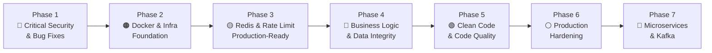
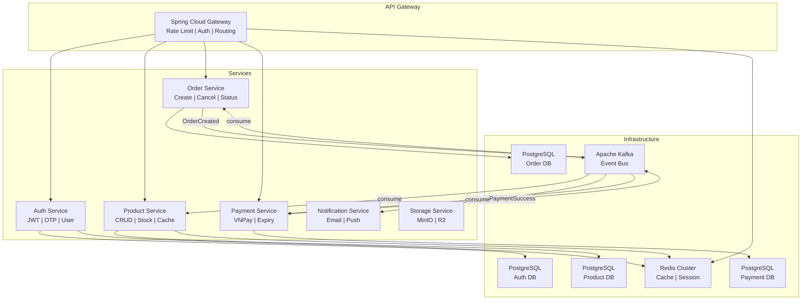
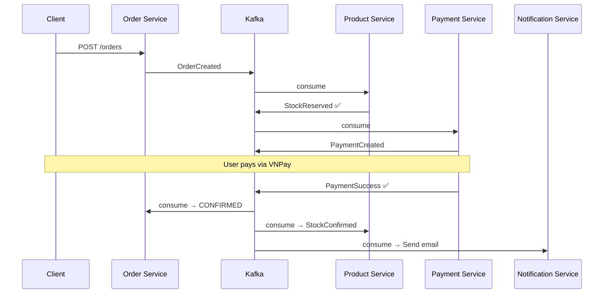
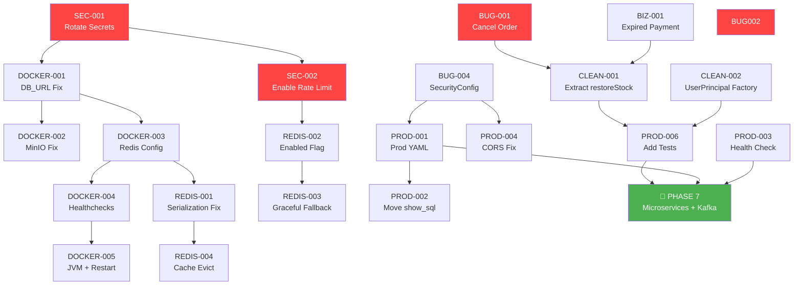

# 🗺️ Mini E-Commerce — Improvement Roadmap

> **Mục tiêu cuối cùng**: Từ Monolith → Production-Ready Monolith → Microservices + Kafka  
> **Tổng tickets**: 48 tickets | 6 Phases cải tiến + 1 Phase chuyển đổi Microservice  
> **Nguyên tắc**: Mỗi ticket đều liên kết với ticket trước/sau — không fix rời rạc.



---

## 📖 Cách Đọc Mỗi Ticket

Mỗi ticket được cấu trúc thống nhất:

| Field | Mô tả |
|-------|--------|
| **ID** | Mã ticket duy nhất (VD: `SEC-001`) |
| **Priority** | 🔴 Critical / 🟠 High / 🟡 Medium / 🟢 Low |
| **File(s)** | Vị trí chính xác file + line number |
| **Vấn đề** | Mô tả bug/issue hiện tại |
| **Tác động** | Hậu quả nếu không fix |
| **Cách khắc phục** | Hướng dẫn fix chi tiết |
| **Depends on** | Ticket phải hoàn thành trước |
| **Blocks** | Ticket bị block nếu ticket này chưa xong |
| **Liên quan Microservice** | Ticket này chuẩn bị gì cho Phase 7 |

---

# PHASE 1: 🔴 CRITICAL SECURITY & BUG FIXES

> **Mục tiêu**: Vá toàn bộ lỗ hổng bảo mật và bugs nghiêm trọng nhất.  
> **Ưu tiên**: Phải hoàn thành trước khi triển khai bất kỳ thứ gì lên Production.  
> **Estimated**: 2-3 ngày

---

## SEC-001: Quản lý bảo mật Environment Variables (.env, .env.prod, .env.example)

| Field | Detail |
|-------|--------|
| **Priority** | 🔴 Critical |
| **Files** | `.gitignore`, `.env.example`, `.env`, `.env.prod` / `.env.production` |
| **Status** | ✅ **CONFIGURED & SECURED** |
| **Depends on** | Không |
| **Blocks** | Tất cả các ticket khác — fix đầu tiên |

### Vấn đề

Mặc dù `.gitignore` đã liệt kê `.env` và `.env.production`, nhưng 2 file này **đã tồn tại trong repository** chứa toàn bộ credentials thật:

```properties
# .env (ví dụ chứa các secret)
MAIL_PASSWORD=xsmtpsib-xxxxxxxxxxxxxxxxxxxx-MASKED
BREVO_API_KEY=xkeysib-xxxxxxxxxxxxxxxxxxxx-MASKED

# .env
JWT_SECRET_KEY=UTv9AfQylaFf6SYpMIqmXjdArxPOXlxIjjYqWji82hJ-MASKED

# .env.production — Database Production credentials
DB_URL=jdbc:postgresql://<render-host>:5432/<db_name>
DB_USERNAME=<db_user>
DB_PASSWORD=xxxxxxxxxxxxxxxxxxxx-MASKED
```

### Tác động

- Bất kỳ ai từng clone repo đều có toàn bộ credentials Production
- Attacker có thể truy cập trực tiếp database Render, gửi email spam qua Brevo, forge JWT tokens
- Vi phạm nguyên tắc bảo mật cơ bản nhất

### Cách khắc phục

**Bước 1**: Xóa file khỏi Git history

```bash
# Cài BFG Repo-Cleaner (nhanh hơn git filter-branch)
brew install bfg

# Xóa .env và .env.production khỏi toàn bộ history
bfg --delete-files .env
bfg --delete-files .env.production

# Dọn dẹp
git reflog expire --expire=now --all && git gc --prune=now --aggressive
git push --force
```

**Bước 2**: Rotate TOÀN BỘ credentials

| Secret | Nơi rotate |
|--------|-----------|
| `JWT_SECRET_KEY` | Tự generate mới: `openssl rand -base64 32` |
| `BREVO_API_KEY` | Brevo Dashboard → SMTP & API → Regenerate |
| `MAIL_PASSWORD` | Brevo Dashboard → SMTP Credentials → Reset |
| `DB_PASSWORD` (Render) | Render Dashboard → Database → Reset Password |
| `VNPAY_SECRET_KEY` | VNPay Merchant Portal |
| `MIN_IO_SECRET_KEY` (Prod) | Cloudflare R2 Dashboard → Regenerate |

**Bước 3**: Đảm bảo `.env.example` chỉ chứa placeholder

```properties
# .env.example — CHỈ chứa key, KHÔNG chứa value thật
JWT_SECRET_KEY=<your-jwt-secret-here>
BREVO_API_KEY=<your-brevo-api-key>
DB_PASSWORD=<your-database-password>
```

### Liên quan Microservice

Khi chuyển sang Microservices, mỗi service sẽ có secrets riêng → cần thiết lập **Secret Management** (Vault, AWS Secrets Manager, hoặc Kubernetes Secrets) ngay từ bây giờ để tạo thói quen.

---

## SEC-002: Rate Limit bị TẮT HOÀN TOÀN — Hệ thống mở cho brute-force

| Field | Detail |
|-------|--------|
| **Priority** | 🔴 Critical |
| **File** | `src/main/java/com/devfat/mini_ecommerce/shared/ratelimit/RateLimitingAspect.java` |
| **Lines** | 38 (bypass) và 40-85 (code bị comment) |
| **Depends on** | `SEC-001` (secrets phải rotate trước), `REDIS-001` (Redis phải hoạt động đúng) |
| **Blocks** | `REDIS-002`, `REDIS-003` |

### Vấn đề

```java
// Line 38 — BỎ QUA TOÀN BỘ rate limit logic
return joinPoint.proceed();

/* Line 40-85 — Toàn bộ logic thực sự bị COMMENT */
```

Rate limit annotation `@RateLimit` trên `AuthController` (login, OTP, forgot-password) không có tác dụng gì.

### Tác động

- Login endpoint có thể bị brute-force không giới hạn
- OTP endpoint có thể bị spam → tốn tiền gửi email Brevo
- Public API có thể bị DDoS

### Cách khắc phục

**Bước 1**: Thêm check `enabled` flag (liên kết `REDIS-002`)

```java
@Around("@annotation(rateLimit)")
public Object enforceRateLimit(ProceedingJoinPoint joinPoint, RateLimit rateLimit) throws Throwable {

    // ✅ Check enabled flag từ YAML config — không cần hardcode bypass nữa
    if (!rateLimitProperties.isEnabled()) {
        return joinPoint.proceed();
    }

    // ... (uncomment toàn bộ block code line 40-85)
}
```

**Bước 2**: Inject `RateLimitProperties`

```java
@RequiredArgsConstructor
public class RateLimitingAspect {
    private final RateLimiterService rateLimiterService;
    private final RateLimitProperties rateLimitProperties; // ← THÊM
    // ...
}
```

**Bước 3**: Uncomment toàn bộ block code từ line 40-85, xóa dòng `return joinPoint.proceed();` ở line 38.

**Bước 4**: Cấu hình toggle trong YAML

```yaml
# application.yaml
app:
  rate-limit:
    enabled: true  # Production: true

# application-dev.yaml — dev có thể tắt khi seed data
app:
  rate-limit:
    enabled: false
```

### Liên quan Microservice

Rate Limit là cross-cutting concern. Khi chuyển sang Microservices, rate limit sẽ được chuyển lên **API Gateway** (Spring Cloud Gateway + Redis) thay vì nằm trong từng service. Code `RateLimiterService` hiện tại sẽ trở thành base cho Gateway filter.

---

## BUG-001: `cancelOrder()` logic bị ĐẢO NGƯỢC + không hoàn stock

| Field | Detail |
|-------|--------|
| **Priority** | 🔴 Critical |
| **File** | `src/main/java/com/devfat/mini_ecommerce/order/internal/OrderServiceImpl.java` |
| **Lines** | 220-236 |
| **Depends on** | Không |
| **Blocks** | `BIZ-003` (stock integrity) |

### Vấn đề

```java
// Line 230-231 — LOGIC NGƯỢC
if (order.getStatus().equals(PENDING)) {  // ← Chặn cancel khi PENDING
    throw new AccessDeniedException("Access denied! Only change with Pending order");
}
// Kết quả: User CHỈ cancel được order KHÔNG phải PENDING (CONFIRMED, SHIPPED...)
// Đúng ra: CHỈ cho phép cancel khi PENDING

// Line 234 — THIẾU hoàn stock
order.setStatus(CANCELLED);
// → Stock bị trừ vĩnh viễn dù order cancelled
```

### Tác động

- User không thể cancel đơn hàng đang PENDING (use case chính)
- User lại cancel được đơn đang SHIPPED/CONFIRMED (bất hợp lý)
- Stock bị trừ vĩnh viễn → hết hàng ảo

### Cách khắc phục

```java
@Override
@Transactional  // ← đảm bảo atomic: status + stock cùng commit/rollback
public void cancelOrder(Long orderId, Long userId) throws AccessDeniedException {
    userRepository.findById(userId)
        .orElseThrow(() -> new ResourceNotFoundException("User not found!"));

    OrderEntity order = orderRepository.findById(orderId)
        .orElseThrow(() -> new ResourceNotFoundException("Order not found!"));

    if (!order.getUser().getId().equals(userId)) {
        throw new AccessDeniedException("Access denied");
    }

    // ✅ FIX 1: Đảo logic — chỉ cho cancel khi PENDING
    if (!order.getStatus().equals(PENDING)) {
        throw new BadRequestException("Only PENDING orders can be cancelled.");
    }

    // ✅ FIX 2: Hoàn trả stock (copy logic từ changeStatus line 188-193)
    order.getItems().forEach(item -> {
        item.getProduct().setStock(
            item.getProduct().getStock() + item.getQuantity()
        );
    });

    order.setStatus(CANCELLED);
}
```

> **Lưu ý**: Cùng pattern restore stock phải áp dụng cho `BIZ-001` (expiredPayment) — xem Phase 4.

### Liên quan Microservice

Khi tách Order Service và Product Service riêng biệt, việc "hoàn stock" sẽ thành **Saga Pattern** — Order Service publish event `OrderCancelled` → Product Service consume và restore stock. Viết logic restore stock tập trung 1 chỗ ngay bây giờ giúp dễ tách sau này.

---

## BUG-002: VNPay Timezone sai — Lệch 14 tiếng

| Field | Detail |
|-------|--------|
| **Priority** | 🔴 Critical |
| **Files** | `src/main/java/com/devfat/mini_ecommerce/payment/internal/VNPayConfig.java` (line 34, 40) |
|  | `src/main/java/com/devfat/mini_ecommerce/payment/internal/PaymentServiceImpl.java` (line 115) |
| **Depends on** | Không |
| **Blocks** | `BIZ-002` (Payment flow) |

### Vấn đề

```java
// VNPayConfig.java line 34 & PaymentServiceImpl.java line 115
Calendar cld = Calendar.getInstance(TimeZone.getTimeZone("Etc/GMT+7"));
```

Theo chuẩn **Etc timezone**, dấu bị **đảo ngược**:
- `Etc/GMT+7` = UTC**-7** (Mountain Time, USA)
- `Etc/GMT-7` = UTC**+7** (Vietnam)

→ `vnp_CreateDate` và `vnp_ExpireDate` bị lệch **14 tiếng** so với Việt Nam.

### Tác động

- VNPay có thể reject transaction vì timestamp không hợp lệ
- `vnp_ExpireDate` tính sai → payment có thể expired ngay lập tức hoặc kéo dài quá lâu

### Cách khắc phục

Sửa **cả 3 chỗ** dùng timezone:

```java
// ✅ VNPayConfig.java — sửa cả 2 method
public static String getCreateDate() {
    return LocalDateTime.now(ZoneId.of("Asia/Ho_Chi_Minh"))
            .format(DateTimeFormatter.ofPattern("yyyyMMddHHmmss"));
}

public static String getExpireDate() {
    return LocalDateTime.now(ZoneId.of("Asia/Ho_Chi_Minh"))
            .plusMinutes(15)
            .format(DateTimeFormatter.ofPattern("yyyyMMddHHmmss"));
}

// ✅ PaymentServiceImpl.java line 115-120 — thay thế Calendar bằng java.time
DateTimeFormatter fmt = DateTimeFormatter.ofPattern("yyyyMMddHHmmss");
LocalDateTime now = LocalDateTime.now(ZoneId.of("Asia/Ho_Chi_Minh"));
vnpParams.put("vnp_CreateDate", now.format(fmt));
vnpParams.put("vnp_ExpireDate", now.plusMinutes(15).format(fmt));
```

### Liên quan Microservice

Payment Service sẽ là service riêng biệt, timezone handling phải centralize thành constant/utility. Chuẩn bị bằng cách tạo `TimeConstants.VIETNAM_ZONE = ZoneId.of("Asia/Ho_Chi_Minh")`.

---

## BUG-003: Payment tạo với PaymentMethod sai

| Field | Detail |
|-------|--------|
| **Priority** | 🔴 Critical |
| **File** | `src/main/java/com/devfat/mini_ecommerce/payment/internal/PaymentServiceImpl.java` |
| **Line** | 92 |
| **Depends on** | `BUG-002` (cùng file, fix chung) |
| **Blocks** | Không |

### Vấn đề

```java
// Line 92
payment.setPaymentMethod(PaymentMethod.WALLET);  // ← SAI: đây là flow VNPay
```

### Cách khắc phục

```java
payment.setPaymentMethod(PaymentMethod.VNPAY);  // ← ĐÚNG
```

---

## BUG-004: `SecurityConfig` — `@AllArgsConstructor` + `@Value` xung đột

| Field | Detail |
|-------|--------|
| **Priority** | 🔴 Critical |
| **File** | `src/main/java/com/devfat/mini_ecommerce/shared/config/SecurityConfig.java` |
| **Lines** | 32, 63-64 |
| **Depends on** | Không |
| **Blocks** | `PROD-001` (CORS Prod config) |

### Vấn đề

```java
@AllArgsConstructor  // ← Tạo constructor chứa TẤT CẢ fields
public class SecurityConfig {
    // ...
    @Value("${app.cors.allowed-origins}")
    private List<String> allowedOrigins;  // ← @Value = field injection
}
```

`@AllArgsConstructor` tạo constructor nhận `allowedOrigins` làm parameter → Spring inject qua constructor **trước khi** `@Value` resolve → giá trị có thể bị `null`.

### Cách khắc phục

```java
@RequiredArgsConstructor  // ← Chỉ inject final fields qua constructor
public class SecurityConfig {
    private final JwtAuthenticationEntryPoint jwtAuthenticationEntryPoint;
    private final JwtAccessDeniedHandler jwtAccessDeniedHandler;

    @Value("${app.cors.allowed-origins}")
    private List<String> allowedOrigins;  // ← Inject qua field, KHÔNG qua constructor
}
```

---

## BUG-005: `getOrderByUserIdAndStatusWithDetails()` — Query DB 2 lần + thiếu auth check

| Field | Detail |
|-------|--------|
| **Priority** | 🔴 Critical |
| **Files** | `src/main/java/com/devfat/mini_ecommerce/order/internal/OrderServiceImpl.java` (line 70) |
|  | `src/main/java/com/devfat/mini_ecommerce/order/OrderController.java` (line 29-41) |
| **Depends on** | Không |
| **Blocks** | `BIZ-004` (authorization pattern) |

### Vấn đề

**Vấn đề 1**: Query DB 2 lần cho cùng userId (line 70)
```java
if(userRepository.findById(Objects.requireNonNull(userId)).isEmpty()
    || userRepository.findById(userId).isEmpty()) {  // ← 2 queries!
```

**Vấn đề 2**: Controller không kiểm tra quyền access (line 29-41)
```java
@GetMapping("/me/{userId}")
public ResponseEntity<...> getOrderResponse(@PathVariable Long userId, ...) {
    // ← Không check userPrincipal.getUserId() == userId
    // → Bất kỳ user nào cũng xem được đơn hàng user khác
}
```

### Cách khắc phục

**Fix Service** (1 query thay vì 2):
```java
@Override
@Transactional(readOnly = true)
public PageResponse<OrderResponseDto> getOrderByUserIdAndStatusWithDetails(
        Long userId, OrderStatus status, Pageable pageable) {
    // ✅ 1 query duy nhất
    userRepository.findById(userId)
        .orElseThrow(() -> new ResourceNotFoundException("User not found!"));
    // ...
}
```

**Fix Controller** (thêm auth check):
```java
@GetMapping("/me/{userId}")
public ResponseEntity<...> getOrderResponse(
        @PathVariable Long userId,
        @RequestParam OrderStatus status,
        @AuthenticationPrincipal UserPrincipal userPrincipal,  // ← THÊM
        Pageable pageable) {
    
    // ✅ Authorization check
    if (!userPrincipal.getUserId().equals(userId) 
            && !userPrincipal.hasRole("ADMIN")) {
        throw new AccessDeniedException("Access denied");
    }
    // ...
}
```

---

## BUG-006: `GlobalExceptionHandler` leak internal error messages

| Field | Detail |
|-------|--------|
| **Priority** | 🔴 Critical |
| **File** | `src/main/java/com/devfat/mini_ecommerce/shared/exception/GlobalExceptionHandler.java` |
| **Lines** | 95-99 |
| **Depends on** | Không |
| **Blocks** | Không |

### Vấn đề

```java
@ExceptionHandler(Exception.class)
public ResponseEntity<ApiResponse<Void>> handleGlobalException(Exception ex) {
    return ResponseEntity.status(HttpStatus.INTERNAL_SERVER_ERROR)
            .body(ApiResponse.error(ex.getMessage()));  // ← LEAK: ex.getMessage() chứa SQL error, stack trace...
}
```

### Tác động

- SQL injection error messages lộ tên table/column
- NullPointerException lộ internal class path
- Attacker khai thác thông tin để tấn công chính xác hơn

### Cách khắc phục

```java
@ExceptionHandler(Exception.class)
public ResponseEntity<ApiResponse<Void>> handleGlobalException(Exception ex) {
    // ✅ Log đầy đủ server-side để debug
    log.error("Unexpected error occurred: ", ex);
    
    // ✅ Trả client message generic — KHÔNG leak internal info
    return ResponseEntity.status(HttpStatus.INTERNAL_SERVER_ERROR)
            .body(ApiResponse.error("An unexpected error occurred. Please try again later."));
}
```

### Liên quan Microservice

Mỗi Microservice sẽ có GlobalExceptionHandler riêng. Pattern "log full + return generic" là chuẩn phải áp dụng cho tất cả services.

---

# PHASE 2: 🟠 DOCKER & INFRASTRUCTURE FOUNDATION

> **Mục tiêu**: Docker Compose hoạt động đúng cho local development.  
> **Phụ thuộc**: Phase 1 hoàn thành (đặc biệt `SEC-001` secrets).  
> **Estimated**: 1-2 ngày

---

## DOCKER-001: Container networking — `DB_URL` dùng `localhost` trong Docker

| Field | Detail |
|-------|--------|
| **Priority** | 🟠 High |
| **File** | `docker-compose.yml` (line 9) |
| **Depends on** | `SEC-001` |
| **Blocks** | `DOCKER-002`, `DOCKER-003` |

### Vấn đề

```yaml
# Line 9
- DB_URL=${DB_URL}  # ← .env chứa jdbc:postgresql://localhost:5432/mini_shop
```

Trong Docker network, `localhost` trong container `app` trỏ đến **chính container đó**, không phải container `db`.

### Cách khắc phục

```yaml
services:
  app:
    environment:
      # ✅ Override DB_URL — dùng service name "db" thay vì "localhost"
      - DB_URL=jdbc:postgresql://db:5432/mini_shop
```

---

## DOCKER-002: MinIO Endpoint sai — port sai + `localhost` trong container

| Field | Detail |
|-------|--------|
| **Priority** | 🟠 High |
| **File** | `docker-compose.yml` (lines 15-21) |
| **Depends on** | `DOCKER-001` |
| **Blocks** | Không |

### Vấn đề

```yaml
# Line 15 — 3 LỖI:
- MINIO_ENDPOINT=http://localhost:9001  
#   1. localhost sai (phải dùng service name "minio")
#   2. Port 9001 = Console UI, port 9000 = S3 API
#   3. Lines 16-17 hardcode rồi 19-20 override — redundant
- MIN_IO_ACCESS_KEY=admin          # Line 16 — hardcode
- MIN_IO_SECRET_KEY=admin12345     # Line 17 — hardcode
- MIN_IO_ACCESS_KEY=${MIN_IO_ACCESS_KEY}   # Line 19 — override!
- MIN_IO_SECRET_KEY=${MIN_IO_SECRET_KEY}   # Line 20 — override!
```

### Cách khắc phục

```yaml
services:
  app:
    environment:
      # ✅ Dùng service name + đúng port S3 API
      - MINIO_ENDPOINT=http://minio:9000
      # ✅ Xóa hardcode, chỉ giữ 1 bộ từ .env
      - MIN_IO_ACCESS_KEY=${MIN_IO_ACCESS_KEY}
      - MIN_IO_SECRET_KEY=${MIN_IO_SECRET_KEY}
      - MIN_IO_BUCKET=${MIN_IO_BUCKET}
```

---

## DOCKER-003: Redis thiếu password + volume + healthcheck

| Field | Detail |
|-------|--------|
| **Priority** | 🟠 High |
| **File** | `docker-compose.yml` (lines 54-58) |
| **Depends on** | `DOCKER-001` |
| **Blocks** | `REDIS-001` (Rate Limit cần Redis healthy) |

### Vấn đề

```yaml
redis:
    image: redis:latest      # ← Không có version pin
    container_name: mini-ecommerce-redis
    ports:
      - "6379:6379"
    # ← Thiếu: password, volume, healthcheck
```

### Cách khắc phục

```yaml
redis:
    image: redis:7-alpine    # ✅ Pin version + Alpine nhẹ
    container_name: mini-ecommerce-redis
    # ✅ Thêm password
    command: redis-server --requirepass ${REDIS_PASSWORD:-redis123} --appendonly yes
    ports:
      - "6379:6379"
    # ✅ Persist data
    volumes:
      - redisdata:/data
    # ✅ Healthcheck
    healthcheck:
      test: ["CMD", "redis-cli", "-a", "${REDIS_PASSWORD:-redis123}", "ping"]
      interval: 5s
      retries: 5

# Thêm volume
volumes:
  pgdata:
  miniodata:
  redisdata:  # ← THÊM
```

### Liên quan Microservice

Redis sẽ trở thành **shared infrastructure** cho tất cả Microservices (session, cache, rate limit, pub/sub). Cấu hình đúng ngay từ bây giờ.

---

## DOCKER-004: MinIO thiếu healthcheck + `app` depends_on không đủ

| Field | Detail |
|-------|--------|
| **Priority** | 🟠 High |
| **File** | `docker-compose.yml` (lines 33-36, 60-71) |
| **Depends on** | `DOCKER-003` |
| **Blocks** | Không |

### Cách khắc phục

```yaml
minio:
    image: quay.io/minio/minio
    container_name: mini-ecommerce-minio
    ports:
      - "9000:9000"
      - "9001:9001"
    environment:
      - MINIO_ROOT_USER=${MIN_IO_ACCESS_KEY}
      - MINIO_ROOT_PASSWORD=${MIN_IO_SECRET_KEY}
    command: server /data --console-address ":9001"
    volumes:
      - miniodata:/data
    # ✅ Thêm healthcheck
    healthcheck:
      test: ["CMD", "mc", "ready", "local"]
      interval: 5s
      retries: 5

services:
  app:
    depends_on:
      db:
        condition: service_healthy
      redis:
        condition: service_healthy    # ✅ Đổi từ service_started
      minio:
        condition: service_healthy    # ✅ Đổi từ service_started
```

---

## DOCKER-005: Profile hardcode `dev` + thiếu restart policy + JVM tuning

| Field | Detail |
|-------|--------|
| **Priority** | 🟠 High |
| **Files** | `docker-compose.yml` (line 8), `Dockerfile` (line 65) |
| **Depends on** | `DOCKER-001` → `DOCKER-004` |
| **Blocks** | `PROD-002` |

### Vấn đề

```yaml
# docker-compose.yml line 8
- SPRING_PROFILES_ACTIVE=dev  # ← Hardcode dev

# Dockerfile line 65
ENTRYPOINT ["java", "-jar", "app.jar"]  # ← Không có JVM flags
```

### Cách khắc phục

```yaml
# docker-compose.yml
services:
  app:
    restart: unless-stopped  # ✅ Auto-restart khi crash
    environment:
      - SPRING_PROFILES_ACTIVE=${SPRING_PROFILES_ACTIVE:-dev}  # ✅ Parameterize
    deploy:
      resources:
        limits:
          memory: 768M  # ✅ Memory limit
```

```dockerfile
# Dockerfile — Thêm JVM container-aware flags
ENTRYPOINT ["java", \
  "-XX:MaxRAMPercentage=75.0", \
  "-XX:+UseContainerSupport", \
  "-Djava.security.egd=file:/dev/./urandom", \
  "-jar", "app.jar"]
```

---

## DOCKER-006: `.dockerignore` exclude Maven wrapper jar

| Field | Detail |
|-------|--------|
| **Priority** | 🟡 Medium |
| **File** | `.dockerignore` (line 6) |
| **Depends on** | Không |
| **Blocks** | Không |

### Vấn đề

```
# .dockerignore line 6
.mvn/wrapper/maven-wrapper.jar  # ← Exclude wrapper jar
```

Nhưng `Dockerfile` line 20: `COPY .mvn .mvn` cần wrapper jar để `./mvnw` hoạt động.

### Cách khắc phục

Xóa dòng `.mvn/wrapper/maven-wrapper.jar` khỏi `.dockerignore`.

---

# PHASE 3: 🟡 REDIS & RATE LIMIT — PRODUCTION-READY

> **Mục tiêu**: Rate Limit hoạt động đúng với Redis, Redis serialization an toàn.  
> **Phụ thuộc**: Phase 2 hoàn thành (Docker Redis healthy).  
> **Estimated**: 1-2 ngày

---

## REDIS-001: Redis `DefaultTyping.EVERYTHING` — Lỗ hổng deserialization

| Field | Detail |
|-------|--------|
| **Priority** | 🟡 High |
| **File** | `src/main/java/com/devfat/mini_ecommerce/shared/config/RedisCacheConfig.java` |
| **Lines** | 34-38 |
| **Depends on** | `DOCKER-003` (Redis phải healthy) |
| **Blocks** | `REDIS-004` (home cache) |

### Vấn đề

```java
// Line 34-38
redisObjectMapper.activateDefaultTyping(
    LaissezFaireSubTypeValidator.instance,  // ← Cho phép MỌI class
    ObjectMapper.DefaultTyping.EVERYTHING,  // ← Serialize/deserialize MỌI type
    JsonTypeInfo.As.PROPERTY
);
```

`EVERYTHING` + `LaissezFaireSubTypeValidator` = **Remote Code Execution** risk nếu attacker inject payload vào Redis.

### Cách khắc phục

```java
// ✅ Restrict chỉ cho phép package của project
PolymorphicTypeValidator ptv = BasicPolymorphicTypeValidator.builder()
    .allowIfBaseType("com.devfat.mini_ecommerce")
    .allowIfBaseType("java.util")
    .allowIfBaseType("java.time")
    .allowIfBaseType("org.springframework.data.domain")
    .build();

redisObjectMapper.activateDefaultTyping(
    ptv,
    ObjectMapper.DefaultTyping.NON_FINAL,  // ✅ Chỉ NON_FINAL
    JsonTypeInfo.As.PROPERTY
);
```

### Liên quan Microservice

Khi có nhiều services cùng dùng Redis, mỗi service nên có **Redis namespace riêng** (prefix key) và **type validator riêng** để tránh conflict.

---

## REDIS-002: Rate Limit `enabled` flag không được check trong Aspect

| Field | Detail |
|-------|--------|
| **Priority** | 🟡 High |
| **Files** | `src/main/java/com/devfat/mini_ecommerce/shared/ratelimit/RateLimitingAspect.java` |
|  | `src/main/java/com/devfat/mini_ecommerce/shared/ratelimit/RateLimitProperties.java` |
| **Depends on** | `SEC-002` (cùng fix, cùng file) |
| **Blocks** | Không |

### Vấn đề

`RateLimitProperties.enabled = true` tồn tại nhưng **không ai check**. Đây là lý do developer phải hardcode `return joinPoint.proceed()` — không có cách tắt rate limit qua config.

> Đã mô tả chi tiết ở `SEC-002`. Ticket này đánh dấu cần inject `RateLimitProperties` và check `isEnabled()`.

---

## REDIS-003: `RateLimitConfig` crash nếu Redis không phải Lettuce

| Field | Detail |
|-------|--------|
| **Priority** | 🟡 Medium |
| **File** | `src/main/java/com/devfat/mini_ecommerce/shared/ratelimit/RateLimitConfig.java` |
| **Line** | 36 |
| **Depends on** | `REDIS-002` |
| **Blocks** | Không |

### Vấn đề

```java
// Line 36
throw new IllegalStateException("RedisConnectionFactory must be an instance of LettuceConnectionFactory");
// → App KHÔNG start được nếu Redis connection factory không phải Lettuce
```

### Cách khắc phục

```java
@Configuration
@ConditionalOnProperty(name = "app.rate-limit.enabled", havingValue = "true", matchIfMissing = true)
public class RateLimitConfig {

    @Bean
    public LettuceBasedProxyManager<byte[]> proxyManager(RedisConnectionFactory connectionFactory) {
        if (!(connectionFactory instanceof LettuceConnectionFactory lettuceConnectionFactory)) {
            // ✅ Graceful fallback thay vì crash
            log.warn("RedisConnectionFactory is not Lettuce. Rate limiting via Redis is disabled.");
            return null;  // hoặc throw và để @ConditionalOnBean handle
        }
        // ... existing code
    }
}
```

---

## REDIS-004: `product:category_browse` cache không evict khi data thay đổi

| Field | Detail |
|-------|--------|
| **Priority** | 🟡 Medium |
| **File** | `src/main/java/com/devfat/mini_ecommerce/product/internal/ProductServiceImpl.java` |
| **Depends on** | `REDIS-001` (Redis serialization phải đúng) |
| **Blocks** | Không |

### Vấn đề

Các method `create()`, `update()`, `softDelete()` chỉ evict cache `"products"` nhưng KHÔNG evict `"product:category_browse"` → user browsing category thấy data cũ.

### Cách khắc phục

Thêm `@CacheEvict(value = "product:category_browse", allEntries = true)` vào các method thay đổi product:

```java
@CacheEvict(value = {"products", "product:category_browse"}, allEntries = true)
@Transactional
public ProductResponseDto create(CreateProductRequestDto dto) { ... }
```

Hoặc tạo helper method evict tất cả product-related caches.

---

# PHASE 4: 🔵 BUSINESS LOGIC & DATA INTEGRITY

> **Mục tiêu**: Fix logic nghiệp vụ sai, đảm bảo data integrity.  
> **Phụ thuộc**: Phase 3 hoàn thành (Rate Limit hoạt động).  
> **Estimated**: 2-3 ngày

---

## BIZ-001: `expiredPayment()` scheduler không hoàn stock

| Field | Detail |
|-------|--------|
| **Priority** | 🟠 High |
| **File** | `src/main/java/com/devfat/mini_ecommerce/payment/internal/PaymentServiceImpl.java` |
| **Lines** | 51-68 |
| **Depends on** | `BUG-001` (cùng pattern restore stock) |
| **Blocks** | Không |

### Vấn đề

```java
// Line 61-68
for (PaymentEntity payment : expiredPayments) {
    payment.setPaymentStatus(PaymentStatus.EXPIRED);
    paymentRepository.save(payment);

    OrderEntity order = payment.getOrder();
    order.setStatus(OrderStatus.CANCELLED);
    orderRepository.save(order);
    // ← THIẾU: Không hoàn stock cho products trong order
}
```

### Cách khắc phục

```java
for (PaymentEntity payment : expiredPayments) {
    payment.setPaymentStatus(PaymentStatus.EXPIRED);

    OrderEntity order = payment.getOrder();

    // ✅ Hoàn stock — cùng pattern với BUG-001 và changeStatus()
    order.getItems().forEach(item -> {
        ProductEntity product = item.getProduct();
        product.setStock(product.getStock() + item.getQuantity());
    });

    order.setStatus(OrderStatus.CANCELLED);
}
```

> **Refactor suggestion**: Tạo method `restoreStock(OrderEntity order)` dùng chung cho `cancelOrder()`, `changeStatus(CANCELLED)`, và `expiredPayment()`. Xem `CLEAN-001`.

### Liên quan Microservice

Scheduler `expiredPayment()` sẽ trở thành **Scheduled Job trong Payment Service** publish event `PaymentExpired` → Order Service consume → Product Service consume (restore stock). Đây là Saga Pattern.

---

## BIZ-002: Order creation race condition — Stock oversell

| Field | Detail |
|-------|--------|
| **Priority** | 🟠 High |
| **File** | `src/main/java/com/devfat/mini_ecommerce/order/internal/OrderServiceImpl.java` |
| **Lines** | 147-160 |
| **Depends on** | Không |
| **Blocks** | Không |

### Vấn đề

```java
// Line 148-152 — Read-then-write pattern (NOT atomic)
ProductEntity product = productRepository.findById(requestItem.productId())...;
if (product.getStock() < requestItem.quantity()) { throw ...; }
product.setStock(product.getStock() - requestItem.quantity());  // ← Race condition!
```

2 requests đồng thời:
1. Cả 2 đọc `stock = 5`
2. Cả 2 check `5 >= 3` → pass
3. Cả 2 set `stock = 5 - 3 = 2`
4. Kết quả: stock = 2, nhưng đã bán 6 đơn vị (oversell!)

### Cách khắc phục

**Option A** (Recommended — Native SQL atomic update):
```java
// Thêm vào ProductRepository
@Modifying
@Query("UPDATE ProductEntity p SET p.stock = p.stock - :qty WHERE p.id = :id AND p.stock >= :qty")
int decreaseStockAtomically(@Param("id") Long id, @Param("qty") int qty);
```

```java
// Sử dụng trong OrderServiceImpl
int rowsAffected = productRepository.decreaseStockAtomically(
    requestItem.productId(), requestItem.quantity());
if (rowsAffected == 0) {
    throw new InsufficientStockException("Not enough stock for product: " + requestItem.productId());
}
```

**Option B** (Optimistic Lock — đã có `@Version`):
```java
// Thêm spring-retry dependency
@Retryable(value = ObjectOptimisticLockingFailureException.class, maxAttempts = 3)
@Transactional
public OrderResponseDto create(Long userId, CreateOrderRequestDto dto) { ... }
```

### Liên quan Microservice

Race condition sẽ **nghiêm trọng hơn** trong Microservices vì Product Service và Order Service chạy riêng. Giải pháp: **Reservation Pattern** — Product Service "reserve" stock trước, confirm sau khi order complete.

---

## BIZ-003: `PaymentController.vnPayReturn()` — Logic nằm sai layer

| Field | Detail |
|-------|--------|
| **Priority** | 🟡 Medium |
| **File** | `src/main/java/com/devfat/mini_ecommerce/payment/PaymentController.java` |
| **Lines** | 29, 52-89 |
| **Depends on** | Không |
| **Blocks** | Không |

### Vấn đề

```java
// Line 29
private final PaymentRepository paymentRepository;  // ← Controller inject Repository trực tiếp

// Line 52-89 — Business logic trong Controller
PaymentEntity payment = paymentRepository.findById(paymentId)...;
// ... redirect URL building logic
```

### Cách khắc phục

Move logic vào `PaymentServiceImpl`:

```java
// PaymentService interface — thêm method
String buildVnPayReturnRedirectUrl(Map<String, String> allParams);

// PaymentController — delegate
@GetMapping("/vnpay-return")
public ResponseEntity<Void> vnPayReturn(@RequestParam Map<String, String> allParams) {
    String redirectUrl = paymentService.buildVnPayReturnRedirectUrl(allParams);
    return ResponseEntity.status(HttpStatus.FOUND)
            .header("Location", redirectUrl)
            .build();
}
```

---

## BIZ-004: Missing `@Transactional` trên nhiều write methods

| Field | Detail |
|-------|--------|
| **Priority** | 🟡 Medium |
| **Files** | `src/main/java/com/devfat/mini_ecommerce/product/internal/ProductServiceImpl.java` (lines 186, 194) |
|  | `src/main/java/com/devfat/mini_ecommerce/user/internal/UserServiceImpl.java` (lines 132, 142) |
| **Depends on** | Không |
| **Blocks** | Không |

### Danh sách methods thiếu `@Transactional`

| Method | File | Line |
|--------|------|------|
| `toggleFeaturedProduct()` | ProductServiceImpl | 186 |
| `configureCombo()` | ProductServiceImpl | 194 |
| `uploadUserImage()` | UserServiceImpl | 132 |
| `requestChangePasswordOtp()` | UserServiceImpl | 142 |
| `getMyOrder()` (thiếu `readOnly=true`) | OrderServiceImpl | 211 |
| `cancelOrder()` (thiếu annotation) | OrderServiceImpl | 220 |

### Cách khắc phục

Thêm `@Transactional` cho write methods, `@Transactional(readOnly = true)` cho read methods.

---

# PHASE 5: 🟢 CLEAN CODE & CODE QUALITY

> **Mục tiêu**: Refactor duplicate code, thống nhất patterns, chuẩn bị cho Microservice.  
> **Phụ thuộc**: Phase 4 hoàn thành.  
> **Estimated**: 2-3 ngày

---

## CLEAN-001: Extract `restoreStock()` — Chấm dứt duplicate stock restore logic

| Field | Detail |
|-------|--------|
| **Priority** | 🟡 Medium |
| **Liên kết** | `BUG-001`, `BIZ-001`, `OrderServiceImpl.changeStatus()` line 188-193 |
| **Depends on** | `BUG-001`, `BIZ-001` |

### Vấn đề

Logic "hoàn trả stock khi cancel order" xuất hiện ở **3 chỗ riêng biệt**:
1. `OrderServiceImpl.changeStatus()` (line 188-193)
2. `OrderServiceImpl.cancelOrder()` (sau fix `BUG-001`)
3. `PaymentServiceImpl.expiredPayment()` (sau fix `BIZ-001`)

### Cách khắc phục

Tạo private method trong `OrderServiceImpl` hoặc shared utility:

```java
// OrderServiceImpl — private helper
private void restoreOrderStock(OrderEntity order) {
    order.getItems().forEach(item -> {
        ProductEntity product = item.getProduct();
        product.setStock(product.getStock() + item.getQuantity());
    });
}
```

Sử dụng ở cả 3 chỗ. Khi chuyển Microservice, method này sẽ trở thành event handler trong Product Service.

---

## CLEAN-002: Extract `UserPrincipalFactory` — Chấm dứt duplicate UserPrincipal builder

| Field | Detail |
|-------|--------|
| **Priority** | 🟡 Medium |
| **Files** | `AuthServiceImpl.java` (line 201-220, 304-323), `CustomUserDetailsService.java` (line 27-50) |
| **Depends on** | Không |

### Vấn đề

Logic extract roles → permissions → build UserPrincipal xuất hiện **3 lần** giống nhau.

### Cách khắc phục

```java
// Tạo file mới: shared/security/UserPrincipalFactory.java
@UtilityClass
public class UserPrincipalFactory {

    public static UserPrincipal fromEntity(UserEntity user) {
        Set<String> roles = user.getRoles() != null
                ? user.getRoles().stream().map(RoleEntity::getName).collect(Collectors.toSet())
                : Set.of();
        Set<String> permissions = user.getRoles() != null
                ? user.getRoles().stream()
                    .filter(r -> r.getPermissions() != null)
                    .flatMap(r -> r.getPermissions().stream())
                    .map(PermissionEntity::getCode)
                    .collect(Collectors.toSet())
                : Set.of();

        return UserPrincipal.builder()
                .userId(user.getId())
                .email(user.getEmail())
                .password(user.getPassword())
                .roles(roles)
                .permissions(permissions)
                .active(user.isActive())
                .emailVerified(user.isEmailVerified())
                .build();
    }
}
```

Sử dụng:
```java
// AuthServiceImpl
UserPrincipal userPrincipal = UserPrincipalFactory.fromEntity(user);

// CustomUserDetailsService
return UserPrincipalFactory.fromEntity(user);
```

---

## CLEAN-003: Fix sai exception types

| Field | Detail |
|-------|--------|
| **Priority** | 🟡 Medium |
| **Files** | Nhiều files |

### Danh sách

| File | Line | Hiện tại | Nên đổi thành |
|------|------|----------|---------------|
| `ProductServiceImpl.java` | 92 | `ResourceNotFoundException("Price must > 0")` | `BadRequestException` |
| `ProductServiceImpl.java` | 114 | `IllegalArgumentException("product unavailable")` | `InsufficientStockException` |
| `ProductServiceImpl.java` | 129 | `InsufficientStockException("Quantity must than 0")` | `BadRequestException` + fix typo |
| `ProductServiceImpl.java` | 143 | `ResourceNotFoundException("Products is unactive")` | `BadRequestException` |
| `ProductServiceImpl.java` | 188 | `ResourceNotFoundException("Product is inactive")` | `BadRequestException` |
| `UserServiceImpl.java` | 88 | `ResourceNotFoundException("Old password does not match!")` | `BadRequestException` |

---

## CLEAN-004: Thống nhất ngôn ngữ error messages → English only

| Field | Detail |
|-------|--------|
| **Priority** | 🟢 Low |
| **Files** | Toàn bộ dự án |

### Ví dụ cần sửa

| Hiện tại | Sửa thành |
|----------|-----------|
| `"Không tìm thấy id = " + id` | `"Product not found with id: " + id` |
| `"Please try again after " + s + " giây."` | `"Please try again after " + s + " seconds."` |
| `"Products is unactive"` | `"Product is inactive"` |

---

## CLEAN-005: Xóa redundant `save()` trong `@Transactional` methods

| Field | Detail |
|-------|--------|
| **Priority** | 🟢 Low |
| **Files** | `ProductServiceImpl.java`, `UserServiceImpl.java`, `OrderServiceImpl.java` |

### Danh sách `save()` thừa

Trong `@Transactional` method, JPA dirty checking tự flush. Các chỗ `save()` thừa:

| Method | File |
|--------|------|
| `decreaseStock()` | ProductServiceImpl L117 |
| `increaseStock()` | ProductServiceImpl L132 |
| `softDelete()` | ProductServiceImpl L146 |
| `toggleFeaturedProduct()` | ProductServiceImpl L191 |
| `changePassword()` | UserServiceImpl (implicit via dirty check) |
| `updateStatusUser()` | UserServiceImpl L129 |

---

## CLEAN-006: Xóa OTP cũ trước khi tạo mới

| Field | Detail |
|-------|--------|
| **Priority** | 🟡 Medium |
| **File** | `src/main/java/com/devfat/mini_ecommerce/auth/internal/OtpServiceImpl.java` |
| **Line** | 76 |
| **Depends on** | Không |

### Vấn đề

`generateAndSendOtp()` tạo record mới mỗi lần gọi, OTP cũ vẫn valid (`consumed = false`) → user dùng được OTP cũ.

### Cách khắc phục

Thêm trước khi tạo OTP mới:

```java
// Vô hiệu hoá tất cả OTP cũ chưa dùng
otpVerificationRepository.consumeAllPending(user.getId(), purpose);
```

```java
// Repository
@Modifying
@Query("UPDATE OtpVerificationEntity o SET o.consumed = true " +
       "WHERE o.user.id = :userId AND o.purpose = :purpose AND o.consumed = false")
void consumeAllPending(@Param("userId") Long userId, @Param("purpose") OtpPurpose purpose);
```

---

## CLEAN-007: Xóa blank lines thừa + code comments không cần thiết

| Field | Detail |
|-------|--------|
| **Priority** | 🟢 Low |
| **Files** | Hầu hết files (5-10 blank lines giữa imports) |

Dọn dẹp formatting, xóa commented-out code blocks (VD: SecurityConfig line 110-117, UserServiceImpl line 49-60).

---

## CLEAN-008: `Flyway repair()` chạy trên cả Production

| Field | Detail |
|-------|--------|
| **Priority** | 🟡 Medium |
| **File** | `src/main/java/com/devfat/mini_ecommerce/shared/config/FlywayConfig.java` |
| **Depends on** | Không |

### Vấn đề

`repairThenMigrate()` chạy `flyway.repair()` trên **mọi profile** kể cả Prod → có thể override checksum bất thường.

### Cách khắc phục

```java
@Configuration
@Profile("dev")  // ✅ Chỉ chạy repair trên dev
public class FlywayConfig {
    @Bean
    public FlywayMigrationStrategy repairThenMigrate() {
        return flyway -> {
            flyway.repair();
            flyway.migrate();
        };
    }
}
```

Đồng thời xóa `repair-on-migrate: true` trong `application-dev.yaml` (line 5) vì đây là property không hợp lệ.

---

# PHASE 6: ⚪ PRODUCTION HARDENING

> **Mục tiêu**: Chuẩn bị toàn bộ cho Production deployment.  
> **Phụ thuộc**: Phase 5 hoàn thành.  
> **Estimated**: 2-3 ngày

---

## PROD-001: `application-prod.yaml` quá thiếu

| Field | Detail |
|-------|--------|
| **Priority** | 🟡 Medium |
| **File** | `src/main/resources/application-prod.yaml` |
| **Depends on** | `BUG-004` (SecurityConfig CORS fix) |

### Vấn đề

Chỉ có 8 dòng. Thiếu hàng loạt config Prod.

### Cách khắc phục

```yaml
spring:
  jpa:
    show-sql: false
    properties:
      hibernate:
        show_sql: false
        format_sql: false

  data:
    redis:
      lettuce:
        pool:
          max-active: 16
          max-idle: 8
          min-idle: 4

  datasource:
    hikari:
      maximum-pool-size: 15
      minimum-idle: 5
      connection-timeout: 20000

  flyway:
    repair-on-migrate: false  # Explicit disable trên Prod

logging:
  level:
    root: INFO
    org.hibernate.SQL: WARN
    org.springframework.web: WARN
    com.devfat.mini_ecommerce: INFO

app:
  cors:
    allowed-origins: https://your-production-domain.com
```

---

## PROD-002: Move `show_sql` từ base config sang dev-only

| Field | Detail |
|-------|--------|
| **Priority** | 🟡 Medium |
| **Files** | `src/main/resources/application.yaml` (line 34-35) |
| **Depends on** | `PROD-001` |

### Cách khắc phục

Xóa từ `application.yaml`:
```yaml
# XÓA 2 dòng này khỏi application.yaml
# hibernate:
#   show-sql: true
#   format_sql: true
```

Thêm vào `application-dev.yaml`:
```yaml
spring:
  jpa:
    properties:
      hibernate:
        show_sql: true
        format_sql: true
```

---

## PROD-003: Thêm Health Check endpoint

| Field | Detail |
|-------|--------|
| **Priority** | 🟡 Medium |
| **Files** | `pom.xml`, Security config |
| **Depends on** | Không |

### Cách khắc phục

**Bước 1**: Thêm Actuator dependency vào `pom.xml`:
```xml
<dependency>
    <groupId>org.springframework.boot</groupId>
    <artifactId>spring-boot-starter-actuator</artifactId>
</dependency>
```

**Bước 2**: Config expose health endpoint:
```yaml
# application.yaml
management:
  endpoints:
    web:
      exposure:
        include: health,info
  endpoint:
    health:
      show-details: when-authorized
```

**Bước 3**: Update SecurityConfig — cho phép actuator endpoints:
```java
private static final String[] PUBLIC_AUTH_URLS = {
    "/api/v1/auth/**",
    "/api/v1/health",
    "/api/v1/payments/vnpay-return",
    "/api/v1/payments/vnpay-ipn",
    "/actuator/health"  // ← THÊM
};
```

### Liên quan Microservice

Actuator health endpoint là **bắt buộc** cho Kubernetes liveness/readiness probes khi deploy Microservices.

---

## PROD-004: CORS thiếu credentials + hardened headers

| Field | Detail |
|-------|--------|
| **Priority** | 🟡 Medium |
| **File** | `src/main/java/com/devfat/mini_ecommerce/shared/config/SecurityConfig.java` |
| **Lines** | 98-108 |
| **Depends on** | `BUG-004` |

### Cách khắc phục

```java
@Bean
public CorsConfigurationSource corsConfigurationSource() {
    CorsConfiguration configuration = new CorsConfiguration();
    configuration.setAllowedOrigins(allowedOrigins);
    configuration.setAllowedMethods(List.of("GET", "POST", "PUT", "PATCH", "DELETE", "OPTIONS"));
    configuration.setAllowedHeaders(List.of("Authorization", "Content-Type", "X-Requested-With"));
    configuration.setAllowCredentials(true);  // ✅ THÊM
    configuration.setMaxAge(3600L);           // ✅ THÊM — cache preflight 1 giờ
    // ...
}
```

---

## PROD-005: `StorageServiceImpl.initBucket()` fail silently

| Field | Detail |
|-------|--------|
| **Priority** | 🟡 Medium |
| **File** | `src/main/java/com/devfat/mini_ecommerce/storage/internal/StorageServiceImpl.java` |
| **Lines** | 46-86 |
| **Depends on** | Không |

### Vấn đề

`@PostConstruct` catch mọi exception, chỉ log → app start OK nhưng mọi upload fail.

### Cách khắc phục

```java
@PostConstruct
public void initBucket() {
    try {
        // ... existing logic
    } catch (Exception e) {
        log.error("❌ MinIO bucket initialization failed: {}", e.getMessage(), e);
        // ✅ Fail fast trong production — dev có thể tiếp tục
        if (activeProfile.equals("prod")) {
            throw new IllegalStateException("MinIO initialization failed", e);
        }
    }
}
```

---

## PROD-006: Thêm test coverage cho critical paths

| Field | Detail |
|-------|--------|
| **Priority** | 🟡 Medium |
| **Depends on** | Tất cả Phase 1-5 |

### Tests cần thêm

| Test | Mô tả |
|------|--------|
| `AuthServiceTest` | Register, Login, Refresh Token, OTP flow |
| `OrderServiceTest` | Create order, cancel order, stock restore |
| `PaymentServiceTest` | VNPay flow, expired payment scheduler |
| `RateLimitTest` | Rate limit on/off, token bucket behavior |
| `SecurityTest` | JWT validation, role-based access |
| `OrderAuthorizationTest` | User chỉ xem được order của mình |

---

## PROD-007: `BaseEntity.updatedAt` NULL khi INSERT

| Field | Detail |
|-------|--------|
| **Priority** | 🟢 Low |
| **File** | `src/main/java/com/devfat/mini_ecommerce/shared/base/BaseEntity.java` |
| **Line** | 27-28 |

### Vấn đề

```java
@Column(name = "updated_at", insertable = false)  // ← insertable = false → NULL khi INSERT
```

### Cách khắc phục

```java
@Column(name = "updated_at")  // ✅ Bỏ insertable = false — @LastModifiedDate sẽ tự xử lý
```

Hoặc nếu muốn giữ NULL khi chưa update thì OK, nhưng cần DB schema cho phép NULL.

---

# PHASE 7: 🚀 MICROSERVICES & KAFKA — THE GRAND PLAN

> **Điều kiện tiên quyết**: Phase 1-6 HOÀN THÀNH 100%  
> **Tại sao?**: Monolith phải stable, clean, well-tested trước khi tách.  
> **Nếu không**: Bạn sẽ mang toàn bộ bugs + tech debt vào TỪNG Microservice.

---

## Kiến Trúc Mục Tiêu



---

## Lộ Trình Chuyển Đổi (4 Sprints)

### Sprint 1: Tách Service đầu tiên — Notification Service

| Task | Mô tả |
|------|--------|
| Setup Kafka cluster | Docker Compose + Zookeeper/KRaft |
| Tạo `notification-service` project | Spring Boot + Kafka Consumer |
| Publish events từ Monolith | `OrderCreated`, `PaymentSuccess`, `OtpRequested` |
| Notification Service consume | Gửi email thay vì gọi trực tiếp `EmailService` |

**Tại sao tách Notification trước?**
- Ít coupling nhất — chỉ nhận event, không trả data
- Nếu fail, không ảnh hưởng business flow (eventual consistency)
- Đã có `@Async` → mindset đã đúng

**Kafka Topics cần tạo:**
```
mini-ecommerce.order.created
mini-ecommerce.payment.success
mini-ecommerce.auth.otp-requested
mini-ecommerce.auth.password-reset
```

---

### Sprint 2: Tách Product Service

| Task | Mô tả |
|------|--------|
| Tạo `product-service` | CRUD Products, Stock management |
| Database riêng | Tách bảng `products`, `categories` sang DB mới |
| API internal | gRPC hoặc REST cho Order Service gọi |
| Saga: Stock Reserve | Order Service request → Product Service reserve stock |

**Kafka Events:**
```
mini-ecommerce.product.stock-reserved
mini-ecommerce.product.stock-released
mini-ecommerce.product.stock-confirmed
```

---

### Sprint 3: Tách Order + Payment Service

| Task | Mô tả |
|------|--------|
| Tạo `order-service` | Order CRUD, status management |
| Tạo `payment-service` | VNPay integration, payment scheduler |
| Implement Saga Pattern | Create Order → Reserve Stock → Create Payment → Confirm |
| Compensating transactions | Payment failed → Release stock → Cancel order |

**Saga Flow:**


---

### Sprint 4: API Gateway + Auth Service

| Task | Mô tả |
|------|--------|
| Tạo `api-gateway` | Spring Cloud Gateway |
| Move Rate Limit lên Gateway | Redis-based rate limiting |
| Tạo `auth-service` | JWT, OTP, User management |
| Service Discovery | Spring Cloud Consul hoặc Kubernetes |

---

## Bảng Mapping: Monolith Package → Microservice

| Monolith Package | Microservice | Database |
|------------------|-------------|----------|
| `auth.*` + `user.*` | `auth-service` | `auth_db` |
| `product.*` + `category.*` | `product-service` | `product_db` |
| `order.*` | `order-service` | `order_db` |
| `payment.*` | `payment-service` | `payment_db` |
| `notification.*` | `notification-service` | Không cần DB riêng |
| `storage.*` | `storage-service` (hoặc shared) | Không cần DB |
| `shared.ratelimit.*` | `api-gateway` | Redis |
| `shared.security.*` | `auth-service` + Gateway | Redis |
| `shared.config.*` | Mỗi service có config riêng | — |

---

## Checklist Trước Khi Bắt Đầu Phase 7

- [ ] Phase 1-6 tất cả tickets đều **DONE**
- [ ] Test coverage > 70% cho critical paths
- [ ] CI/CD pipeline hoạt động (build + test + deploy)
- [ ] Docker Compose local chạy ổn định
- [ ] Monitoring cơ bản (Actuator health + logs)
- [ ] Documentation API up-to-date

---

## Tổng Kết Dependency Graph



---

> **Lời khuyên**: Fix Phase 1 (Critical) ngay hôm nay. Mỗi Phase mất 1-3 ngày. Toàn bộ roadmap ~2-3 tuần để hoàn thành trước khi bắt đầu Microservices.
