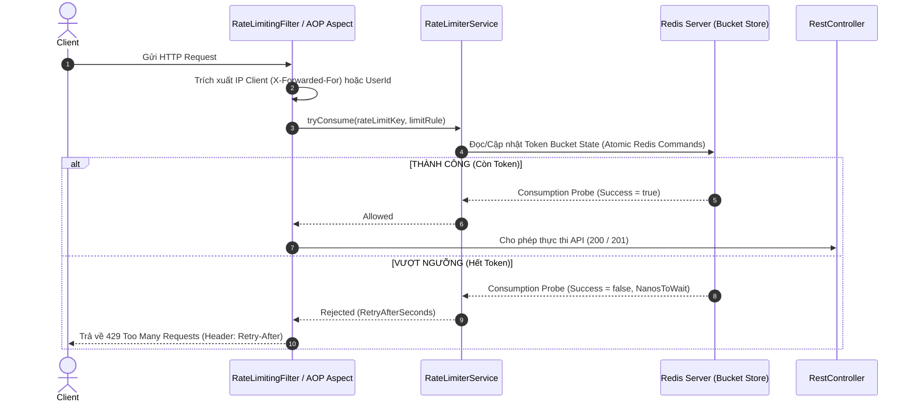

# 🛡️ CẨM NANG TỰ THỰC THI (MASTER SELF-IMPLEMENTATION PLAN)
## TASK 9: RATE LIMITING & API PROTECTION VỚI BUCKET4J + REDIS

> **Mục tiêu:** Tài liệu này giúp bạn tự tay xây dựng tầng **Rate Limiting & API Protection** hoàn chỉnh sử dụng **Bucket4j + Redis** cho ứng dụng Spring Boot 3.5.x & Java 21. 
> 
> **Thành quả thu được:**
> 1. Bảo vệ ứng dụng khỏi các cuộc tấn công **Brute-Force Login**, **Spam OTP** và **DDOS/Crawl sản phẩm**.
> 2. Đảm bảo tính nhất quán của bộ đếm Token trên **Hệ thống phân tán (Distributed System)** nhờ lưu trữ trạng thái Bucket trong Redis.
> 3. Tùy biến giới hạn linh hoạt qua **Annotation `@RateLimit`** hoặc **Spring Security Filter**.

---

## 🗺️ BẢN ĐỒ TỔNG THỂ & THUẬT TOÁN (ARCHITECTURE & ALGORITHM)

### 1. Thuật toán Token Bucket (Token Bucket Algorithm)
```text
  [Refill Engine] ──(Nạp N token mỗi X giây)──> ┌─────────────────────────┐
                                               │      TOKEN BUCKET       │
                                               │ (Sức chứa tối đa: C)   │
                                               │  🪙  🪙  🪙  🪙  🪙      │
                                               └───────────┬─────────────┘
                                                           │
 [Client Request] ─────────────────────────────────────────┼──(Rút 1 Token)
                                                           │
                                             ┌─────────────┴─────────────┐
                                             ▼                           ▼
                                   [Còn Token trong Xô]        [Hết Token (Xô rỗng)]
                                             │                           │
                                             ▼                           ▼
                                      [200 OK / 201 Created]    [429 Too Many Requests]
                                                                (Header: Retry-After)
```

### 2. Luồng Xử Lý Request Runtime (Filter / Interceptor Flow)


---

## 🧭 CÁC GIAI ĐOẠN THỰC THI (5 GIAI ĐOẠN)

---

### 📍 GIAI ĐOẠN 1: BỔ SUNG DEPENDENCY & CẤU HÌNH `application.yml`

#### 1. Thêm dependency vào `pom.xml`:
* Mở [pom.xml](file:///Users/andy2015bui/Desktop/mini-ecommerce/pom.xml) và thêm thư viện Bucket4j Redis:
```xml
<!-- Bucket4j Core & Lettuce Redis Provider -->
<dependency>
    <groupId>com.bucket4j</groupId>
    <artifactId>bucket4j-core</artifactId>
    <version>8.10.1</version>
</dependency>
<dependency>
    <groupId>com.bucket4j</groupId>
    <artifactId>bucket4j-redis</artifactId>
    <version>8.10.1</version>
</dependency>
```

#### 2. Cấu hình ngưỡng Rate Limit trong `application.yml`:
* Mở `src/main/resources/application.yml` và bổ sung section `app.rate-limit`:
```yaml
app:
  rate-limit:
    enabled: true
    rules:
      login:
        capacity: 5
        refill-tokens: 5
        duration-minutes: 15
      otp:
        capacity: 3
        refill-tokens: 3
        duration-minutes: 5
      public-api:
        capacity: 60
        refill-tokens: 60
        duration-minutes: 1
```

---

### 📍 GIAI ĐOẠN 2: THIẾT KẾ ANNOTATION `@RateLimit` & ENUM QUY TẮC

#### 1. Tạo Enum `RateLimitType.java`
* Thư mục: `src/main/java/com/devfat/mini_ecommerce/shared/ratelimit/RateLimitType.java`
* Định nghĩa các nhóm quy tắc giới hạn:
  - `LOGIN`: Dành cho API Đăng nhập (5 req / 15 phút / IP).
  - `OTP`: Dành cho API OTP (3 req / 5 phút / IP).
  - `PUBLIC_API`: Dành cho API công khai như xem danh sách Sản phẩm/Danh mục (60 req / 1 phút / IP).
  - `USER_ACTION`: Dành cho các thao tác cá nhân của User đã đăng nhập (30 req / 1 phút / UserId).

#### 2. Tạo Annotation `@RateLimit.java`
* Thư mục: `src/main/java/com/devfat/mini_ecommerce/shared/ratelimit/RateLimit.java`
* Khai báo `@Target(ElementType.METHOD)`, `@Retention(RetentionPolicy.RUNTIME)`:
```java
package com.devfat.mini_ecommerce.shared.ratelimit;

import java.lang.annotation.*;

@Target(ElementType.METHOD)
@Retention(RetentionPolicy.RUNTIME)
@Documented
public @interface RateLimit {
    RateLimitType type() default RateLimitType.PUBLIC_API;
    
    /**
     * Nếu true: Phân biệt theo IP Client.
     * Nếu false: Phân biệt theo UserId của User đã đăng nhập.
     */
    boolean byIp() default true;
}
```

---

### 📍 GIAI ĐOẠN 3: XÂY DỰNG `RateLimiterService.java`

* Thư mục: `src/main/java/com/devfat/mini_ecommerce/shared/ratelimit/RateLimiterService.java`
* Khai báo `@Service`, `@RequiredArgsConstructor`, `@Slf4j`.
* **Nhiệm vụ chính**:
  1. Sử dụng `RedisTemplate<String, byte[]>` hoặc `ProxyManager<String>` của Bucket4j kết hợp Redis.
  2. Tạo/Lấy Bucket tương ứng với Key (ví dụ: `rate_limit:login:192.168.1.1` hoặc `rate_limit:user:42`).
  3. Phương thức `tryConsume(String key, RateLimitType type)` trả về kết quả `ConsumptionProbe` (chứa `isConsumed()` và `getNanosToWait()`).

---

### 📍 GIAI ĐOẠN 4: THIẾT KẾ AOP ASPECT HỖ TRỢ ANNOTATION `@RateLimit`

* Thư mục: `src/main/java/com/devfat/mini_ecommerce/shared/ratelimit/RateLimitingAspect.java`
* Khai báo `@Aspect`, `@Component`, `@Order(1)`.
* Phương thức `@Around("@annotation(rateLimit)")`:
  1. Lấy thông tin Client IP (từ Request Header `X-Forwarded-For` hoặc `request.getRemoteAddr()`).
  2. Xây dựng Key định danh:
     * Nếu `byIp = true`: `key = "rate_limit:" + type + ":ip:" + clientIp`.
     * Nếu `byIp = false`: `key = "rate_limit:" + type + ":user:" + currentUserId`.
  3. Gọi `rateLimiterService.tryConsume(key, type)`.
  4. **Nếu vượt ngưỡng**: Ném `TooManyRequestsException` (chứa thông tin `retryAfterSeconds`).

---

### 📍 GIAI ĐOẠN 5: GÁN ANNOTATION BẢO VỆ CONTROLLERS & TEST BIÊN DỊCH

#### 1. Gán Annotation vào các Controller Methods:
* **Trong `AuthController.java`**:
  - `@RateLimit(type = RateLimitType.LOGIN, byIp = true)` trên method `login`.
  - `@RateLimit(type = RateLimitType.OTP, byIp = true)` trên method `verifyOtp` và `resendOtp`.
* **Trong `ProductController.java`**:
  - `@RateLimit(type = RateLimitType.PUBLIC_API, byIp = true)` trên method `getAll`.

#### 2. Kiểm thử biên dịch:
Mở Terminal và chạy lệnh:
```bash
./mvnw clean test-compile
```

---

## 🧪 HƯỚNG DẪN KIỂM THỬ XÁC NHẬN (VERIFICATION PLAN)

1. **Khởi chạy ứng dụng**: `./mvnw spring-boot:run`
2. **Kiểm thử API Login**:
   * Dùng Postman hoặc `curl` gửi 6 request liên tiếp vào `POST /api/v1/auth/login`:
   * **Request 1 -> 5**: Trả về `200 OK` (hoặc `401 Unauthorized` nếu mật khẩu sai, nhưng vẫn tính là đã consume token).
   * **Request thứ 6**: Trả về `429 Too Many Requests` với body:
     ```json
     {
       "status": 429,
       "message": "Too many requests. Please try again in 899 seconds.",
       "data": null
     }
     ```
   * Kiểm tra Header Response có `Retry-After: 899`.
