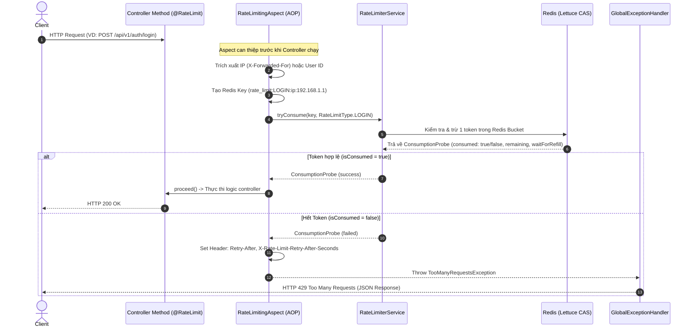

# TÀI LIỆU KỸ THUẬT & CÂU HỎI PHỎNG VẤN VỀ RATE LIMITING (SPRING BOOT + BUCKET4J + REDIS)

Document này tổng hợp chi tiết từ kiến thức nền tảng, thiết kế hệ thống, giải thích code thực tế trong dự án **Mini Ecommerce**, cho đến các câu hỏi phỏng vấn thực chiến chuyên sâu.

---

## 1. TỔNG QUAN VỀ RATE LIMITING (WHAT & WHY)

### 1.1. Rate Limiting là gì?
**Rate Limiting** (Giới hạn tần suất truy cập) là kỹ thuật kiểm soát số lượng request mà một client (người dùng, IP, API key) được phép gửi đến hệ thống trong một khoảng thời gian xác định (ví dụ: tối đa 5 request / 15 phút cho API Login, 60 request / 1 phút cho Public API).

### 1.2. Tại sao dự án Mini Ecommerce cần Rate Limiting?
1. **Chống tấn công Brute-Force & Credential Stuffing**: Ngăn chặn kẻ tấn công tự động dò thử mật khẩu tài khoản ở API Login (`/api/v1/auth/login`).
2. **Chống lạm dụng gửi OTP / Spam Email**: API đăng ký/xác thực tài khoản gửi OTP (`/api/v1/auth/send-otp`) tốn chi phí và tài nguyên hệ thống; cần giới hạn chặt chẽ (ví dụ 3 lượt / 5 phút).
3. **Bảo vệ hệ thống khỏi DDoS & Spike Traffic**: Đảm bảo các API công khai (xem sản phẩm, danh mục) không bị cào dữ liệu (web scraping) hoặc bị quá tải làm sập server.
4. **Đảm bảo tính công bằng (Fairness)**: Ngăn 1 client chiếm dụng toàn bộ tài nguyên của hệ thống, ảnh hưởng đến các người dùng khác.

---

## 2. THUẬT TOÁN & LÝ DO CHỌN BUCKET4J + REDIS

### 2.1. Thuật toán Token Bucket (Thùng chứa Token)
Dự án sử dụng thư viện **Bucket4j**, hoạt động theo thuật toán **Token Bucket**:
- Mỗi client sở hữu một "thùng" (Bucket) có dung tích tối đa $C$ (Capacity).
- Theo thời gian, hệ thống tự động bơm thêm $R$ token vào thùng sau mỗi khoảng thời gian $T$ (Refill rate).
- Mỗi khi có 1 request đến:
  - Nếu thùng còn token ($\ge 1$): Request được **chấp nhận**, 1 token bị trừ khỏi thùng.
  - Nếu thùng hết token ($= 0$): Request bị **từ chối ngay lập tức** (trả về lỗi HTTP `429 Too Many Requests`).

**So sánh với các thuật toán khác**:
- **Fixed Window**: Dễ bị hiện tượng "Spike traffic" ở ranh giới giữa 2 cửa sổ thời gian.
- **Sliding Window Log**: Tốn bộ nhớ vì phải lưu lịch sử của từng request.
- **Token Bucket**: Cân bằng xuất sắc giữa việc cho phép đột biến lượng request nhỏ (Burst support) và đảm bảo tần suất trung bình ổn định, bộ nhớ lưu trữ cực kỳ nhẹ (chỉ lưu số lượng token hiện tại + timestamp lần nạp cuối).

### 2.2. Tại sao lại dùng Redis (Lettuce) kết hợp Bucket4j thay vì In-Memory Local?
- **In-Memory Local Rate Limit (Caffeine/Guava)**: Chỉ chạy trên 1 instance JVM duy nhất. Khi hệ thống scale ngang (Horizontal Scaling) lên $N$ instance đằng sau Load Balancer, client có thể vượt giới hạn gấp $N$ lần bằng cách gửi request luân phiên qua các instance khác nhau.
- **Distributed Rate Limit với Redis**:
  - State của các Bucket được lưu tập trung trên **Redis**. Tất cả các instance Spring Boot đều truy vấn chung 1 nguồn dữ liệu duy nhất.
  - Bucket4j sử dụng các thao tác nguyên tử (**Atomic CAS / Lua Script**) trên Redis thông qua driver **Lettuce**, đảm bảo không xảy ra race condition khi có hàng trăm request đồng thời.

---

## 3. KIẾN TRÚC VÀ LUỒNG HOẠT ĐỘNG TRONG DỰ ÁN

### 3.1. Luồng xử lý một Request (Execution Flow)



---

## 4. GIẢI THÍCH CHI TIẾT CÁC COMPONENT CODE

### 4.1. `@RateLimit` Annotation ([RateLimit.java](file:///Users/andy2015bui/Desktop/mini-ecommerce/src/main/java/com/devfat/mini_ecommerce/shared/ratelimit/RateLimit.java))
Annotation đánh dấu trên method Controller để bật tính năng Rate Limiting.
- `type`: Loại quy tắc rate limit (`LOGIN`, `OTP`, `PUBLIC_API`, `USER_ACTION`).
- `byIp`: `true` -> định danh theo IP client; `false` -> ưu tiên định danh theo `userId` (nếu đã đăng nhập), nếu chưa đăng nhập sẽ fallback về IP.

### 4.2. `RateLimitType` Enum ([RateLimitType.java](file:///Users/andy2015bui/Desktop/mini-ecommerce/src/main/java/com/devfat/mini_ecommerce/shared/ratelimit/RateLimitType.java))
Định nghĩa cấu hình mặc định (fallback):
- **`LOGIN`**: Tối đa 5 lượt / 15 phút.
- **`OTP`**: Tối đa 3 lượt / 5 phút.
- **`PUBLIC_API`**: Tối đa 60 lượt / 1 phút.
- **`USER_ACTION`**: Tối đa 30 lượt / 1 phút.

### 4.3. Dynamic Config với `application.yml` ([RateLimitProperties.java](file:///Users/andy2015bui/Desktop/mini-ecommerce/src/main/java/com/devfat/mini_ecommerce/shared/ratelimit/RateLimitProperties.java))
Cho phép ghi đè (override) ngưỡng Rate Limit qua file cấu hình `application.yml` mà không cần sửa code Java:
```yaml
app:
  rate-limit:
    enabled: true
    rules:
      login:
        capacity: 5
        refill-tokens: 5
        duration-minutes: 15
      otp:
        capacity: 3
        refill-tokens: 3
        duration-minutes: 5
```

### 4.4. Proxy Manager Bean ([RateLimitConfig.java](file:///Users/andy2015bui/Desktop/mini-ecommerce/src/main/java/com/devfat/mini_ecommerce/shared/ratelimit/RateLimitConfig.java))
Khởi tạo `LettuceBasedProxyManager<byte[]>` kết nối với Redis qua Lettuce driver. Cấu hình chiến lược hết hạn chìa khóa trong Redis via `ClientSideConfig`:
```java
return LettuceBasedProxyManager.builderFor(connection)
        .withClientSideConfig(
                ClientSideConfig.getDefault()
                        .withExpirationAfterWriteStrategy(
                                ExpirationAfterWriteStrategy.basedOnTimeForRefillingBucketUpToMax(
                                        Duration.ofMinutes(30)
                                )
                        )
        )
        .build();
```

### 4.5. Handling Service ([RateLimiterService.java](file:///Users/andy2015bui/Desktop/mini-ecommerce/src/main/java/com/devfat/mini_ecommerce/shared/ratelimit/RateLimiterService.java))
- Kiểm tra xem cấu hình rule trong `application.yml` có tồn tại không. Nếu có thì lấy từ YAML, nếu không sẽ dùng default từ Enum.
- Gọi `proxyManager.builder().build(keyBytes, configSupplier)` và `tryConsumeAndReturnRemaining(1)` để trừ token trong Redis.

### 4.6. Aspect AOP ([RateLimitingAspect.java](file:///Users/andy2015bui/Desktop/mini-ecommerce/src/main/java/com/devfat/mini_ecommerce/shared/ratelimit/RateLimitingAspect.java))
- Bắt tất cả các method được gắn `@RateLimit`.
- Xử lý trích xuất IP client thông qua các header proxy như `X-Forwarded-For`, `X-Real-IP` (nếu app nằm sau Nginx, Reverse Proxy hoặc Cloudflare).
- Nếu hết token: tính số giây cần chờ (`retryAfterSeconds`), đặt header `Retry-After` và ném ra `TooManyRequestsException`.

### 4.7. Exception & Global Response ([GlobalExceptionHandler.java](file:///Users/andy2015bui/Desktop/mini-ecommerce/src/main/java/com/devfat/mini_ecommerce/shared/exception/GlobalExceptionHandler.java))
- Bắt `TooManyRequestsException`, trả về HTTP Status `429 TOO_MANY_REQUESTS`.
- Body JSON trả về cho Client:
```json
{
  "success": false,
  "message": "Bạn đã gửi quá nhiều yêu cầu. Vui lòng thử lại sau 300 giây.",
  "data": null,
  "timestamp": "2026-08-08T23:00:00"
}
```

---

## 5. ƯU ĐIỂM VÀ NHƯỢC ĐIỂM CỦA THIẾT KẾ HỆ THỐNG

### 5.1. Ưu điểm (Pros)
1. **Phân tán & Chuẩn xác (Distributed Consistency)**: Đảm bảo giới hạn đúng trên toàn bộ cluster của ứng dụng nhờ Redis.
2. **Khai báo dễ dàng (Declarative via Annotation)**: Chỉ cần thêm `@RateLimit(type = RateLimitType.LOGIN)` trên Controller method là API tự động được bảo vệ.
3. **Tùy biến linh hoạt (Dynamic Thresholds)**: Cấu hình ngưỡng linh hoạt qua `application.yml` mà không cần sửa code/build lại ứng dụng.
4. **Thân thiện với Client & Chuẩn REST API**: Trả về Header chuẩn RFC `Retry-After` cùng mã lỗi HTTP `429`.
5. **Hỗ trợ Reverse Proxy/Load Balancer**: Tự động bóc tách IP chính xác qua `X-Forwarded-For` và `X-Real-IP`.

### 5.2. Nhược điểm & Hướng nâng cấp (Cons & Potential Improvements)
1. **Phụ thuộc vào Redis (Redis Dependency)**: Nếu Redis bị sập hoặc nghẽn mạng, luồng rate limit có thể bị ảnh hưởng.
   - *Giải pháp*: Cần cấu hình Redis Sentinel / Cluster hoặc triển khai cơ chế Fail-Open (nếu Redis lỗi thì cho phép request đi tiếp thay vì chặn đứng toàn bộ traffic).
2. **Network RTT đến Redis**: Mỗi request gắn `@RateLimit` sẽ tốn thêm khoảng 1-2ms RTT gửi đến Redis.
   - *Giải pháp*: Cực kỳ nhanh vì Redis chạy in-memory, có thể kết hợp Local L1 Cache nếu lượng traffic cực lớn (Millions RPS).

---

## 6. HƯỚNG DẪN SỬ DỤNG VÀ THỰC HÀNH

### Ví dụ 1: Bảo vệ API Login
```java
@PostMapping("/login")
@RateLimit(type = RateLimitType.LOGIN, byIp = true)
public ResponseEntity<ApiResponse<AuthResponseDto>> login(@Valid @RequestBody LoginRequestDto request) {
    return ResponseEntity.ok(ApiResponse.success(authService.login(request)));
}
```

### Ví dụ 2: Bảo vệ API gửi OTP xác thực
```java
@PostMapping("/send-otp")
@RateLimit(type = RateLimitType.OTP, byIp = true)
public ResponseEntity<ApiResponse<Void>> sendOtp(@RequestParam String email) {
    authService.sendOtp(email);
    return ResponseEntity.ok(ApiResponse.success(null));
}
```

---

## 7. BỘ CÂU HỎI PHỎNG VẤN THỰC CHIẾN (INTERVIEW QUESTIONS & ANSWERS)

### Q1: Rate Limit là gì và tại sao em lại triển khai Rate Limit trong dự án Mini Ecommerce?
> **Trả lời:**
> Rate Limit là cơ chế kiểm soát tần suất request mà một client có thể gửi đến hệ thống trong một khoảng thời gian.
> Em triển khai Rate Limit cho dự án Mini Ecommerce nhằm 4 mục đích chính:
> 1. Chống Brute-force mật khẩu ở API `/login`.
> 2. Chống lạm dụng gửi spam OTP ở API `/send-otp`.
> 3. Chống web-scraping và quá tải cho các Public API lấy thông tin sản phẩm.
> 4. Bảo vệ hệ thống khỏi các đợt bùng nổ traffic bất thường (Spike Traffic) hoặc tấn công DoS.

### Q2: Tại sao em lại chọn Redis kết hợp với Bucket4j mà không dùng Rate Limiter Local (như Guava RateLimiter hay Resilience4j)?
> **Trả lời:**
> Vì dự án hướng tới kiến trúc Microservices / Multi-instance (Scale ngang).
> Nếu dùng Rate Limiter Local trong bộ nhớ JVM (như Guava hay Resilience4j), state của Rate Limit bị phân tán riêng lẻ ở từng instance. Khi hệ thống có 5 instance đứng sau Load Balancer, client có thể lách luật bằng cách gửi request xoay vòng qua 5 instance, dẫn đến vượt giới hạn gấp 5 lần.
> Việc kết hợp **Bucket4j với Redis (Lettuce)** giúp tập trung toàn bộ state của Bucket lên Redis. Mọi instance Spring Boot đều dùng chung một bộ đếm chuẩn xác trên Redis với các thao tác Atomic (CAS/Lua script), đảm bảo an toàn tuyệt đối về mặt dữ liệu và tính nhất quán (Thread-safe & Distributed-safe).

### Q3: Thuật toán Token Bucket hoạt động ra sao? Tại sao em chọn nó thay vì Fixed Window?
> **Trả lời:**
> Thuật toán Token Bucket quản lý một thùng đựng token với dung tích $C$. Sau mỗi khoảng thời gian $T$, hệ thống sẽ tự động nạp $R$ token vào thùng. Mỗi request đến sẽ tiêu tốn 1 token. Nếu hết token, request bị từ chối ngay.
> Em chọn Token Bucket vì:
> - **Hỗ trợ xử lý đợt bùng nổ nhỏ (Burst Traffic)**: Người dùng có thể dùng hết $C$ token trong vài giây đầu nếu họ chưa từng gửi request trước đó, sau đó tần suất sẽ bị giới hạn theo tốc độ nạp (Refill rate).
> - **Khắc phục nhược điểm của Fixed Window**: Fixed Window dễ bị bùng nổ gấp đôi giới hạn ở thời điểm ranh giới giữa 2 window (ví dụ 59s và 01s tiếp theo). Token Bucket giải quyết triệt để vấn đề này một cách mượt mà.

### Q4: Em phân biệt các Client như thế nào? Xử lý trường hợp Client đứng sau Reverse Proxy (Nginx/Cloudflare) ra sao?
> **Trả lời:**
> Em tạo key lưu trữ trên Redis theo định dạng: `rate_limit:{TYPE}:ip:{IP}` hoặc `rate_limit:{TYPE}:user:{USER_ID}`.
> Để lấy IP chính xác của Client khi app nằm sau Nginx hoặc Cloudflare, em trích xuất theo thứ tự ưu tiên trong `RateLimitingAspect`:
> 1. Header `X-Forwarded-For` (lấy IP đầu tiên trong chuỗi danh sách proxy).
> 2. Header `X-Real-IP`.
> 3. `request.getRemoteAddr()` (fallback khi gọi trực tiếp).

### Q5: Khi một Client vượt quá ngưỡng Rate Limit, hệ thống của em phản hồi như thế nào?
> **Trả lời:**
> Hệ thống sẽ:
> 1. Trả về mã HTTP Status Code **`429 Too Many Requests`**.
> 2. Đặt thêm Header chuẩn RFC: `Retry-After: <số_giây_cần_chờ>` và `X-Rate-Limit-Retry-After-Seconds`.
> 3. Trả về JSON Body thống nhất theo chuẩn `ApiResponse`:
>    `{"success": false, "message": "Bạn đã gửi quá nhiều yêu cầu. Vui lòng thử lại sau X giây."}`

### Q6: Nếu Redis Server gặp sự cố (Down), hệ thống Rate Limiter của em xử lý ra sao?
> **Trả lời:**
> Hiện tại, nếu kết nối Redis lỗi, hệ thống sẽ ném ra Exception (Fail-Closed).
> Tuy nhiên, trong thực tế sản xuất (Production Ready), em đề xuất cấu hình cơ chế **Fail-Open** bằng cách bọc khối try-catch xung quanh `tryConsume`. Nếu không thể kết nối Redis, log cảnh báo (WARN) và cho phép request đi tiếp (`joinPoint.proceed()`) để tránh việc sự cố của Redis làm sập toàn bộ dịch vụ của người dùng cuối.

### Q7: Làm sao em thay đổi ngưỡng Rate Limit mà không cần phải sửa code Java hay re-deploy ứng dụng?
> **Trả lời:**
> Em thiết kế class `RateLimitProperties` sử dụng `@ConfigurationProperties(prefix = "app.rate-limit")`.
> Nhờ đó, em có thể cấu hình và tùy chỉnh các tham số `capacity`, `refillTokens`, `durationMinutes` trực tiếp trong file `application.yml` hoặc nạp qua biến môi trường (Environment Variables). `RateLimiterService` sẽ ưu tiên kiểm tra cấu hình trong `application.yml` trước khi dùng giá trị mặc định trong Enum.
