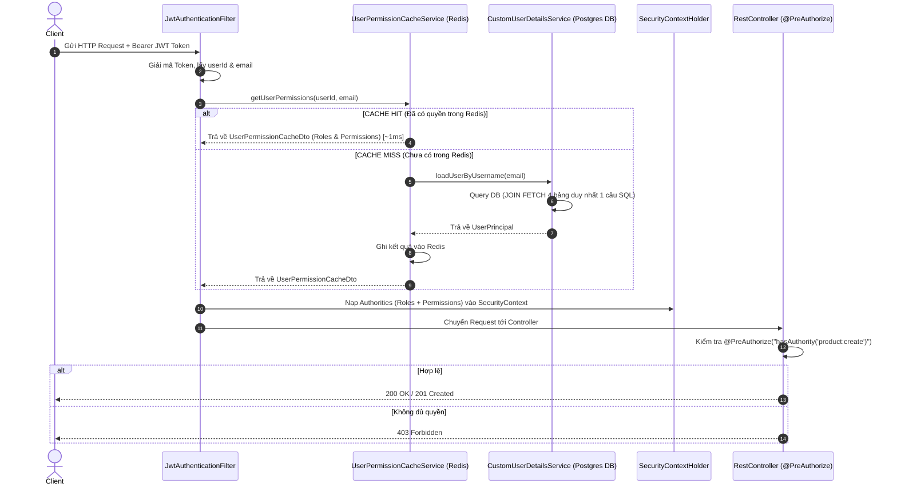

# 🛡️ CẨM NANG TOÀN DIỆN VỀ DYNAMIC RBAC & REDIS CACHING

---

## 1. RBAC LÀ GÌ? (Role-Based Access Control)

**RBAC (Role-Based Access Control)** là phương pháp phân quyền dựa trên **Vai trò (Role)** của người dùng thay vì gán trực tiếp từng quyền hạn cho từng tài khoản cá nhân.

* **Cách tiếp cận cũ (Static Role / Enum Role)**: Bảng `users` có cột `role = 'ADMIN'` hoặc `'USER'`. Trong code kiểm tra `@PreAuthorize("hasRole('ADMIN')")`.
  * *Nhược điểm*: Cứng nhắc. Khi muốn tạo role mới (vd: `CONTENT_MANAGER`, `SUPPORT_STAFF`) hoặc thay đổi quyền của `USER` thì phải **sửa lại source code và deploy lại toàn bộ ứng dụng**.
* **Cách tiếp cận hiện đại (Dynamic 2-Tier RBAC - Dự án của chúng ta)**:
  * Người dùng (**User**) $\rightarrow$ Sở hữu các **Role** (Vai trò).
  * Vai trò (**Role**) $\rightarrow$ Sở hữu các **Permission** (Quyền hạn nguyên tử như `product:create`, `order:manage`).
  * Admin có thể **tạo Role mới, thêm/bớt Permission vào Role, hoặc gán Role cho User** thông qua REST API **ngay tại runtime** mà không cần khởi động lại Server!

---

## 2. NGUYÊN LÝ & LUỒNG HOẠT ĐỘNG (ARCHITECTURE & FLOW)

### A. Mô Hình CSDL 4 Bảng (Tích hợp 2 quan hệ Nhiều-Nhiều)

```text
               ┌──────────────┐
               │    users     │ (Người dùng)
               └──────┬───────┘
                      │ N
               ┌──────┴───────┐
               │  user_roles  │ (Bảng trung gian N-N: user_id, role_id)
               └──────┬───────┘
                      │ N
               ┌──────┴───────┐
               │    roles     │ (Vai trò: ADMIN, USER, STAFF, MANAGER, ...)
               └──────┬───────┘
                      │ N
               ┌──────┴───────┐
               │role_permission│ (Bảng trung gian N-N: role_id, permission_id)
               └──────┬───────┘
                      │ N
               ┌──────┴───────┐
               │ permissions  │ (Quyền hạn: product:create, rbac:manage, ...)
               └──────────────┘
```

### B. Sơ đồ Luồng Xử Lý Request Runtime (Stateless JWT + Redis Cache)



---

## 3. CÁC BƯỚC IMPLEMENT TÍNH NĂNG NÀY TRONG DỰ ÁN

1. **Bước 1: Thiết kế Database & Seed Data**:
   * Tạo 4 bảng chính (`users`, `roles`, `permissions`, `user_roles`, `role_permissions`) trong file [V1__init_mini_shop.sql](file:///Users/andy2015bui/Desktop/mini-ecommerce/src/main/resources/db/migration/V1__init_mini_shop.sql).
   * Khởi tạo sẵn Seed Data cho `roles` (`ADMIN`, `USER`) và `permissions` (`product:create`, `rbac:manage`, ...).
2. **Bước 2: Xây dựng JPA Entities & Repositories**:
   * Tạo [RoleEntity.java](file:///Users/andy2015bui/Desktop/mini-ecommerce/src/main/java/com/devfat/mini_ecommerce/user/internal/RoleEntity.java), [PermissionEntity.java](file:///Users/andy2015bui/Desktop/mini-ecommerce/src/main/java/com/devfat/mini_ecommerce/user/internal/PermissionEntity.java), cập nhật [UserEntity.java](file:///Users/andy2015bui/Desktop/mini-ecommerce/src/main/java/com/devfat/mini_ecommerce/user/internal/UserEntity.java).
   * Trong [UserRepository.java](file:///Users/andy2015bui/Desktop/mini-ecommerce/src/main/java/com/devfat/mini_ecommerce/user/internal/UserRepository.java), viết query JPQL `findByEmailWithRolesAndPermissions` dùng `LEFT JOIN FETCH` nạp toàn bộ 4 bảng trong **1 truy vấn SQL duy nhất**.
3. **Bước 3: Tích hợp Spring Security SecurityContext**:
   * Cập nhật [UserPrincipal.java](file:///Users/andy2015bui/Desktop/mini-ecommerce/src/main/java/com/devfat/mini_ecommerce/shared/security/UserPrincipal.java) gom cả Role (tiền tố `ROLE_`) và Permission vào `GrantedAuthority`.
4. **Bước 4: Thiết kế Redis Authorization Caching Layer**:
   * Tạo [UserPermissionCacheDto.java](file:///Users/andy2015bui/Desktop/mini-ecommerce/src/main/java/com/devfat/mini_ecommerce/user/dto/UserPermissionCacheDto.java) (`Serializable`).
   * Viết [UserPermissionCacheService.java](file:///Users/andy2015bui/Desktop/mini-ecommerce/src/main/java/com/devfat/mini_ecommerce/user/internal/UserPermissionCacheService.java) chứa `@Cacheable` để cache quyền và `@CacheEvict` để xóa cache khi Admin thay đổi quyền.
5. **Bước 5: Viết Admin Management APIs & Bảo vệ Endpoints**:
   * Tạo [RbacAdminController.java](file:///Users/andy2015bui/Desktop/mini-ecommerce/src/main/java/com/devfat/mini_ecommerce/user/RbacAdminController.java) cung cấp 5 APIs quản lý RBAC.
   * Cập nhật các Controller như [ProductController.java](file:///Users/andy2015bui/Desktop/mini-ecommerce/src/main/java/com/devfat/mini_ecommerce/product/ProductController.java) sử dụng `@PreAuthorize("hasAuthority('product:create') or hasRole('ADMIN')")`.

---

## 4. TẠI SAO LẠI DÙNG REDIS ĐỂ LƯU AUTHORIZATION CACHE?

* **Vấn đề nếu KHÔNG dùng Redis**: Với kiến trúc Stateless JWT, mỗi API request gửi lên từ Client đều trải qua Security Filter kiểm tra quyền. Nếu không cache, ứng dụng phải **JOIN 4 bảng Postgres ở MỌI REQUEST** $\rightarrow$ Làm quá tải Database và kéo dài latency của ứng dụng.
* **Giải pháp với Redis Cache**:
  1. **Tốc độ cực nhanh (In-Memory)**: Truy xuất Redis lấy thông tin phân quyền mất $\sim 1\text{ms}$, nhanh gấp 10-50 lần so với query RDBMS.
  2. **Giảm tải 90-99% truy vấn cho RDBMS**: Database Postgres chỉ làm nhiệm vụ ghi dữ liệu và phục vụ nghiệp vụ chính.
  3. **Đồng bộ trên Hệ thống Phân tán (Distributed Systems)**: Ngay cả khi bạn mở rộng ứng dụng lên nhiều Instance (Microservices / Multi-node), tất cả đều dùng chung 1 Redis Cache trung tâm.

### Chiến lược Evict Cache (Xóa Cache khi dữ liệu thay đổi):
* **Sửa Role của 1 User cụ thể**: Gọi `@CacheEvict(value = "user-permissions", key = "#userId")` $\rightarrow$ Chỉ xóa cache của duy nhất User đó.
* **Sửa Permission của 1 Role**: Gọi `@CacheEvict(value = "user-permissions", allEntries = true)` $\rightarrow$ Hủy toàn bộ cache quyền trong hệ thống để tất cả User liên quan đều phải load lại quyền mới nhất từ DB ở request tiếp theo.

---

## 5. ƯU ĐIỂM & NHƯỢC ĐIỂM CỦA MÔ HÌNH RBAC

### 🟢 Ưu điểm:
1. **Linh hoạt & Động (Dynamic Policy)**: Quản trị viên tự do thêm/bớt Role và gán Permission qua API mà không cần sửa code hay rebuild app.
2. **Dễ bảo trì & Quản lý**: Phân tách trách nhiệm rõ ràng (Principle of Least Privilege).
3. **Hiệu năng cao nhờ Redis**: Đảm bảo phản hồi API siêu tốc.

### 🔴 Nhược điểm & Hạn chế:
1. **Không hỗ trợ phân quyền theo ngữ cảnh/dữ liệu thực thể (Data-Level Access Control)**:
   * *Ví dụ*: RBAC trả lời được câu hỏi *"User X có quyền xóa đơn hàng không?"* (`order:delete`).
   * *Nhưng RBAC KHÔNG trả lời được câu hỏi*: *"User X có quyền xóa đơn hàng #123 của User Y hay không?"*.
   * $\rightarrow$ *Giải pháp*: Cần kết hợp thêm **ABAC (Attribute-Based Access Control)** hoặc kiểm tra quyền sở hữu (*Resource Ownership Check*) ở tầng Business Logic (`order.getUserId().equals(currentUserId)`).
2. **Nguy cơ Role Explosion (Bùng nổ Role)**: Nếu chia nhỏ Role quá mức cho từng phòng ban/chức vụ cụ thể, số lượng Role trong DB có thể bùng nổ hàng trăm Role gây khó quản lý.

---

## 🎯 BỘ CÂU HỎI PHỎNG VẤN CHUYÊN SÂU (WITH MODEL ANSWERS)

### ❓ Câu 1: Tại sao bạn lại chọn thiết kế 4 bảng (User - Role - Permission) thay vì dùng 1 cột `role` dạng Enum/String đơn giản trong bảng `users`?
> **Trả lời:**
> * Cách dùng 1 cột `role` dạng Enum thích hợp cho ứng dụng nhỏ, cố định. Tuy nhiên, nó là **Static Authorization** — mỗi khi muốn thêm vai trò mới hoặc đổi quyền của 1 vai trò, chúng ta phải sửa code và redeploy hệ thống.
> * Với thiết kế 4 bảng (User - Role - Permission), ứng dụng đạt được **Dynamic RBAC**. Admin có thể tạo Role mới, gán bớt Permission cho Role ngay tại Runtime thông qua UI/API Admin. Đồng thời, việc tách thành Permission nguyên tử (ví dụ `product:create`, `order:manage`) giúp kiểm tra quyền hạt mịn (fine-grained authorization) dễ dàng hơn nhiều.

---

### ❓ Câu 2: Khi dùng JPA/Hibernate, việc JOIN qua 4 bảng để lấy Quyền của User rất dễ gặp lỗi N+1 Query. Bạn giải quyết bài toán này như thế nào?
> **Trả lời:**
> * Để tránh lỗi N+1 Query khi nạp quan hệ Many-to-Many giữa `User` $\rightarrow$ `Role` $\rightarrow$ `Permission`, em đã viết một câu truy vấn JPQL tùy chỉnh trong `UserRepository` sử dụng `LEFT JOIN FETCH`:
>   ```java
>   @Query("SELECT DISTINCT u FROM UserEntity u " +
>          "LEFT JOIN FETCH u.roles r " +
>          "LEFT JOIN FETCH r.permissions " +
>          "WHERE u.email = :email")
>   Optional<UserEntity> findByEmailWithRolesAndPermissions(@Param("email") String email);
>   ```
> * Nhờ `FETCH`, Hibernate sẽ sinh ra **đúng 1 câu SQL `JOIN` duy nhất** để nạp trọn vẹn đối tượng `User` cùng toàn bộ danh sách `Roles` và `Permissions` của họ trong một lượt gọi DB.

---

### ❓ Câu 3: Làm thế nào bạn giải quyết bài toán Cache Invalidation (Xóa cache cũ) khi Admin thay đổi quyền hạn của Người dùng hoặc Vai trò trong Redis?
> **Trả lời:**
> Em áp dụng 2 cấp độ Eviction dựa trên Spring Cache annotations trong `UserPermissionCacheService`:
> 1. **Cấp độ User (`evictUserPermissions(userId)`)**: Khi Admin đổi vai trò của 1 User cụ thể, em sử dụng `@CacheEvict(value = "user-permissions", key = "#userId")`. Thao tác này chỉ xóa đúng key của User đó trên Redis mà không ảnh hưởng tới các user khác.
> 2. **Cấp độ Role (`evictAllUserPermissions()`)**: Khi Admin thêm/bớt Permission của một Role (ví dụ bớt quyền `product:delete` khỏi role `STAFF`), việc này ảnh hưởng đến toàn bộ user đang mang role `STAFF`. Em sử dụng `@CacheEvict(value = "user-permissions", allEntries = true)` để flush toàn bộ namespace cache phân quyền, ép tất cả user nạp lại quyền chuẩn từ DB ở request tiếp theo.

---

### ❓ Câu 4: Điều gì xảy ra nếu hệ thống Redis bị nock-out (Redis Down)? Ứng dụng của bạn có bị sập theo không?
> **Trả lời:**
> * Trong kiến trúc em thiết kế, Redis đóng vai trò là **Authorization Caching Layer (Tầng đệm)** chứ không phải nơi lưu trữ dữ liệu duy nhất (Source of Truth nằm ở PostgreSQL).
> * Nếu Redis bị sự cố, em có thể cấu hình Spring Cache Catch Exception Fallback (hoặc `@Cacheable` khi gặp lỗi connection sẽ log warning và fallback gọi trực tiếp xuống `CustomUserDetailsService` để query Postgres DB).
> * Nhờ vậy, hệ thống vẫn hoạt động bình thường (High Availability), chỉ có latency của request sẽ tăng lên đôi chút do phải truy vấn RDBMS thay vì đọc In-Memory.

---

### ❓ Câu 5: Trong Spring Security, `@PreAuthorize("hasRole('ADMIN')")` và `@PreAuthorize("hasAuthority('product:create')")` khác nhau như thế nào về mặt bản chất?
> **Trả lời:**
> * Về bản chất, cả `hasRole` và `hasAuthority` đều kiểm tra danh sách `GrantedAuthority` được nạp trong `SecurityContextHolder`.
> * `hasRole('ADMIN')`: Spring Security sẽ tự động thêm tiền tố `ROLE_` vào chuỗi truyền vào để so sánh với authority `ROLE_ADMIN`.
> * `hasAuthority('product:create')`: Spring Security so sánh chính xác chuỗi `product:create` mà không tự động thêm bất kỳ tiền tố nào.
> * Trong dự án của em, `UserPrincipal` nạp cả 2 loại vào `getAuthorities()`: Role có prefix `ROLE_` (dùng cho `hasRole`) và Permission dạng mã code hạt mịn (dùng cho `hasAuthority`), giúp lập trình viên linh hoạt sử dụng cả 2 cách trong `@PreAuthorize`.

---

### ❓ Câu 6: RBAC có hạn chế gì khi kiểm tra quyền sở hữu dữ liệu (Resource Ownership), và bạn sẽ giải quyết ra sao?
> **Trả lời:**
> * **Hạn chế**: RBAC là mô hình Static/Dynamic Role-Permission, nó chỉ trả lời được câu hỏi *"User có quyền chỉnh sửa đơn hàng không?"* chứ không trả lời được *"User có phải là chủ sở hữu của đơn hàng #999 này hay không?"*.
> * **Giải pháp**: 
>   1. **Kiểm tra ở tầng Service Logic**: Sau khi `@PreAuthorize("hasAuthority('order:update')")` thông qua, trong hàm `updateOrder(orderId, currentUser)` em sẽ query `Order` từ DB và kiểm tra `if (!order.getUserId().equals(currentUser.getId())) throw new AccessDeniedException(...)`.
>   2. **Sử dụng Custom Spring Security Expression (ABAC)**: Viết custom `@PreAuthorize("@orderSecurity.isOwner(#orderId, authentication)")` để đánh giá ngữ cảnh dựa trên thuộc tính dữ liệu.
