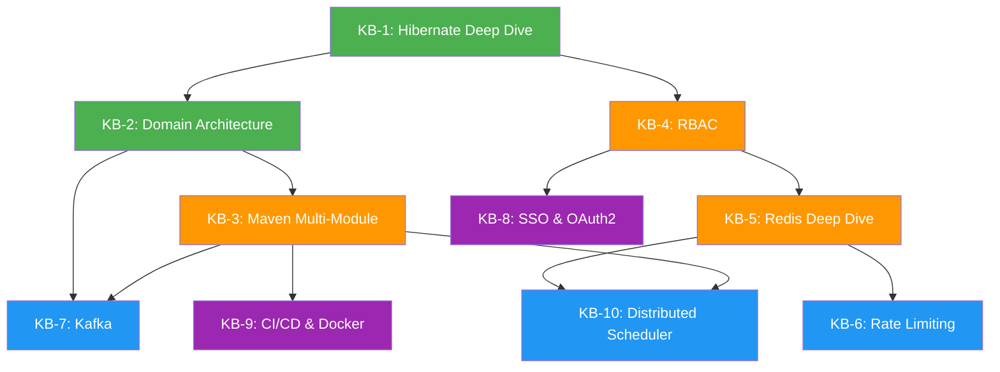

# 🎯 PLAN KỸ THUẬT CHUYÊN SÂU — Mini E-Commerce

> **Triết lý:** Technical vững → Business dễ thở.
> Mỗi Knowledge Block (KB) là một khối kiến thức độc lập, đi từ **"nó là gì?"** → **"bên trong hoạt động ra sao?"** → **"tại sao dùng nó?"** → **"áp dụng vào project thế nào?"**

---

## Mục lục

| KB    | Chủ đề                                                    | Nền tảng cần nắm trước |
| ----- | --------------------------------------------------------- | ---------------------- |
| KB-1  | [JPA/Hibernate Deep Dive & Entity Design](#kb-1)          | SQL cơ bản             |
| KB-2  | [Kiến trúc phân lớp & Module hóa theo Domain](#kb-2)      | KB-1                   |
| KB-3  | [Maven Multi-Module Project](#kb-3)                       | KB-2                   |
| KB-4  | [RBAC — Phân quyền động dưới Database](#kb-4)             | Spring Security cơ bản |
| KB-5  | [Redis Deep Dive — Cache, Session, Token Tracking](#kb-5) | KB-4                   |
| KB-6  | [Rate Limiting & API Protection](#kb-6)                   | KB-5                   |
| KB-7  | [Kafka & Event-Driven Architecture](#kb-7)                | KB-2, KB-3             |
| KB-8  | [SSO & OAuth2 / OpenID Connect](#kb-8)                    | KB-4                   |
| KB-9  | [CI/CD Pipeline, Docker Multi-Env & Jenkins](#kb-9)       | Docker cơ bản          |
| KB-10 | [Scheduler Architecture & Distributed Scheduling](#kb-10) | KB-3, KB-5             |

---

## KB-1: JPA/Hibernate Deep Dive & Entity Design {#kb-1}

> _"Hibernate là framework dễ dùng sai nhất trong Java ecosystem."_ — Vlad Mihalcea

### 1.1 — Bản chất: Hibernate là gì thực sự?

#### Nó là gì?

Hibernate là một **ORM (Object-Relational Mapping)** framework — lớp trung gian dịch giữa thế giới Object (Java) và thế giới Relational (SQL). Nhưng bên dưới, nó phức tạp hơn nhiều so với "tự generate SQL".

#### Cơ chế hoạt động nội bộ — Persistence Context:

```
┌─────────────────────────────────────────────────────┐
│                  EntityManager                       │
│  ┌─────────────────────────────────────────────┐    │
│  │          PERSISTENCE CONTEXT                 │    │
│  │  ┌──────────┐  ┌──────────┐  ┌──────────┐  │    │
│  │  │ Entity A │  │ Entity B │  │ Entity C │  │    │
│  │  │ MANAGED  │  │ MANAGED  │  │ MANAGED  │  │    │
│  │  └──────────┘  └──────────┘  └──────────┘  │    │
│  │                                              │    │
│  │  Dirty Checking ←→ First Level Cache         │    │
│  │  Identity Map ←→ Write-Behind               │    │
│  └─────────────────────────────────────────────┘    │
│                       │                              │
│              flush() / commit()                      │
│                       ▼                              │
│            ┌──────────────────┐                      │
│            │   JDBC / SQL     │                      │
│            └──────────────────┘                      │
└─────────────────────────────────────────────────────┘
```

**4 trạng thái của Entity cần hiểu rõ:**

| Trạng thái    | Mô tả                                                                                    | Ví dụ                                             |
| ------------- | ---------------------------------------------------------------------------------------- | ------------------------------------------------- |
| **Transient** | Mới tạo bằng `new`, chưa có trong DB, chưa được quản lý                                  | `new UserEntity()`                                |
| **Managed**   | Đang được Persistence Context theo dõi. Mọi thay đổi **tự động** sync xuống DB khi flush | `repository.save(entity)` → trả về managed entity |
| **Detached**  | Đã từng managed nhưng EntityManager đóng rồi. Thay đổi **KHÔNG** tự sync                 | Entity sau khi transaction kết thúc               |
| **Removed**   | Đã marked để xóa, sẽ DELETE khi flush                                                    | `repository.delete(entity)`                       |

> [!IMPORTANT]
> **Dirty Checking** là cơ chế cốt lõi: Hibernate snapshot entity lúc load, so sánh với trạng thái hiện tại khi flush → nếu khác → tự sinh UPDATE SQL. Đây là lý do **không cần gọi `save()` sau khi modify entity đang managed** (nhưng gọi cũng không sai, chỉ thừa).

#### Tại sao project hiện tại đang dùng sai một số pattern?

**Vấn đề 1: `@Data` trên Entity**

Lombok `@Data` = `@Getter` + `@Setter` + `@ToString` + `@EqualsAndHashCode` + `@RequiredArgsConstructor`

Vấn đề cụ thể:

- `@ToString` include mọi field → gọi `.toString()` trên entity có `@ManyToOne` LAZY → trigger SELECT → **LazyInitializationException** nếu ngoài transaction
- `@EqualsAndHashCode` dùng tất cả fields → 2 entity cùng row nhưng ở 2 trạng thái khác nhau (trước/sau update) → `equals()` trả `false` → **HashSet, HashMap hỏng**
- Bidirectional `@OneToMany` + `@ManyToOne` → `toString()` gọi qua lại → **StackOverflowError**

**Best practice theo Vlad Mihalcea:**

```java
// ĐÚNG: chỉ dùng @Getter/@Setter, override equals/hashCode theo ID
@Getter @Setter
@Entity
public class ProductEntity {
    @Id @GeneratedValue
    private Long id;

    @Override
    public boolean equals(Object o) {
        if (this == o) return true;
        if (!(o instanceof ProductEntity that)) return false;
        return id != null && id.equals(that.getId());
    }

    @Override
    public int hashCode() {
        return getClass().hashCode(); // constant hashCode — đúng theo Vlad
    }
}
```

> [!NOTE]
> Lý do `hashCode()` return constant: vì entity có thể chuyển từ transient (id=null) sang managed (id=123). Nếu hashCode dựa vào id, thì khi add entity vào Set lúc transient → persist → id thay đổi → hashCode thay đổi → Set không tìm thấy entity nữa.

---

### 1.2 — BaseEntity & JPA Auditing

#### Nó là gì?

`@MappedSuperclass` cho phép tạo class cha chứa các field chung mà **không tạo table riêng** trong DB. Mọi entity kế thừa sẽ **nhận các column đó vào table của mình**.

#### Cơ chế hoạt động:

```
┌─────────────────────────┐
│   @MappedSuperclass     │    ← KHÔNG có table riêng trong DB
│   BaseEntity            │
│   - createdAt           │
│   - updatedAt           │
│   - createdBy           │
│   - updatedBy           │
└──────────┬──────────────┘
           │ extends
    ┌──────┴──────┐
    ▼             ▼
┌──────────┐ ┌──────────┐
│ products │ │  orders  │    ← Mỗi table có 4 column audit
│ + các    │ │ + các    │
│   column │ │   column │
│   riêng  │ │   riêng  │
└──────────┘ └──────────┘
```

**So sánh 3 cách kế thừa trong JPA:**

| Strategy                        | Annotation     | Table                               | Khi nào dùng                               |
| ------------------------------- | -------------- | ----------------------------------- | ------------------------------------------ |
| `@MappedSuperclass`             | Trên class cha | Không tạo table cho cha             | Shared fields, không cần query polymorphic |
| `@Inheritance(SINGLE_TABLE)`    | Trên class cha | 1 table chung, discriminator column | Ít subclass, query nhanh                   |
| `@Inheritance(JOINED)`          | Trên class cha | Mỗi class 1 table, JOIN khi query   | Nhiều subclass, normalized                 |
| `@Inheritance(TABLE_PER_CLASS)` | Trên class cha | Mỗi class 1 table đầy đủ            | Hiếm dùng, UNION khi query                 |

**Tại sao `@MappedSuperclass` phù hợp nhất cho BaseEntity?**
→ Vì chúng ta KHÔNG BAO GIỜ cần query "tất cả BaseEntity" — chúng ta chỉ muốn share column. Các strategy khác tạo ra JOIN hoặc UNION không cần thiết.

#### JPA Auditing — `@CreatedBy` / `@LastModifiedBy` hoạt động thế nào?

```
Request đến → SecurityContext chứa UserPrincipal
                     │
                     ▼
         ┌──────────────────────┐
         │  AuditorAware<String>│ ← Spring gọi bean này để lấy "ai đang thao tác"
         │  getCurrentAuditor() │
         └──────────┬───────────┘
                    │
                    ▼
         ┌──────────────────────┐
         │ AuditingEntityListener│ ← Hibernate event listener
         │ @PrePersist → set    │    intercept trước khi INSERT/UPDATE
         │   createdBy          │
         │ @PreUpdate → set     │
         │   updatedBy          │
         └──────────────────────┘
```

Cần cấu hình:

1. `@EnableJpaAuditing` trên `@Configuration` class
2. Implement `AuditorAware<String>` bean — lấy user hiện tại từ `SecurityContextHolder`
3. `@EntityListeners(AuditingEntityListener.class)` trên `BaseEntity`

---

### 1.3 — Hibernate Association Mapping Best Practices

#### Nguồn gốc: Tham khảo sâu theo Vlad Mihalcea

**Quy tắc #1: `@ManyToOne` là owner — LUÔN LUÔN**

```
Product ←──── @ManyToOne ────→ Category
(owner)                        (inverse)

// Product.java — OWNER side
@ManyToOne(fetch = FetchType.LAZY)    // ← BẮT BUỘC LAZY
@JoinColumn(name = "category_id")
private CategoryEntity category;

// Category.java — INVERSE side (TÙY CHỌN, có thể KHÔNG CẦN)
@OneToMany(mappedBy = "category")
private Set<ProductEntity> products;  // ← Dùng Set, KHÔNG dùng List
```

**Quy tắc #2: `@OneToMany` có cần không? Suy nghĩ kỹ trước khi thêm**

| Tình huống           | Có nên thêm `@OneToMany`? | Lý do                                   |
| -------------------- | ------------------------- | --------------------------------------- |
| Order → OrderItems   | ✅ Nên                    | Số lượng ít, luôn cần load cùng         |
| Category → Products  | ❌ Không nên              | 1 category có thể có hàng nghìn product |
| User → Orders        | ❌ Không nên              | Query từ OrderRepository tốt hơn        |
| Product → OrderItems | ❌ Không nên              | Dùng repository query                   |

> [!WARNING]
> **Anti-pattern trong project hiện tại:** [CategoryEntity.products](file:///Users/andy2015bui/Desktop/mini-ecommerce/src/main/java/com/devfat/mini_ecommerce/entity/CategoryEntity.java#L32-L33) — `@OneToMany` từ Category → Product. Khi có 10,000 products trong 1 category, load Category sẽ kéo theo TẤT CẢ products (nếu ai đó gọi `.getProducts()`). Nên XÓA field này và query từ `ProductRepository.findByCategoryId()` thay thế.

**Quy tắc #3: `List` vs `Set` trong `@OneToMany`**

| Collection | Behavior khi thêm/xóa                               | `MultipleBagFetchException`          |
| ---------- | --------------------------------------------------- | ------------------------------------ |
| `List`     | Hibernate xóa TẤT CẢ rồi INSERT lại khi có thay đổi | ✅ Xảy ra khi fetch 2+ List cùng lúc |
| `Set`      | Hibernate chỉ INSERT/DELETE phần thay đổi           | ❌ Không xảy ra                      |

→ **Luôn dùng `Set` cho `@OneToMany`** (trừ khi cần thứ tự → dùng `@OrderBy`)

**Quy tắc #4: Utility methods cho bidirectional**

```java
// OrderEntity.java
public void addItem(OrderItemEntity item) {
    items.add(item);
    item.setOrder(this);   // ← SYNC cả 2 phía
}

public void removeItem(OrderItemEntity item) {
    items.remove(item);
    item.setOrder(null);
}
```

Tại sao cần? Vì Hibernate chỉ check phía **owner** (`@ManyToOne`) khi persist. Nếu chỉ add vào collection mà không set ngược → DB lưu `order_id = NULL`.

**Quy tắc #5: N+1 Query Problem**

```
// ❌ N+1: 1 query lấy 100 orders + 100 query lấy user cho mỗi order
List<OrderEntity> orders = orderRepository.findAll();
orders.forEach(o -> System.out.println(o.getUser().getFullName()));

// ✅ Giải pháp 1: JOIN FETCH trong JPQL
@Query("SELECT o FROM OrderEntity o JOIN FETCH o.user WHERE o.status = :status")
List<OrderEntity> findByStatusWithUser(@Param("status") OrderStatus status);

// ✅ Giải pháp 2: @EntityGraph
@EntityGraph(attributePaths = {"user", "items"})
List<OrderEntity> findByStatus(OrderStatus status);

// ✅ Giải pháp 3: DTO Projection (tốt nhất cho read-only)
@Query("SELECT new com.devfat.dto.OrderSummary(o.id, o.status, u.fullName) " +
       "FROM OrderEntity o JOIN o.user u")
List<OrderSummary> findOrderSummaries();
```

#### Bài tập áp dụng vào project:

- [ ] Thay `@Data` → `@Getter/@Setter` + override `equals()`/`hashCode()` trên tất cả entity
- [ ] Tạo `BaseEntity` với `@MappedSuperclass` + JPA Auditing
- [ ] Xóa `@OneToMany products` khỏi `CategoryEntity`
- [ ] Đổi `List` → `Set` trong `OrderEntity.items` và `ProductEntity.orderItems`
- [ ] Thêm utility methods `addItem()`/`removeItem()` cho `OrderEntity`
- [ ] Kiểm tra N+1 query bằng cách bật `spring.jpa.properties.hibernate.generate_statistics=true`

---

## KB-2: Kiến trúc phân lớp & Module hóa theo Domain {#kb-2}

### 2.1 — Layer Architecture vs Domain Architecture

#### Layer-based (hiện tại của project):

```
com.devfat.mini_ecommerce/
├── controller/    ← TẤT CẢ controller
├── service/       ← TẤT CẢ service
├── repository/    ← TẤT CẢ repository
├── entity/        ← TẤT CẢ entity
└── dto/           ← TẤT CẢ DTO
```

**Vấn đề cốt lõi:** Khi project lớn lên (20+ entity, 50+ API), việc tìm file liên quan đến "payment" yêu cầu mở **5 folder khác nhau**. Muốn tách "payment" thành microservice → phải mò khắp nơi.

#### Domain-based (nên chuyển sang):

```
com.devfat.mini_ecommerce/
├── product/
│   ├── ProductController.java
│   ├── ProductService.java
│   ├── ProductServiceImpl.java
│   ├── ProductRepository.java
│   ├── ProductEntity.java
│   └── dto/
│       ├── CreateProductRequest.java
│       └── ProductResponse.java
├── payment/
│   ├── PaymentController.java
│   ├── PaymentService.java
│   ├── PaymentRepository.java
│   ├── PaymentEntity.java
│   ├── vnpay/                    ← sub-domain
│   │   ├── VNPayConfig.java
│   │   ├── VNPayUtil.java
│   │   └── VNPayGateway.java
│   └── dto/
└── shared/
    ├── config/
    ├── exception/
    ├── security/
    └── common/
```

#### So sánh 2 kiến trúc:

| Tiêu chí              | Layer-based                          | Domain-based                   |
| --------------------- | ------------------------------------ | ------------------------------ |
| **Tìm file**          | Phải mở 5+ folder                    | Tất cả trong 1 folder          |
| **Tách microservice** | Mò khắp nơi, dễ miss                 | Cut folder → done              |
| **Team work**         | Conflict nhiều (cùng sửa `service/`) | Mỗi người 1 domain             |
| **Hiểu business**     | Khó thấy flow                        | Nhìn folder = hiểu domain      |
| **Coupling**          | Cao (import chéo dễ dàng)            | Thấp (buộc phải qua interface) |
| **Khi nào dùng**      | Project nhỏ, < 10 entity             | Project trung bình-lớn         |

### 2.2 — Nguyên tắc Module hóa: Bounded Context (DDD Lite)

```
┌─────────────────────────────────────────────────┐
│              Mini E-Commerce System              │
│                                                  │
│  ┌──────────┐  ┌──────────┐  ┌──────────────┐  │
│  │ Product  │  │  Order   │  │   Payment    │  │
│  │ Context  │  │ Context  │  │   Context    │  │
│  │          │  │          │  │              │  │
│  │ Product  │←→│ Order    │←→│ Payment      │  │
│  │ Category │  │ OrderItem│  │ VNPay        │  │
│  │          │  │          │  │ (Momo, Zalo) │  │
│  └──────────┘  └──────────┘  └──────────────┘  │
│       ↕              ↕              ↕           │
│  ┌──────────────────────────────────────────┐   │
│  │           Shared / Common                │   │
│  │  Security, Exception, Config, BaseEntity │   │
│  └──────────────────────────────────────────┘   │
└─────────────────────────────────────────────────┘
```

**Quy tắc giao tiếp giữa các domain:**

1. Domain A **KHÔNG import entity** của Domain B
2. Giao tiếp qua **interface/DTO** hoặc **event** (chuẩn bị cho Kafka sau này)
3. Shared code (BaseEntity, ApiResponse, SecurityConfig) nằm trong `shared/`

**Ví dụ: Payment cần biết Order amount**

```java
// ❌ SAI: PaymentService import OrderEntity trực tiếp
OrderEntity order = orderRepository.findById(orderId);
payment.setAmount(order.getTotalAmount());

// ✅ ĐÚNG: PaymentService gọi OrderService qua interface
BigDecimal amount = orderService.getOrderAmount(orderId);
payment.setAmount(amount);
```

### 2.3 — Controller Group theo Admin / User / Public

#### Triết lý đằng sau:

```
┌─────────────────────────────────────────────────────┐
│                    API Gateway                       │
│                                                      │
│  /api/v1/public/**  → Không cần token              │
│  /api/v1/user/**    → Cần JWT, role = USER/ADMIN    │
│  /api/v1/admin/**   → Cần JWT, role = ADMIN         │
│                                                      │
│  SecurityConfig:                                     │
│  .requestMatchers("/api/v1/public/**").permitAll()   │
│  .requestMatchers("/api/v1/admin/**")                │
│       .hasRole("ADMIN")                              │
│  .requestMatchers("/api/v1/user/**")                 │
│       .authenticated()                               │
└─────────────────────────────────────────────────────┘
```

**Lợi ích:**

- Security config **dựa trên URL prefix** thay vì annotation từng method → dễ audit, khó bỏ sót
- `@PreAuthorize` trên từng method là **defense in depth** (lớp bảo vệ thứ 2), không phải lớp duy nhất
- Swagger UI tự group theo tag → dễ đọc API doc

#### Bài tập áp dụng vào project:

- [ ] Refactor package structure từ layer-based → domain-based
- [ ] Tách controller: `admin/AdminProductController`, `user/ProductController`, `public/AuthController`
- [ ] Cập nhật `SecurityConfig` dùng URL prefix thay vì liệt kê từng endpoint
- [ ] Đảm bảo domain không import entity chéo — giao tiếp qua service interface

---

## KB-3: Maven Multi-Module Project {#kb-3}

### 3.1 — Multi-Module là gì? Tại sao cần?

#### Bản chất:

Maven multi-module là cách **chia 1 project lớn thành nhiều artifact (JAR) nhỏ**, mỗi artifact có `pom.xml` riêng, quản lý bởi 1 parent POM.

#### Cơ chế hoạt động:

```
mini-ecommerce/                        ← Parent POM (packaging = pom)
├── pom.xml                            ← Khai báo <modules>, quản lý version
│
├── ecommerce-common/                  ← JAR: DTO, Exception, Util
│   └── pom.xml                        ← <parent> trỏ về parent POM
│
├── ecommerce-core/                    ← JAR: Entity, Repository, Service
│   └── pom.xml                        ← depends on: common
│
├── ecommerce-api/                     ← Spring Boot JAR: REST Controllers
│   └── pom.xml                        ← depends on: core
│
├── ecommerce-web/                     ← Spring Boot JAR: Thymeleaf Admin
│   └── pom.xml                        ← depends on: core
│
└── ecommerce-scheduler/              ← Spring Boot JAR: @Scheduled jobs
    └── pom.xml                        ← depends on: core
```

#### Dependency Graph:

```
              ┌──────────┐
              │  common  │
              └────┬─────┘
                   │
              ┌────▼─────┐
              │   core   │
              └────┬─────┘
                   │
         ┌─────────┼──────────┐
         ▼         ▼          ▼
    ┌────────┐ ┌───────┐ ┌───────────┐
    │  api   │ │  web  │ │ scheduler │
    └────────┘ └───────┘ └───────────┘

    Mỗi cái = 1 JAR riêng = 1 process riêng khi deploy
```

### 3.2 — So sánh: Single Module vs Multi-Module vs Microservice

| Tiêu chí          | Single Module           | Multi-Module            | Microservices             |
| ----------------- | ----------------------- | ----------------------- | ------------------------- |
| **Complexity**    | Thấp                    | Trung bình              | Cao                       |
| **Deploy**        | 1 JAR duy nhất          | Nhiều JAR, cùng repo    | Nhiều repo, nhiều service |
| **Scale**         | Scale cả khối           | Scale từng module       | Scale từng service        |
| **Database**      | 1 DB                    | 1 DB (shared)           | Mỗi service 1 DB          |
| **Team size**     | 1-3 người               | 3-8 người               | 8+ người                  |
| **Refactor**      | Dễ                      | Trung bình              | Khó (distributed)         |
| **Communication** | Method call             | Method call             | HTTP/gRPC/Message Queue   |
| **Transaction**   | Simple `@Transactional` | Simple `@Transactional` | Saga Pattern (phức tạp)   |

> [!IMPORTANT]
> **Lời khuyên:** Project hiện tại phù hợp nhất với **Multi-Module Monolith**. ĐỪNG nhảy thẳng sang microservices — multi-module cho phép tách code rõ ràng mà vẫn giữ được sự đơn giản của monolith. Khi nào traffic thật sự cần → tách module thành microservice rất dễ vì boundary đã rõ.

### 3.3 — Kỹ thuật quan trọng: BOM (Bill of Materials)

```xml
<!-- Parent POM: quản lý version TẬP TRUNG -->
<dependencyManagement>
    <dependencies>
        <dependency>
            <groupId>com.devfat</groupId>
            <artifactId>ecommerce-common</artifactId>
            <version>${project.version}</version>
        </dependency>
        <!-- Tất cả module con KHÔNG cần khai báo <version> -->
    </dependencies>
</dependencyManagement>
```

Tại sao cần? → Tránh **version conflict** khi module A dùng Jackson 2.15, module B dùng Jackson 2.17.

#### Bài tập áp dụng vào project:

- [ ] Hiểu rõ Maven lifecycle: `validate → compile → test → package → verify → install → deploy`
- [ ] Tạo parent POM với `<modules>`
- [ ] Tách `common` (DTO, exception, util) → `core` (entity, repo, service) → `api` (controller)
- [ ] Chạy `mvn clean install` từ root và hiểu dependency resolution
- [ ] Thử deploy `api` và `scheduler` trên 2 port khác nhau

---

## KB-4: RBAC — Phân quyền động dưới Database {#kb-4}

### 4.1 — Các mô hình phân quyền: ACL vs RBAC vs ABAC

#### So sánh tổng quan:

| Model    | Viết tắt                       | Cách hoạt động                                           | Khi nào dùng                             |
| -------- | ------------------------------ | -------------------------------------------------------- | ---------------------------------------- |
| **ACL**  | Access Control List            | Gắn permission trực tiếp vào user                        | Hệ thống nhỏ, ít user                    |
| **RBAC** | Role-Based Access Control      | User → Role → Permission                                 | Đa số hệ thống enterprise                |
| **ABAC** | Attribute-Based Access Control | Policy dựa trên attribute (role + time + location + ...) | Hệ thống phức tạp (ngân hàng, chính phủ) |

#### RBAC — Cơ chế chi tiết:

```
┌──────────────────────────────────────────────────────────────┐
│                     RBAC Model                                │
│                                                               │
│  User ──── M:N ──── Role ──── M:N ──── Permission            │
│                                                               │
│  ┌──────┐       ┌──────────┐       ┌─────────────────────┐   │
│  │ Phát │──────→│  ADMIN   │──────→│ PRODUCT_CREATE      │   │
│  │      │       │          │──────→│ PRODUCT_UPDATE      │   │
│  │      │       │          │──────→│ PRODUCT_DELETE      │   │
│  │      │       │          │──────→│ ORDER_VIEW_ALL      │   │
│  │      │       │          │──────→│ USER_MANAGE         │   │
│  └──────┘       └──────────┘       └─────────────────────┘   │
│                                                               │
│  ┌──────┐       ┌──────────┐       ┌─────────────────────┐   │
│  │Khách │──────→│  USER    │──────→│ PRODUCT_VIEW        │   │
│  │      │       │          │──────→│ ORDER_CREATE        │   │
│  │      │       │          │──────→│ ORDER_VIEW_OWN      │   │
│  └──────┘       └──────────┘       └─────────────────────┘   │
│                                                               │
│  ┌──────┐       ┌──────────┐       ┌─────────────────────┐   │
│  │Shipper│─────→│ SHIPPER  │──────→│ ORDER_VIEW_ASSIGNED │   │
│  │      │       │          │──────→│ ORDER_UPDATE_STATUS │   │
│  └──────┘       └──────────┘       └─────────────────────┘   │
└──────────────────────────────────────────────────────────────┘
```

### 4.2 — Tại sao enum Role hiện tại là "Static RBAC" và tại sao chưa đủ?

**Hiện tại (Static RBAC):**

```java
public enum Role { USER, ADMIN }

@PreAuthorize("hasRole('ADMIN')")  // ← Hardcode trong source code
public ResponseEntity<?> createProduct(...) { }
```

**Vấn đề:**

1. Thêm role `SHIPPER` → sửa enum → sửa TẤT CẢ annotation liên quan → recompile → redeploy
2. CEO muốn cho MODERATOR quyền xem report nhưng không được xóa product → **không làm được** nếu không sửa code
3. Không thể phân quyền runtime (admin dashboard thêm/bớt quyền)

**Dynamic RBAC (cần hướng tới):**

```sql
-- Schema
CREATE TABLE roles (
    id BIGSERIAL PRIMARY KEY,
    name VARCHAR(50) UNIQUE NOT NULL,       -- 'ADMIN', 'MODERATOR', 'SHIPPER'
    description TEXT
);

CREATE TABLE permissions (
    id BIGSERIAL PRIMARY KEY,
    name VARCHAR(100) UNIQUE NOT NULL,      -- 'product:create', 'order:view:all'
    description TEXT
);

CREATE TABLE role_permissions (
    role_id BIGINT REFERENCES roles(id),
    permission_id BIGINT REFERENCES permissions(id),
    PRIMARY KEY (role_id, permission_id)
);

CREATE TABLE user_roles (
    user_id BIGINT REFERENCES users(id),
    role_id BIGINT REFERENCES roles(id),
    PRIMARY KEY (user_id, role_id)
);
```

### 4.3 — Tích hợp với Spring Security

```
Request + JWT
      │
      ▼
┌─────────────────────┐
│ JwtAuthFilter       │ ← Parse JWT, lấy userId
└────────┬────────────┘
         │
         ▼
┌─────────────────────┐
│ CustomUserDetails   │ ← Load user + roles + permissions từ DB
│ Service             │
│                     │    user.getRoles()
│                     │      .forEach(role -> role.getPermissions()
│                     │        .forEach(perm -> authorities.add(
│                     │          new SimpleGrantedAuthority(perm.getName()))))
└────────┬────────────┘
         │
         ▼
┌─────────────────────┐
│ SecurityContext      │ ← Authentication chứa List<GrantedAuthority>
│ authorities =        │    ["product:create", "product:update", "order:view:all"]
│ [product:create,...] │
└────────┬────────────┘
         │
         ▼
┌─────────────────────┐
│ @PreAuthorize(       │ ← Check authority, KHÔNG check role cứng nữa
│ "hasAuthority(       │
│  'product:create')") │
└─────────────────────┘
```

**Key insight:** Chuyển từ check **ROLE** sang check **PERMISSION**. Role chỉ là container nhóm permissions. Admin dashboard quản lý bảng `role_permissions` → thay đổi quyền KHÔNG CẦN sửa code.

#### Bài tập áp dụng vào project:

- [ ] Tạo Flyway migration thêm 4 bảng: `roles`, `permissions`, `role_permissions`, `user_roles`
- [ ] Tạo entity + repository cho Role và Permission
- [ ] Modify `CustomUserDetailsService` để load permissions từ DB
- [ ] Chuyển `@PreAuthorize("hasRole('ADMIN')")` → `@PreAuthorize("hasAuthority('product:create')")`
- [ ] Tạo API admin quản lý roles/permissions (CRUD)
- [ ] Cache permissions trong Redis (KB-5) để tránh query DB mỗi request

---

## KB-5: Redis Deep Dive — Cache, Session, Token Tracking {#kb-5}

### 5.1 — Redis là gì thực sự? Không chỉ là "cache"

#### Bản chất:

Redis = **Remote Dictionary Server** — là in-memory data structure store. KHÔNG CHỈ là cache. Redis hỗ trợ:

| Data Structure | Lệnh                         | Use case                     |
| -------------- | ---------------------------- | ---------------------------- |
| **String**     | `SET`, `GET`, `INCR`         | Cache, counter, rate limit   |
| **Hash**       | `HSET`, `HGET`, `HGETALL`    | Session, user profile        |
| **List**       | `LPUSH`, `RPOP`, `LRANGE`    | Message queue, recent items  |
| **Set**        | `SADD`, `SMEMBERS`, `SINTER` | Tags, unique visitors        |
| **Sorted Set** | `ZADD`, `ZRANGE`, `ZRANK`    | Leaderboard, scheduled tasks |
| **Stream**     | `XADD`, `XREAD`              | Event log, audit trail       |

### 5.2 — Các vai trò của Redis trong project (hiện tại vs mục tiêu)

```
┌─────────────────────────────────────────────────────┐
│                 Redis trong Project                  │
│                                                      │
│  ✅ HIỆN TẠI:                                       │
│  ┌─────────────────────────────────┐                │
│  │ 1. Cache (Spring @Cacheable)    │                │
│  │    - products (TTL 30 min)      │                │
│  │    - categories (TTL 30 min)    │                │
│  │    - analytics (TTL 5 min)      │                │
│  └─────────────────────────────────┘                │
│                                                      │
│  ❌ CẦN BỔ SUNG:                                    │
│  ┌─────────────────────────────────┐                │
│  │ 2. Session/Token Management     │ ← KB-5.3      │
│  │    - Device tracking            │                │
│  │    - IP tracking                │                │
│  │    - Force logout per device    │                │
│  ├─────────────────────────────────┤                │
│  │ 3. Rate Limiting                │ ← KB-6        │
│  │    - Sliding window counter     │                │
│  │    - Token bucket               │                │
│  ├─────────────────────────────────┤                │
│  │ 4. Permission Cache             │ ← KB-4        │
│  │    - Cache RBAC permissions     │                │
│  │    - Invalidate on role change  │                │
│  ├─────────────────────────────────┤                │
│  │ 5. Distributed Lock             │ ← KB-10       │
│  │    - Scheduler chỉ chạy 1 node │                │
│  └─────────────────────────────────┘                │
└─────────────────────────────────────────────────────┘
```

### 5.3 — Token Device/IP Tracking — Thiết kế chi tiết

#### Vấn đề cần giải quyết:

- User đăng nhập từ **nhiều thiết bị** (laptop, điện thoại, tablet)
- Cần biết **thiết bị nào** đang active
- Cần **force logout** 1 thiết bị cụ thể
- Cần **phát hiện** đăng nhập từ IP bất thường

#### Thiết kế Redis data structure:

```
Key:    session:{userId}:{deviceFingerprint}
Type:   Hash
Fields:
  - refreshTokenHash: "abc123..."
  - ip: "192.168.1.100"
  - userAgent: "Chrome/120 Windows 10"
  - deviceName: "Chrome trên Windows"    ← parse từ User-Agent
  - loginAt: "2026-08-05T10:30:00"
  - lastActiveAt: "2026-08-05T12:45:00"
TTL:    = refresh token expiration (7 ngày)

Ví dụ:
  session:42:d8a9f3bc → { ip: "1.2.3.4", userAgent: "...", loginAt: "..." }
  session:42:e7b2c1ad → { ip: "5.6.7.8", userAgent: "...", loginAt: "..." }
```

#### Flow hoạt động:

```
LOGIN:
  Client gửi email + password + User-Agent header
         │
         ▼
  Server xác thực → generate JWT + refreshToken
         │
         ▼
  Tính deviceFingerprint = hash(User-Agent + partial-IP)
         │
         ▼
  Redis: HSET session:{userId}:{fingerprint}
         ip "1.2.3.4" userAgent "..." loginAt "..."
  Redis: EXPIRE session:{userId}:{fingerprint} 604800  (7 days)
         │
         ▼
  Response: { accessToken, refreshToken, deviceId: fingerprint }

──────────────────────────────────────────────────────

VALIDATE REQUEST (trong JwtAuthFilter):
  Lấy userId từ JWT
         │
         ▼
  Lấy deviceId từ JWT claims (hoặc header)
         │
         ▼
  Redis: EXISTS session:{userId}:{deviceId}
         │
    ┌────┴────┐
    │ false   │ true
    │         │
    ▼         ▼
  401       Cập nhật lastActiveAt
  (revoked)  HSET ... lastActiveAt "now"

──────────────────────────────────────────────────────

LIST DEVICES (GET /api/v1/users/me/sessions):
  Redis: SCAN session:{userId}:*
         │
         ▼
  Trả về list: [ { deviceId, ip, deviceName, loginAt, lastActiveAt } ]

──────────────────────────────────────────────────────

REVOKE DEVICE (DELETE /api/v1/users/me/sessions/{deviceId}):
  Redis: DEL session:{userId}:{deviceId}
         │
         ▼
  Next request từ device đó → EXISTS trả false → 401
```

> [!TIP]
> **Tại sao dùng Redis thay vì PostgreSQL cho session?**
>
> - Session data là **ephemeral** (tạm thời) — mất cũng không sao, user login lại
> - Cần check **TỪNG request** → tốc độ Redis (microseconds) >> PostgreSQL (milliseconds)
> - TTL tự động cleanup → không cần scheduler dọn dẹp
> - Dữ liệu tương ứng với Refresh Token chỉ sống tối đa 7 ngày

#### Bài tập áp dụng vào project:

- [ ] Cấu hình `RedisTemplate<String, Object>` (khác với `RedisCacheManager`)
- [ ] Implement login flow lưu session vào Redis Hash
- [ ] Modify `JwtAuthenticationFilter` check session existence
- [ ] API `GET /users/me/sessions` — liệt kê thiết bị
- [ ] API `DELETE /users/me/sessions/{deviceId}` — đăng xuất thiết bị
- [ ] Migrate refresh_token từ PostgreSQL → Redis (optional, có thể giữ cả 2)

---

## KB-6: Rate Limiting & API Protection {#kb-6}

### 6.1 — Rate Limiting là gì? Các thuật toán

#### Tại sao cần?

Không có rate limiting = mời hacker brute-force login, DDoS API, spam OTP.

#### 4 thuật toán phổ biến:

**1. Fixed Window Counter:**

```
Mỗi phút = 1 window, đếm request trong window đó
Ví dụ: max 100 req/phút

Minute 1: [req1, req2, ..., req100] ← OK
           [req101] ← REJECT 429

Nhược điểm: Burst ở biên window
  Phút 1 cuối: 100 req
  Phút 2 đầu: 100 req
  → 200 req trong 2 giây liên tiếp mà vẫn pass
```

**2. Sliding Window Log:**

```
Lưu timestamp từng request, đếm trong window trượt
Chính xác hơn nhưng tốn memory

Redis: ZRANGEBYSCORE rate:{ip} (now - 60s) now
→ COUNT > 100 → REJECT
```

**3. Sliding Window Counter (khuyên dùng):**

```
Kết hợp Fixed Window + tỷ lệ phần trăm window trước
Ví dụ: 30% window trước còn → count = prev*0.3 + current

Chính xác gần bằng Sliding Log, memory như Fixed Window
```

**4. Token Bucket (phổ biến nhất):**

```
Mỗi user có "xô" chứa token. Mỗi request lấy 1 token.
Token được refill theo rate cố định.

┌──────────┐
│  Bucket  │  capacity = 10
│  ████░░  │  tokens = 4
│  ░░░░░░  │  refill = 1 token/giây
└──────────┘

Request đến:
  tokens > 0 → tokens-- → ALLOW
  tokens = 0 → REJECT 429
```

### 6.2 — Implement với Bucket4j + Redis

#### Tại sao Bucket4j?

| Library              | Thuật toán   | Distributed           | Spring Boot support  |
| -------------------- | ------------ | --------------------- | -------------------- |
| **Bucket4j**         | Token Bucket | ✅ (Redis, Hazelcast) | ✅ Starter           |
| Resilience4j         | Rate Limiter | ❌ (chỉ in-memory)    | ✅                   |
| Guava RateLimiter    | Token Bucket | ❌ (chỉ in-memory)    | ❌                   |
| Spring Cloud Gateway | Multiple     | ✅ (Redis)            | ✅ (chỉ cho Gateway) |

→ **Bucket4j** vì: distributed (Redis), thuật toán tốt (Token Bucket), tích hợp Spring Boot dễ.

#### Phân loại endpoint cần rate limit:

| Endpoint                     | Rate               | Lý do                       |
| ---------------------------- | ------------------ | --------------------------- |
| `POST /auth/login`           | 5 req/phút/IP      | Chống brute-force           |
| `POST /auth/forgot-password` | 3 req/15phút/email | Chống spam email            |
| `POST /auth/resend-otp`      | 3 req/5phút/email  | Chống spam OTP              |
| `POST /auth/register`        | 5 req/giờ/IP       | Chống tạo account hàng loạt |
| `GET /products`              | 60 req/phút/IP     | Chống crawl/DDoS            |
| `POST /payments/**`          | 10 req/phút/user   | Chống spam payment          |

#### Bài tập áp dụng vào project:

- [ ] Thêm dependency `bucket4j-spring-boot-starter` + `bucket4j-redis`
- [ ] Tạo `RateLimitFilter` extend `OncePerRequestFilter`
- [ ] Cấu hình rate limit khác nhau cho từng nhóm endpoint
- [ ] Return proper `429 Too Many Requests` với `Retry-After` header
- [ ] Viết unit test verify rate limit behavior

---

## KB-7: Kafka & Event-Driven Architecture {#kb-7}

### 7.1 — Message Queue là gì? Kafka vs RabbitMQ vs Redis Pub/Sub

#### Bản chất:

Message Queue = **bưu điện** giữa các service. Service A gửi message (letter) → Queue (bưu cục) → Service B nhận.

#### So sánh chi tiết:

| Tiêu chí           | **Kafka**                           | **RabbitMQ**               | **Redis Pub/Sub**                          |
| ------------------ | ----------------------------------- | -------------------------- | ------------------------------------------ |
| **Mô hình**        | Distributed log                     | Message broker             | In-memory pub/sub                          |
| **Persistence**    | ✅ Lưu trên disk                    | ✅ Có thể persist          | ❌ Fire-and-forget                         |
| **Throughput**     | Rất cao (millions/sec)              | Trung bình (thousands/sec) | Cao nhưng mất data                         |
| **Consumer group** | ✅ Built-in                         | ✅ (manual)                | ❌                                         |
| **Replay**         | ✅ Đọc lại message cũ               | ❌ Đã consume = mất        | ❌                                         |
| **Ordering**       | ✅ Per partition                    | ❌ Không guarantee         | ❌                                         |
| **Complexity**     | Cao (Zookeeper/KRaft)               | Trung bình                 | Thấp                                       |
| **Khi nào dùng**   | Event sourcing, big data, audit log | Task queue, RPC            | Real-time notification, cache invalidation |

> [!NOTE]
> **Cho project này**, Kafka phù hợp nhất vì:
>
> 1. Payment event cần **guarantee delivery** (không được mất)
> 2. Cần **replay** khi debug production issue
> 3. Sau này scale lên → Kafka đã sẵn sàng
> 4. Học Kafka = giá trị career cao hơn RabbitMQ

### 7.2 — Kafka Internal Architecture

```
┌──────────────────────────────────────────────────────────┐
│                    KAFKA CLUSTER                          │
│                                                           │
│  Topic: "payment-events"                                  │
│  ┌─────────────┬─────────────┬─────────────┐             │
│  │ Partition 0 │ Partition 1 │ Partition 2 │             │
│  │ [msg0][msg3]│ [msg1][msg4]│ [msg2][msg5]│             │
│  │ [msg6]      │ [msg7]      │ [msg8]      │             │
│  └──────┬──────┴──────┬──────┴──────┬──────┘             │
│         │             │             │                     │
│  Broker 1       Broker 2      Broker 3                   │
│  (Leader P0)    (Leader P1)   (Leader P2)                │
│  (Replica P1)   (Replica P2)  (Replica P0)               │
└──────────────────────────────────────────────────────────┘
         ▲                                    │
         │                                    ▼
   ┌─────────────┐                  ┌─────────────────┐
   │  PRODUCER   │                  │  CONSUMER GROUP  │
   │ PaymentSvc  │                  │  ┌───────────┐   │
   │             │                  │  │Consumer 1 │←P0│
   │ send(event) │                  │  │Consumer 2 │←P1│
   └─────────────┘                  │  │Consumer 3 │←P2│
                                    │  └───────────┘   │
                                    │  "notification-  │
                                    │   service"       │
                                    └─────────────────┘

Key concepts:
- Topic = category of messages
- Partition = đơn vị parallel processing
- Consumer Group = mỗi partition chỉ 1 consumer trong group đọc
- Offset = vị trí đọc cuối cùng → cho phép replay
```

### 7.3 — Áp dụng Event-Driven vào project

#### Hiện tại (Synchronous — Tight Coupling):

```
PaymentServiceImpl.handleVnPayIpn()
    │
    ├── paymentRepository.save(payment)          ← DB write
    ├── order.setStatus(CONFIRMED)               ← TRỰC TIẾP modify Order
    ├── orderRepository.save(order)              ← DB write
    └── emailService.sendPaymentSuccessEmail()   ← Gọi TRỰC TIẾP email service

Vấn đề:
  - Email fail → toàn bộ transaction rollback? Hay payment bị stuck?
  - Muốn thêm "gửi SMS" → sửa PaymentServiceImpl
  - Muốn thêm "cập nhật inventory" → sửa PaymentServiceImpl
  → PaymentService trở thành GOD CLASS biết quá nhiều thứ
```

#### Mục tiêu (Event-Driven — Loose Coupling):

```
PaymentServiceImpl.handleVnPayIpn()
    │
    ├── paymentRepository.save(payment)
    └── kafkaTemplate.send("payment-events", PaymentSuccessEvent)

         Topic: "payment-events"
              │
    ┌─────────┼────────────┬──────────────┐
    ▼         ▼            ▼              ▼
┌────────┐ ┌────────┐ ┌──────────┐ ┌──────────┐
│ Order  │ │ Email  │ │ SMS      │ │ Analytics│
│ Service│ │ Service│ │ Service  │ │ Service  │
│        │ │        │ │ (tương   │ │ (tương   │
│ update │ │ send   │ │  lai)    │ │  lai)    │
│ status │ │ email  │ │          │ │          │
└────────┘ └────────┘ └──────────┘ └──────────┘

Lợi ích:
  - PaymentService CHỈ lo payment, publish event xong là DONE
  - Thêm consumer mới (SMS, Analytics) → KHÔNG sửa PaymentService
  - Email fail → chỉ email fail, payment vẫn OK
  - Có thể retry failed consumer độc lập
```

#### Bài tập áp dụng vào project:

- [ ] Thêm `spring-kafka` dependency + Kafka Docker service trong `docker-compose.yml`
- [ ] Tạo topic: `payment-events`, `order-events`, `user-events`
- [ ] Tạo `PaymentSuccessEvent` DTO
- [ ] Producer: `PaymentServiceImpl` publish event sau khi payment thành công
- [ ] Consumer 1: `OrderEventConsumer` — update order status
- [ ] Consumer 2: `NotificationConsumer` — gửi email
- [ ] Implement **Dead Letter Topic (DLT)** cho message fail
- [ ] Test: tắt email consumer → payment vẫn thành công, email retry sau

---

## KB-8: SSO & OAuth2 / OpenID Connect {#kb-8}

### 8.1 — Authentication Protocols: Bức tranh tổng thể

```
┌──────────────────────────────────────────────────────┐
│              Authentication Landscape                 │
│                                                       │
│  Session-based (truyền thống)                        │
│  └── Cookie + Server-side Session                    │
│                                                       │
│  Token-based (hiện đại)                              │
│  ├── JWT (project hiện tại đang dùng)               │
│  ├── OAuth 2.0 (Authorization framework)             │
│  │   ├── Authorization Code Grant ← Web app         │
│  │   ├── Client Credentials ← Server-to-Server      │
│  │   ├── PKCE ← Mobile/SPA (khuyên dùng)           │
│  │   └── Implicit ← DEPRECATED                      │
│  └── OpenID Connect (OIDC) = OAuth 2.0 + Identity   │
│      ├── Google Login                                │
│      ├── Facebook Login                              │
│      └── Keycloak / Auth0 / Okta                    │
│                                                       │
│  SSO (Single Sign-On)                                │
│  └── 1 lần đăng nhập → truy cập nhiều ứng dụng    │
│      ├── SAML 2.0 (enterprise, XML-based)           │
│      └── OIDC-based SSO (modern, JSON-based)        │
└──────────────────────────────────────────────────────┘
```

### 8.2 — OAuth2 Authorization Code Flow (quan trọng nhất)

```
┌────────┐                              ┌────────────┐
│  User  │                              │  Google    │
│(Browser)│                             │ (Auth      │
│         │                             │  Server)   │
└────┬────┘                             └─────┬──────┘
     │                                        │
     │ 1. Click "Login with Google"           │
     │────────────────────────────────────────→│
     │                                        │
     │ 2. Google shows consent screen         │
     │←────────────────────────────────────────│
     │                                        │
     │ 3. User approves                       │
     │────────────────────────────────────────→│
     │                                        │
     │ 4. Redirect to YOUR server with        │
     │    authorization_code                  │
     │←────────────────────────────────────────│
     │                                        │
     │         ┌─────────────┐                │
     │         │ YOUR Server │                │
     │────────→│ (Backend)   │                │
     │         │             │                │
     │         │ 5. Exchange code             │
     │         │    for access_token ─────────│→ Google
     │         │    + id_token       ←────────│← Google
     │         │                              │
     │         │ 6. Read id_token →           │
     │         │    get email, name, picture  │
     │         │                              │
     │         │ 7. Find/Create user in DB    │
     │         │    Generate YOUR JWT          │
     │         │                              │
     │         │ 8. Return JWT to client      │
     │←────────│                              │
     │         └─────────────┘                │
```

### 8.3 — So sánh: Tự build Auth vs Dùng Identity Provider

| Tiêu chí         | Tự build (hiện tại)   | Keycloak            | Auth0/Okta        |
| ---------------- | --------------------- | ------------------- | ----------------- |
| **Control**      | 100%                  | 80%                 | 60%               |
| **Effort**       | Cao (tự viết mọi thứ) | Trung bình (config) | Thấp (SaaS)       |
| **SSO**          | Phải tự build         | ✅ Built-in         | ✅ Built-in       |
| **Social login** | Phải tự integrate     | ✅ Built-in         | ✅ Built-in       |
| **MFA**          | Phải tự build         | ✅ Built-in         | ✅ Built-in       |
| **Cost**         | Free                  | Free (self-host)    | Free tier limited |
| **Learning**     | Hiểu sâu auth         | Hiểu OAuth2/OIDC    | Hiểu integration  |
| **Production**   | Risky (tự maintain)   | Battle-tested       | Enterprise-grade  |

> [!TIP]
> **Cho mục đích học:** Implement Google OAuth2 login bằng `spring-boot-starter-oauth2-client` trước (hiểu flow), sau đó thử tích hợp Keycloak (hiểu IdP). Giữ cả 2 flow: email/password (hiện tại) + Google OAuth2 (mới).

#### Bài tập áp dụng vào project:

- [ ] Thêm `spring-boot-starter-oauth2-client`
- [ ] Cấu hình Google OAuth2 trong `application.yaml`
- [ ] Tạo `OAuth2LoginSuccessHandler` — find/create user, generate JWT
- [ ] Endpoint `GET /auth/oauth2/google` → redirect to Google
- [ ] Handle callback, map Google profile → UserEntity
- [ ] Bonus: thử Keycloak Docker container làm Identity Provider

---

## KB-9: CI/CD Pipeline, Docker Multi-Env & Jenkins {#kb-9}

### 9.1 — CI/CD là gì? Pipeline stages

```
┌─────────────────────────────────────────────────────────────────┐
│                     CI/CD PIPELINE                               │
│                                                                  │
│  ┌──────┐   ┌──────┐   ┌──────┐   ┌──────┐   ┌──────────────┐ │
│  │ Code │──→│Build │──→│ Test │──→│ Stage│──→│ Production   │ │
│  │ Push │   │      │   │      │   │      │   │              │ │
│  └──────┘   └──────┘   └──────┘   └──────┘   └──────────────┘ │
│     │          │          │          │              │           │
│  git push   compile    unit +     deploy to      deploy to     │
│  to branch  + PMD      integration staging       production   │
│             check      tests       env           env           │
│                                                                  │
│  ├──── CI (Continuous Integration) ────┤                        │
│  ├──── CD (Continuous Delivery) ───────────────────┤            │
│  ├──── CD (Continuous Deployment) ─────────────────────────┤    │
└─────────────────────────────────────────────────────────────────┘

CI = tự động build + test mỗi commit
CD (Delivery) = tự động deploy đến staging, manual approve cho production
CD (Deployment) = tự động deploy đến cả production (hiếm dùng)
```

### 9.2 — Docker Compose Multi-Environment

#### Hiện tại vs Mục tiêu:

```
HIỆN TẠI:                          MỤC TIÊU:
docker-compose.yml (1 file)        docker-compose.yml (base)
.env                               docker-compose.dev.yml (override)
.env.production                    docker-compose.stg.yml (override)
                                   docker-compose.prod.yml (override)
                                   .env.dev
                                   .env.stg
                                   .env.prod
```

#### Docker Compose override mechanism:

```bash
# Dev: base + dev override
docker compose -f docker-compose.yml -f docker-compose.dev.yml --env-file .env.dev up

# Staging: base + stg override
docker compose -f docker-compose.yml -f docker-compose.stg.yml --env-file .env.stg up

# Production: base + prod override
docker compose -f docker-compose.yml -f docker-compose.prod.yml --env-file .env.prod up
```

**Base file** chứa service definitions chung.
**Override file** chứa config khác biệt:

| Config                   | Dev                     | Staging        | Production              |
| ------------------------ | ----------------------- | -------------- | ----------------------- |
| `SPRING_PROFILES_ACTIVE` | dev                     | stg            | prod                    |
| DB                       | Local Docker            | Shared test DB | Managed DB (RDS/Render) |
| Redis                    | Local Docker            | Shared Redis   | Managed Redis           |
| Replicas                 | 1                       | 1              | 2-3                     |
| Logging                  | DEBUG                   | INFO           | WARN                    |
| `show-sql`               | true                    | false          | false                   |
| Volumes                  | bind mount (hot reload) | named volume   | named volume            |

### 9.3 — Jenkins vs GitHub Actions

| Tiêu chí                | Jenkins                          | GitHub Actions       |
| ----------------------- | -------------------------------- | -------------------- |
| **Hosting**             | Self-hosted (bạn quản lý server) | GitHub-hosted (SaaS) |
| **Cost**                | Free software, tốn server        | Free 2000 min/month  |
| **Plugins**             | 1800+ plugins                    | Marketplace Actions  |
| **Pipeline as Code**    | Jenkinsfile (Groovy)             | YAML workflow        |
| **Docker build**        | ✅ Native                        | ✅ Native            |
| **Learning curve**      | Cao (Groovy, plugin config)      | Trung bình (YAML)    |
| **Enterprise adoption** | Rất phổ biến                     | Đang tăng nhanh      |
| **Khi nào dùng**        | On-premise, complex pipelines    | Cloud-native, simple |

#### Bài tập áp dụng vào project:

- [ ] Tạo `docker-compose.dev.yml`, `docker-compose.stg.yml`, `docker-compose.prod.yml`
- [ ] Tạo `application-stg.yaml` cho staging profile
- [ ] Di chuyển secrets ra khỏi `.env` file → dùng CI/CD secrets
- [ ] Mở rộng GitHub Actions: thêm stage build Docker image + push to registry
- [ ] Bonus: Cài Jenkins local (Docker), tạo Jenkinsfile pipeline

---

## KB-10: Scheduler Architecture & Distributed Scheduling {#kb-10}

### 10.1 — Vấn đề với `@Scheduled` hiện tại

```
HIỆN TẠI — Single Instance:

┌─────────────────────┐
│     App Instance    │
│                     │
│  @Scheduled         │ ← OtpCleanupScheduler: cron hardcode
│  @Scheduled         │ ← PaymentExpireScheduler: fixedRate hardcode
│  REST API           │ ← Cùng process với scheduler
│  Security           │
└─────────────────────┘

Vấn đề 1: Cron hardcode trong Java → đổi = recompile + redeploy
Vấn đề 2: Scheduler chạy cùng API → scheduler nặng = API chậm
Vấn đề 3: Scale 3 instance → scheduler chạy 3 LẦN (trùng lặp!)
```

### 10.2 — Externalize Cron → Properties File

```yaml
# application.yaml
app:
  scheduler:
    otp-cleanup: "0 0 3 * * *"
    payment-expire-rate: 120000
    payment-expire-initial-delay: 60000

# application-dev.yaml (chạy thường xuyên hơn để test)
app:
  scheduler:
    otp-cleanup: "0 */5 * * * *"     # mỗi 5 phút
    payment-expire-rate: 30000        # mỗi 30 giây
```

```java
@Scheduled(cron = "${app.scheduler.otp-cleanup}")
public void cleanupExpiredOtps() { ... }

@Scheduled(
    fixedRateString = "${app.scheduler.payment-expire-rate}",
    initialDelayString = "${app.scheduler.payment-expire-initial-delay}"
)
public void expiredPayment() { ... }
```

### 10.3 — Distributed Scheduling với ShedLock

```
VẤN ĐỀ: 3 instance → scheduler chạy 3 lần

Instance 1: cleanupExpiredOtps() ← chạy lúc 3:00:00
Instance 2: cleanupExpiredOtps() ← chạy lúc 3:00:00  ← TRÙNG!
Instance 3: cleanupExpiredOtps() ← chạy lúc 3:00:00  ← TRÙNG!

GIẢI PHÁP: ShedLock — distributed lock

Instance 1: TRY LOCK "otp-cleanup" → ✅ GOT LOCK → RUN → RELEASE
Instance 2: TRY LOCK "otp-cleanup" → ❌ LOCKED → SKIP
Instance 3: TRY LOCK "otp-cleanup" → ❌ LOCKED → SKIP
```

**So sánh các giải pháp distributed scheduling:**

| Giải pháp             | Cơ chế                  | Complexity | Khi nào dùng                              |
| --------------------- | ----------------------- | ---------- | ----------------------------------------- |
| **ShedLock**          | Lock table (DB/Redis)   | Thấp       | Cùng app, cần đảm bảo chỉ 1 instance chạy |
| **Quartz Cluster**    | JDBC Job Store          | Trung bình | Cần quản lý job phức tạp                  |
| **Spring Cloud Task** | Task execution tracking | Cao        | Cloud-native batch processing             |
| **Kafka-based**       | Consumer group          | Cao        | Event-driven scheduling                   |

> [!TIP]
> **Khuyên dùng ShedLock** cho project này — đơn giản nhất, dùng Redis đã có sẵn làm lock store. Chỉ cần thêm 1 dependency + 2 annotation.

#### Bài tập áp dụng vào project:

- [ ] Di chuyển tất cả cron expression vào `application.yaml`
- [ ] Tách `PaymentServiceImpl.expiredPayment()` → `PaymentExpireScheduler` trong package `scheduler/`
- [ ] Thêm ShedLock dependency + cấu hình Redis lock provider
- [ ] Annotate schedulers với `@SchedulerLock`
- [ ] Test: chạy 2 instance cùng lúc → verify chỉ 1 instance chạy scheduler

---

## 📋 Tổng hợp: Dependency Graph giữa các Knowledge Block



**Thứ tự học đề xuất:**

```
KB-1 (Hibernate) → KB-2 (Domain Architecture) → KB-4 (RBAC) → KB-5 (Redis)
     ↓                    ↓                                        ↓
KB-6 (Rate Limit)   KB-3 (Multi-Module)                     KB-10 (Scheduler)
                          ↓
                    KB-7 (Kafka) → KB-9 (CI/CD) → KB-8 (SSO)
```

> [!IMPORTANT]
> **KB-1 và KB-2 là nền tảng** — phải nắm vững trước khi đi tiếp. Nếu Hibernate mapping sai, RBAC sai, refactor sau sẽ rất đau. Các KB còn lại tương đối độc lập, có thể học song song sau khi xong KB-1 → KB-2.
