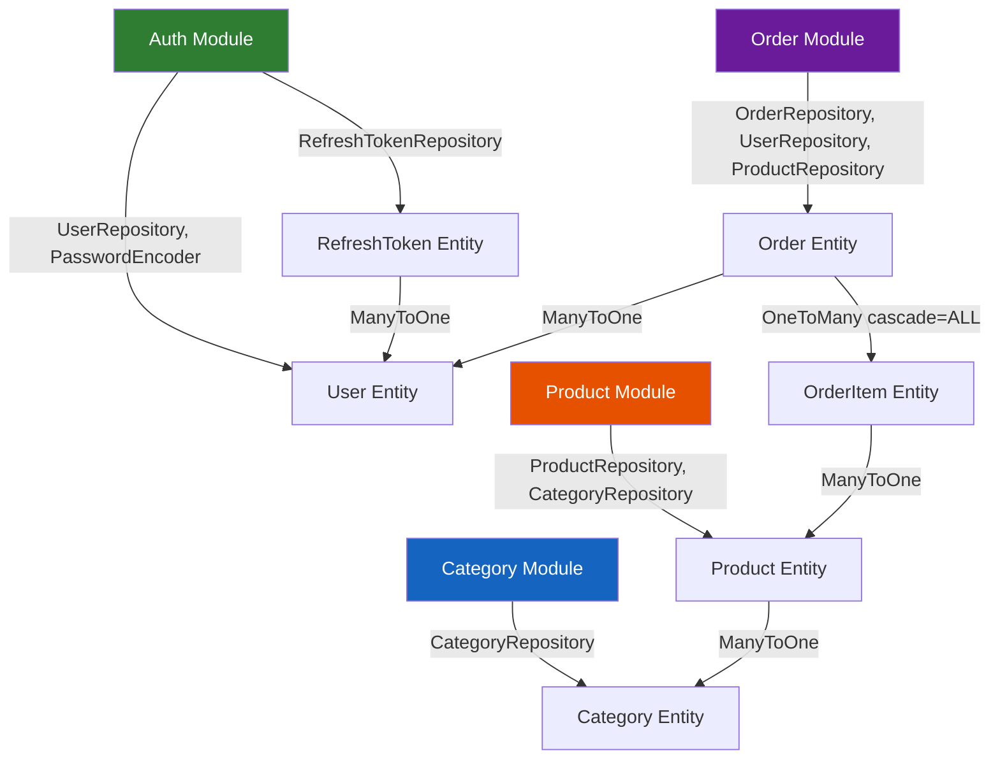

# 📖 PROJECT OVERVIEW V3 — Mini Ecommerce (Technical Deep-Dive & Gap Analysis)

> **Mục đích tài liệu:** Đây là bản phân tích KỸ THUẬT CHUYÊN SÂU nhất — không chỉ mô tả "project có gì" (V2 đã làm), mà đi sâu vào **mỗi module đã thực sự hoạt động đúng chưa**, **các module kết nối liền mạch ra sao**, **bug/gap nào đang tồn tại**, và **action plan tiếp theo cần làm gì theo thứ tự ưu tiên**.
>
> **Phương pháp:** Đối chiếu trực tiếp source code thực tế với 2 plan:
> - `auth_security_jwt_plan_v2.md` (Giai đoạn A→E)
> - `plan_hoan_thien_project_F_K.md` (Giai đoạn F→K)
>
> **Cập nhật lần cuối:** 2026-07-16

---

## 📋 MỤC LỤC

1. [Tổng quan trạng thái hoàn thiện](#1-tổng-quan-trạng-thái-hoàn-thiện)
2. [Module Auth/Security — Phân tích chi tiết](#2-module-authsecurity--phân-tích-chi-tiết)
3. [Module Category — Phân tích chi tiết](#3-module-category--phân-tích-chi-tiết)
4. [Module Product — Phân tích chi tiết](#4-module-product--phân-tích-chi-tiết)
5. [Module Order — Phân tích chi tiết](#5-module-order--phân-tích-chi-tiết)
6. [Module User — Phân tích chi tiết](#6-module-user--phân-tích-chi-tiết)
7. [Cross-Module Integration — Liền mạch hay đứt đoạn?](#7-cross-module-integration--liền-mạch-hay-đứt-đoạn)
8. [Bug & Technical Debt Registry](#8-bug--technical-debt-registry)
9. [Đối chiếu với Plan F→K — Tiến độ thực tế](#9-đối-chiếu-với-plan-fk--tiến-độ-thực-tế)
10. [Action Plan ưu tiên tiếp theo](#10-action-plan-ưu-tiên-tiếp-theo)

---

## 1. Tổng quan trạng thái hoàn thiện

### 1.1. Bảng đánh giá nhanh theo Module

| Module | Trạng thái | Độ hoàn thiện | Ghi chú chính |
|--------|-----------|--------------|---------------|
| 🔐 **Auth/Security** | ✅ Hoàn thành A→E | **90%** | Plan JWT v2 hoàn tất. Còn thiếu: secret key chưa env var, `ErrorResponse` dead code |
| 📂 **Category** | ✅ CRUD hoàn chỉnh | **85%** | Pagination ✅, Search ✅, Phân quyền ✅. Thiếu: `@SecurityRequirements({})` cho GET public |
| 📦 **Product** | ✅ CRUD + Analytics | **75%** | Pagination ✅, Analytics ✅, Phân quyền ✅. **BUG: update() bỏ sót field `price`** |
| 🛒 **Order** | ✅ CRUD + State Machine | **70%** | IDOR protection ✅. **BUG: không hoàn kho khi CANCELLED**, thiếu pagination |
| 👤 **User** | ❌ RỖNG | **0%** | Interface + class đều trống. Không có profile, đổi mật khẩu |
| 🏗️ **Infrastructure** | ⚠️ Một phần | **50%** | Flyway ✅, Swagger ✅, CORS ✅. Thiếu: Docker, env vars, `ddl-auto` vẫn `update` |
| 🧪 **Testing** | ❌ Chưa bắt đầu | **0%** | Không có test code |

### 1.2. Đối chiếu với Plan — Tổng quan

| Giai đoạn Plan | Mô tả | Trạng thái |
|----------------|-------|-----------|
| **A→E** (Auth JWT v2) | Spring Security + JWT + Refresh Token | ✅ **Hoàn thành 100%** |
| **F** (Technical Debt) | Dọn nợ kỹ thuật — 6 items | ⚠️ **Chưa bắt đầu** (0/6) |
| **G** (Feature) | Hoàn thiện feature — 4 items | ❌ **Chưa bắt đầu** (0/4) |
| **H** (Testing) | Unit & Integration Test | ❌ **Chưa bắt đầu** (0/6) |
| **I** (Docker) | Containerization | ❌ **Chưa bắt đầu** (0/4) |
| **J** (Presentation) | README, Postman, ERD | ❌ **Chưa bắt đầu** (0/4) |
| **K** (Interview Prep) | Song song xuyên suốt | ❌ **Chưa bắt đầu** |

---

## 2. Module Auth/Security — Phân tích chi tiết

### 2.1. Những gì ĐÃ LÀM ĐÚNG (đối chiếu Plan A→E)

#### ✅ A1→A4: Nền tảng lý thuyết → Áp dụng đúng

Code thực tế cho thấy bạn **hiểu rõ** Authentication vs Authorization:
- `SecurityConfig`: `SessionCreationPolicy.STATELESS` → đúng tinh thần JWT stateless (A4)
- CSRF disabled đúng lý do (A3/B3)
- `PasswordEncoder` khai báo 1 lần duy nhất thành Bean (B2 best practice)

#### ✅ B1→B4: UserDetails + Register hoàn chỉnh

**`UserPrincipal.java`** — Implementation chuẩn:
```
✅ getAuthorities() → "ROLE_" + role.name() → đúng convention cho hasRole()
✅ isEnabled() → map tới userEntity.isActive() → tài khoản bị khoá sẽ không login được
✅ getUserId(), getRole() → helper methods cho Controller dùng
✅ Tách riêng class bọc (không để UserEntity implements UserDetails) → clean separation
```

**`AuthServiceImpl.register()`** — Logic chặt chẽ:
```
✅ Trim + lowercase email trước khi xử lý
✅ Check trùng email VÀ phone riêng biệt → DuplicateResourceException rõ ràng
✅ BCrypt hash password → lưu hash, KHÔNG lưu raw
✅ Response DTO không chứa password (UserResponseDto không có field password)
✅ Default role=USER, isActive=true
```

#### ✅ C1→C5: JWT hoàn chỉnh

**`JwtProvider.java`** — Đủ 3 chức năng cốt lõi:
```
✅ generateToken() → claims chứa userId, role, subject=email, iat, exp
✅ validateToken() → bắt đầy đủ 5 loại exception (Signature, Malformed, Expired, Unsupported, IllegalArgument)
✅ getEmailFromToken(), getUserIdFromToken(), getRoleFromToken() → đọc ngược claims
✅ Secret key đọc từ application.yaml (chưa env var nhưng logic đúng)
✅ Expiration đọc từ config, không hardcode
```

**`JwtAuthenticationFilter.java`** — Filter chuẩn:
```
✅ extends OncePerRequestFilter → mỗi request chỉ chạy 1 lần
✅ Đọc "Authorization" header → tách "Bearer " → validate → set SecurityContext
✅ LUÔN gọi filterChain.doFilter() ở cuối → không bao giờ "treo" request
✅ Không có token / token sai → để trống SecurityContext, cho filter chain xử lý tiếp
```

#### ✅ D1→D7: Áp dụng vào project + phân quyền

**`SecurityConfig.filterChain()`**:
```
✅ PUBLIC_URLS: auth endpoints (register, login, refresh, logout)
✅ PUBLIC_GET_URLS: products, categories (khách vãng lai xem được)
✅ SWAGGER_URLS: swagger-ui, api-docs
✅ anyRequest().authenticated() → mặc định cần login
✅ addFilterBefore(jwtFilter, UsernamePasswordAuthenticationFilter.class) → đúng vị trí
✅ exceptionHandling → entryPoint (401) + accessDeniedHandler (403)
✅ CORS cấu hình tập trung, không rải @CrossOrigin
```

**Phân quyền thực tế trên Controller (đối chiếu Plan D3):**

| API | Plan D3 yêu cầu | Code thực tế | ✅/❌ |
|-----|-----------------|-------------|------|
| `POST /products` | ADMIN | `@PreAuthorize("hasRole('ADMIN')")` | ✅ |
| `PATCH /products/{id}` | ADMIN | `@PreAuthorize("hasRole('ADMIN')")` | ✅ |
| `DELETE /products/{id}` | ADMIN | `@PreAuthorize("hasRole('ADMIN')")` | ✅ |
| `PATCH /products/increase, decrease` | ADMIN | `@PreAuthorize("hasRole('ADMIN')")` | ✅ |
| `GET /products`, `GET /products/{id}` | Public | `@SecurityRequirements({})` + `permitAll` | ✅ |
| `GET /products/top-buy, revenue-*` | ADMIN | `@PreAuthorize("hasRole('ADMIN')")` | ✅ |
| `POST /categories`, `PUT`, `DELETE` | ADMIN | `@PreAuthorize("hasRole('ADMIN')")` | ✅ |
| `GET /categories` | Public | Không có `@PreAuthorize` + `permitAll` config | ✅ |
| `POST /orders` | Authenticated | `@AuthenticationPrincipal` (implicit auth) | ✅ |
| `GET /orders/user/{userId}` | USER xem của mình / ADMIN xem tất cả | Logic trong Service | ✅ |
| `PATCH /orders/{id}/status` | ADMIN | `@PreAuthorize("hasRole('ADMIN')")` | ✅ |

**IDOR Protection (D4)** — Áp dụng ĐÚNG:
```
✅ POST /orders: userId lấy từ @AuthenticationPrincipal, KHÔNG từ request body
✅ GET /orders/user/{userId}: so sánh userIdPath vs userIdInToken, ADMIN bypass
✅ GET /orders/{id}: kiểm tra order.user.id == userIdInToken nếu role=USER
```

**Exception Handling Auth (D5)** — Đồng nhất format:
```
✅ JwtAuthenticationEntryPoint → JSON 401 dùng ApiResponse.error() + ObjectMapper
✅ JwtAccessDeniedHandler → JSON 403 dùng ApiResponse.error() + ObjectMapper
✅ Format đồng nhất với GlobalExceptionHandler (cùng dùng ApiResponse)
```

#### ✅ E1→E7: Refresh Token hoàn chỉnh

**Luồng đầy đủ đã implement:**
```
Login → sinh accessToken (JWT) + refreshToken (SecureRandom 64 bytes, Base64)
     → SHA-256 hash refreshToken → lưu RefreshTokenEntity vào DB
     → Trả cả 2 token cho client (refreshToken = bản RAW)

Refresh → nhận raw refreshToken → SHA-256 hash → tìm trong DB
       → check revoked + expiry → sinh accessToken MỚI → trả về

Logout → nhận raw refreshToken → hash → tìm → set revoked=true → save
       → Idempotent (không throw nếu không tìm thấy)

Login cũng clean expired/revoked tokens: deleteExpiredOrRevokedByUserId()
```

**Quyết định kỹ thuật đáng chú ý:**
- **SHA-256 (không phải BCrypt)** cho refresh token hash → đúng vì refresh token có entropy cao (64 bytes random), không cần salt/work factor như password
- **getReferenceById()** thay vì `findById()` khi lấy user cho refresh token → tối ưu 1 query (proxy thay vì SELECT thật)
- **SecureRandom 64 bytes** → đủ entropy, khó brute-force

### 2.2. Những gì CÒN THIẾU / CẦN SỬA

| # | Vấn đề | Mức độ | Plan tương ứng |
|---|--------|--------|----------------|
| 1 | **Secret key hardcode** trong `application.yaml` (`p7u+RsHIDcCzWpazxlEjiTF3NTaF65vI2LdWGcYN148=`) | 🔴 Nghiêm trọng | **F4** |
| 2 | **DB credentials hardcode** (`username: postgres`, `password: 123456`) | 🔴 Nghiêm trọng | **F4** |
| 3 | **Mail credentials hardcode** (`phathn2688@gmail.com`, app password lộ) | 🔴 Nghiêm trọng | **F4** |
| 4 | `ExpiredJwtException.java` — class rỗng, shadow `io.jsonwebtoken.ExpiredJwtException`, **KHÔNG được dùng** | 🟡 Dead code | **F6** |
| 5 | `ErrorResponse.java` record — **KHÔNG được dùng** (mọi nơi dùng `ApiResponse`) | 🟡 Dead code | **F6** |
| 6 | CORS `allowedOrigins` hardcode `localhost:8085` — OK cho dev, cần env var cho prod | 🟡 Minor | **F4/I3** |

---

## 3. Module Category — Phân tích chi tiết

### 3.1. Kiến trúc liên kết

```
CategoryController → CategoryService → CategoryServiceImpl → CategoryRepository → CategoryEntity
                                                                                      │
                                                                                      │ 1:N (OneToMany)
                                                                                      ▼
                                                                                ProductEntity
```

### 3.2. Những gì ĐÃ HOẠT ĐỘNG ĐÚNG

**CRUD hoàn chỉnh:**
```
✅ CREATE: Check tên trùng (existsByNameIgnoreCase) → DuplicateResourceException → save
✅ READ (list): Pagination + search (findByNameContainingIgnoreCase) → Page<CategoryResponseDto>
✅ READ (single): findById → orElseThrow → ResourceNotFoundException
✅ UPDATE: findById → setName → save
✅ DELETE: findById → check products.isEmpty() → nếu có SP: CategoryHasProductsException → nếu rỗng: hard delete
```

**Phân quyền đúng:**
```
✅ POST, PUT, DELETE → @PreAuthorize("hasRole('ADMIN')")
✅ GET (list + single) → Public (không có @PreAuthorize + trong PUBLIC_GET_URLS)
```

**Patterns tốt:**
```
✅ @Transactional trên tất cả method
✅ @Transactional(readOnly = true) cho read methods → tối ưu Hibernate flush mode
✅ DTO mapping tách riêng (toCategoryResponseDto)
✅ Validation ở DTO level (@NotNull @NotBlank)
```

### 3.3. Vấn đề cần lưu ý

| # | Vấn đề | Mức độ |
|---|--------|--------|
| 1 | `create()` throw `ResourceNotFoundException` khi tên trùng → **sai semantic** (nên là `DuplicateResourceException`) | 🟡 Logic |
| 2 | `update()` **không check tên trùng** — có thể đổi tên category thành tên đã tồn tại | 🟡 Logic |
| 3 | `GET /categories` thiếu `@SecurityRequirements({})` trên Swagger → Swagger UI vẫn hiện ổ khoá, gây nhầm lẫn (tuy thực tế vẫn public) | 🟢 UX |
| 4 | `deleteById()` dùng **hard delete** — xem xét có nên soft delete như Product không | 🟢 Design choice |

---

## 4. Module Product — Phân tích chi tiết

### 4.1. Kiến trúc liên kết

```
ProductController → ProductService → ProductServiceImpl → ProductRepository → ProductEntity
       │                                                       │                    │
       │                                                       │ Projection:        │ ManyToOne → CategoryEntity
       │                                                       │ TopProductView     │ OneToMany → OrderItemEntity
       │                                                       │ CategoryRevenueView│
       │                                                       │ MonthlyRevenueView │
       ▼                                                       │
  Analytics APIs (admin only)                                  │
  • /top-buy                                                    │
  • /revenue-by-category                                        │
  • /revenue-in-month                                           │
```

### 4.2. Những gì ĐÃ HOẠT ĐỘNG ĐÚNG

**CRUD:**
```
✅ CREATE: Tìm category → set tất cả fields → save
✅ READ (search + pagination): findByNameContainsIgnoreCase → Page<ProductResponseDto>
✅ READ (single): findById → map → orElseThrow
✅ UPDATE: Partial update (PATCH semantic) — chỉ set field != null
✅ SOFT DELETE: set isActive=false → check đã inactive thì throw exception
```

**Stock Management:**
```
✅ decreaseStock: validate quantity > 0 + stock >= quantity → trừ stock
✅ increaseStock: validate quantity > 0 → cộng stock
```

**Analytics (Projection Queries):**
```
✅ TopProductView: LEFT JOIN orderItems, GROUP BY, ORDER BY SUM(quantity) DESC
✅ CategoryRevenueView: Multi-table JOIN, SUM(unitPrice * quantity)
✅ MonthlyRevenueView: DATE_TRUNC('month'), SUM revenue
```

**Swagger UX:**
```
✅ @Operation annotations cho mỗi endpoint
✅ @SecurityRequirements({}) cho GET /products (public) → Swagger UI không hiện ổ khoá
```

### 4.3. BUG VÀ VẤN ĐỀ

| # | Vấn đề | Mức độ | Plan tương ứng |
|---|--------|--------|----------------|
| 1 | 🔴 **BUG: `update()` BỎ SÓT field `price`** — DTO có field `price` nhưng service KHÔNG đọc/set → API update sản phẩm âm thầm bỏ qua giá | 🔴 Nghiêm trọng | **F1** |
| 2 | `decreaseStock()` thiếu `@Override` annotation (method có trong interface nhưng impl quên annotate) | 🟡 Convention |
| 3 | `decreaseStock()` message lỗi sai: `"Quantity must less than 0"` → nên là `"Not enough stock"` | 🟡 UX |
| 4 | `ProductResponseDto` **không có field `description`** → response luôn thiếu mô tả sản phẩm | 🟡 Missing data |
| 5 | `ProductResponseDto` **không có field `isActive`** → không biết sản phẩm đang active hay đã soft delete | 🟡 Missing data |
| 6 | `getProductsWithSearch()` trả về cả sản phẩm `isActive=false` → client thấy sản phẩm đã "xoá" | 🟡 Logic |
| 7 | `SecurityContextHolder` import không sử dụng trong `ProductServiceImpl` | 🟢 Cleanup |

---

## 5. Module Order — Phân tích chi tiết

### 5.1. Kiến trúc liên kết

```
OrderController → OrderService → OrderServiceImpl → OrderRepository → OrderEntity
       │                              │                                    │
       │ @AuthenticationPrincipal     │ UserRepository                     │ ManyToOne → UserEntity
       │ (lấy userId từ JWT)          │ ProductRepository                  │ OneToMany(cascade=ALL) → OrderItemEntity
       ▼                              ▼                                    │                             │
  IDOR Protection              State Machine                              │                ManyToOne → ProductEntity
  (so sánh userIdPath          ALLOWED_ORDERS Map                         │
   vs userIdInToken)                                                       │
```

### 5.2. Những gì ĐÃ HOẠT ĐỘNG ĐÚNG

**State Machine — Logic chặt chẽ:**
```
PENDING ──→ CONFIRMED ──→ SHIPPED ──→ DONE
   │             │
   └──→ CANCELLED └──→ CANCELLED

✅ Implement bằng Map<OrderStatus, Set<OrderStatus>> → clean, dễ mở rộng
✅ Terminal states (DONE, CANCELLED) không có entry → tự động throw exception
✅ InvalidStatusTransitionException khi transition không hợp lệ
```

**Create Order — Logic tạo đơn hàng:**
```
✅ Tìm User từ DB
✅ Tạo Order rỗng (PENDING, totalAmount=0)
✅ Lặp items: tìm Product → check stock ≥ quantity → TRỪ STOCK → tạo OrderItem
✅ unitPrice = product.getPrice() → snapshot giá tại thời điểm đặt hàng
✅ Tính totalAmount = Σ(unitPrice × quantity)
✅ CascadeType.ALL → save order tự cascade save items
✅ @Transactional → toàn bộ rollback nếu 1 item lỗi giữa chừng
```

**IDOR Protection — Triển khai đúng:**
```
✅ findByUserIdWithDetails: role=USER → userIdPath phải == userIdInToken, ADMIN bypass
✅ findById: role=USER → order.user.id phải == userIdInToken
✅ create: userId lấy từ @AuthenticationPrincipal, KHÔNG từ request body
✅ changeStatus: @PreAuthorize("hasRole('ADMIN')") — chỉ admin đổi trạng thái
```

### 5.3. BUG VÀ VẤN ĐỀ

| # | Vấn đề | Mức độ | Plan tương ứng |
|---|--------|--------|----------------|
| 1 | 🔴 **BUG: Không hoàn kho khi CANCELLED** — stock đã trừ lúc tạo order nhưng KHÔNG cộng lại khi order bị huỷ → hàng "biến mất" khỏi kho | 🔴 Nghiêm trọng | **F5** |
| 2 | 🔴 **`OrderRepository.findByUserIdAndUserId(Long, Long)`** — tên method lặp `UserId` 2 lần, Spring Data parse ra query sai ngữ nghĩa. **Method KHÔNG ĐƯỢC SỬ DỤNG** trong code nhưng vẫn tồn tại → dead code + gây hiểu lầm | 🟡 Dead code | **F2** |
| 3 | `findAllByUserId()` trả `Optional<OrderEntity>` → **sai kiểu trả về** — method `findAllBy...` nên trả `List<>`, không phải `Optional<>` (Spring Data sẽ chỉ trả 1 kết quả, gây mất data) | 🔴 Bug tiềm ẩn | **F2** |
| 4 | `findByUserIdWithDetails()` trả `List<OrderResponseDto>` → **thiếu pagination** — nếu user có nhiều order, response sẽ rất lớn | 🟡 Performance | **G3** |
| 5 | `OrderResponseDto` **thiếu field `note`** → response không có ghi chú đơn hàng | 🟡 Missing data |
| 6 | `OrderResponseDto` **thiếu field `userId` / `userName`** → client không biết đơn hàng của ai (ADMIN xem) | 🟡 Missing data |
| 7 | Comment code block trong `findById()` (line 107-110) → nên xoá clean | 🟢 Cleanup |

---

## 6. Module User — Phân tích chi tiết

### 6.1. Trạng thái hiện tại

```java
// UserService.java
public interface UserService {
    // RỖNG — không có method nào
}

// UserServiceImpl.java
public class UserServiceImpl {
    // RỖNG — không implements UserService, không có annotation @Service
}
```

**UserController: RỖNG** — không có endpoint nào.

### 6.2. Impact Analysis

Việc User module trống gây ra các hệ quả:

| Thiếu gì | Ảnh hưởng | Mức độ |
|----------|----------|--------|
| `GET /users/me` | User không xem được profile của mình | 🔴 Feature gap lớn |
| `PATCH /users/me` | User không sửa được tên/SĐT | 🔴 Feature gap lớn |
| `PATCH /users/me/password` | User không đổi được mật khẩu | 🔴 Feature gap lớn + Security |
| `GET /users` (ADMIN) | Admin không quản lý được danh sách user | 🟡 Admin feature |
| `PATCH /users/{id}/status` (ADMIN) | Admin không khoá/mở tài khoản user | 🟡 Admin feature |

> **Lưu ý:** `UserPrincipal.isEnabled()` đã map tới `isActive` → nếu ADMIN khoá user (set `isActive=false`), user đó **sẽ không login được** nhờ Spring Security tự check `UserDetails.isEnabled()`. Phần foundation đã sẵn sàng, chỉ cần API endpoint.

---

## 7. Cross-Module Integration — Liền mạch hay đứt đoạn?

### 7.1. Ma trận liên kết giữa các Module



### 7.2. Đánh giá sự liền mạch

#### ✅ Auth → Order (LIỀN MẠCH)

```
Login → JWT (chứa userId, role)
  → OrderController nhận @AuthenticationPrincipal UserPrincipal
  → Lấy userId từ token → truyền vào OrderService
  → OrderService dùng userId để tạo order / check IDOR

ĐÁNH GIÁ: Tuyệt vời. userId không bao giờ từ client request body.
           IDOR protection chặt chẽ. @Transactional đúng chỗ.
```

#### ✅ Auth → Product/Category (LIỀN MẠCH)

```
JWT + @PreAuthorize("hasRole('ADMIN')") → chặn đúng CRUD admin
GET endpoints → permitAll() config → khách vãng lai xem được

ĐÁNH GIÁ: Phân quyền rõ ràng, đồng nhất giữa SecurityConfig + Controller annotations.
```

#### ✅ Product → Category (LIỀN MẠCH)

```
Product.create() → tìm CategoryEntity qua categoryId → set relationship
Product.update() → partial update, chỉ đổi category khi categoryId != null
Category.delete() → check products.isEmpty() → ngăn xoá category có SP

ĐÁNH GIÁ: Quan hệ bi-directional (Category.products ↔ Product.category) hoạt động đúng.
           Business rule "không xoá category có product" được bảo vệ.
```

#### ✅ Order → Product (LIỀN MẠCH một phần)

```
Order.create():
  → Tìm Product → check stock → TRỪ STOCK → snapshot unitPrice → tạo OrderItem

ĐÁNH GIÁ: Luồng tạo đơn hoạt động đúng.
  ⚠️ NHƯNG: luồng HUỶ ĐƠN (changeStatus → CANCELLED) KHÔNG hoàn kho
     → đây là ĐIỂM ĐỨT ĐOẠN duy nhất giữa Order ↔ Product
```

#### ❌ Auth ↔ User Module (ĐỨT ĐOẠN)

```
Auth module xử lý: register, login, refresh, logout
User module: RỖNG
→ Không có cầu nối giữa "đã đăng nhập" và "quản lý profile"
→ User đã login nhưng không làm gì được với tài khoản của mình

ĐÁNH GIÁ: Đây là gap lớn nhất. User module cần G1+G2 từ plan.
```

### 7.3. Luồng dữ liệu xuyên module — Đánh giá chi tiết

#### Luồng 1: Register → Login → Tạo Order → Xem Order

```
[1] POST /auth/register
    ✅ Email/phone check → BCrypt hash → save UserEntity(role=USER, active=true)
    ✅ Return UserResponseDto (không có password)

[2] POST /auth/login
    ✅ AuthenticationManager.authenticate() → CustomUserDetailsService → PasswordEncoder
    ✅ Sinh accessToken (JWT 1h) + refreshToken (SecureRandom → SHA-256 → DB)
    ✅ Clean expired/revoked tokens trước khi tạo mới

[3] POST /orders (Bearer <accessToken>)
    ✅ JwtFilter → validate → set SecurityContext
    ✅ @AuthenticationPrincipal → userId từ JWT (KHÔNG từ body)
    ✅ Tìm User → Tạo Order(PENDING) → Loop items → Check stock → Trừ stock → Save
    ✅ CascadeType.ALL → OrderItems tự save

[4] GET /orders/user/{userId} (Bearer <accessToken>)
    ✅ So sánh userIdPath vs userIdInToken → IDOR protection
    ✅ JOIN FETCH user + LEFT JOIN FETCH items → tránh N+1
    ✅ Map → OrderResponseDto

ĐÁNH GIÁ: Luồng chính hoạt động liền mạch từ đầu tới cuối.
```

#### Luồng 2: Access Token hết hạn → Refresh → Tiếp tục

```
[1] Gọi API bất kỳ với token hết hạn
    ✅ JwtFilter → validateToken() return false → SecurityContext rỗng
    ✅ Authorization check → chặn → JwtAuthenticationEntryPoint → 401 JSON

[2] POST /auth/refresh-token {refreshToken: "raw_token"}
    ✅ SHA-256 hash → tìm trong DB → check revoked + expiry
    ✅ Sinh accessToken MỚI → trả về

[3] Retry API với accessToken mới
    ✅ Hoạt động bình thường

ĐÁNH GIÁ: Luồng refresh hoạt động hoàn chỉnh.
```

#### Luồng 3: Admin đổi trạng thái Order → ⚠️ ĐỨT khi CANCELLED

```
[1] PATCH /orders/{id}/status {orderStatus: "CONFIRMED"}
    ✅ @PreAuthorize("hasRole('ADMIN')") → chỉ admin
    ✅ State machine check → PENDING → CONFIRMED hợp lệ

[2] PATCH /orders/{id}/status {orderStatus: "CANCELLED"}
    ⚠️ State machine check → PENDING → CANCELLED hợp lệ
    ❌ NHƯNG: stock KHÔNG được hoàn lại
    → Product stock bị trừ vĩnh viễn dù đơn đã huỷ
    → ĐÂY LÀ BUG NGHIỆP VỤ NGHIÊM TRỌNG NHẤT

ĐÁNH GIÁ: Cần fix ngay ở F5.
```

---

## 8. Bug & Technical Debt Registry

### 8.1. BUG — Cần fix trước khi viết Test

| ID | Severity | Module | Mô tả | File | Line | Plan |
|----|----------|--------|-------|------|------|------|
| **BUG-001** | 🔴 Critical | Product | `update()` bỏ sót field `price` — API update sản phẩm âm thầm bỏ qua giá | `ProductServiceImpl.java` | L79-99 | F1 |
| **BUG-002** | 🔴 Critical | Order | Không hoàn kho khi order bị CANCELLED — hàng "biến mất" khỏi kho | `OrderServiceImpl.java` | L162-173 | F5 |
| **BUG-003** | 🔴 Critical | Order | `findAllByUserId()` trả `Optional<OrderEntity>` thay vì `List<>` — mất data | `OrderRepository.java` | L17 | F2 |
| **BUG-004** | 🟡 Medium | Product | `decreaseStock()` message lỗi sai: `"Quantity must less than 0"` | `ProductServiceImpl.java` | L109 | F1 |
| **BUG-005** | 🟡 Medium | Category | `create()` throw `ResourceNotFoundException` thay vì `DuplicateResourceException` khi tên trùng | `CategoryServiceImpl.java` | L39 | - |

### 8.2. Technical Debt — Fix sau bug

| ID | Severity | Module | Mô tả | Plan |
|----|----------|--------|-------|------|
| **TD-001** | 🔴 Security | Config | JWT secret key, DB password, mail credentials **HARDCODE** trong `application.yaml` | F4 |
| **TD-002** | 🟡 Architecture | Config | `ddl-auto: update` xung đột triết lý với Flyway → cần đổi thành `validate` | F3 |
| **TD-003** | 🟡 Dead code | Exception | `ErrorResponse.java` record không được sử dụng → xoá hoặc sử dụng | F6 |
| **TD-004** | 🟡 Dead code | Exception | `ExpiredJwtException.java` class rỗng, shadow thư viện JJWT → xoá | F6 |
| **TD-005** | 🟡 Dead code | Repository | `findByUserIdAndUserId()` tên sai, không được sử dụng → xoá | F2 |
| **TD-006** | 🟡 Missing data | Product | `ProductResponseDto` thiếu `description`, `isActive` | - |
| **TD-007** | 🟡 Missing data | Order | `OrderResponseDto` thiếu `note`, `userId/userName` | - |
| **TD-008** | 🟡 Logic | Product | `getProductsWithSearch()` trả về cả sản phẩm `isActive=false` | - |
| **TD-009** | 🟢 Cleanup | Order | Comment code block (line 107-110) trong `OrderServiceImpl.findById()` | - |
| **TD-010** | 🟢 Convention | Product | `decreaseStock()` thiếu `@Override` | - |
| **TD-011** | 🟢 Cleanup | Product | Import `SecurityContextHolder` không sử dụng | - |

---

## 9. Đối chiếu với Plan F→K — Tiến độ thực tế

### 9.1. Giai đoạn F — Dọn nợ kỹ thuật

| Task | Mô tả | Trạng thái | Phân tích |
|------|-------|-----------|-----------|
| **F1** | Sửa lỗi update giá sản phẩm bị bỏ sót | ❌ Chưa fix | `ProductServiceImpl.update()` line 79-99: KHÔNG có `if(updateProductRequest.price() != null) product.setPrice(...)` |
| **F2** | Sửa tên method Repository sai ngữ nghĩa | ❌ Chưa fix | `OrderRepository.findByUserIdAndUserId()` vẫn tồn tại (L21). `findAllByUserId()` trả `Optional` thay vì `List` (L17) |
| **F3** | ddl-auto: update → validate | ❌ Chưa đổi | `application.yaml` L21: `ddl-auto: update` |
| **F4** | Secret key & config → env variables | ❌ Chưa làm | JWT secret (L55), DB password (L10), mail password (L40) đều hardcode |
| **F5** | Hoàn kho khi Order bị CANCELLED | ❌ Chưa làm | `changeStatus()` line 162-173: chỉ setStatus, KHÔNG loop items để cộng stock |
| **F6** | Thống nhất định dạng lỗi | ❌ Chưa quyết định | `ErrorResponse.java` tồn tại nhưng không sử dụng. Toàn bộ code dùng `ApiResponse` |

### 9.2. Giai đoạn G — Hoàn thiện Feature

| Task | Mô tả | Trạng thái | Phân tích |
|------|-------|-----------|-----------|
| **G1** | UserService/Controller — profile, đổi mật khẩu | ❌ Chưa bắt đầu | Interface + class đều rỗng |
| **G2** | Admin quản lý User — list, khoá/mở | ❌ Chưa bắt đầu | Chưa có endpoint |
| **G3** | Pagination cho Orders | ❌ Chưa làm | `findByUserIdWithDetails()` trả `List<>` không phải `Page<>` |
| **G4** | Search/Filter Product nâng cao (Optional) | ❌ Chưa làm | Chỉ có search by name |

### 9.3. Giai đoạn H→K

Tất cả **chưa bắt đầu**: Testing (H), Docker (I), Presentation (J), Interview Prep (K).

---

## 10. Action Plan ưu tiên tiếp theo

> **Nguyên tắc:** F (dọn nợ) → G (feature) → H (test) → I (docker) → J (trình bày)
> Đúng thứ tự plan đã đề ra. **KHÔNG nhảy cóc.**

### 🔴 Phase 1: Fix Bugs (F1, F2, F5) — Ưu tiên CAO NHẤT (~1-2 ngày)

**Vì sao quan trọng nhất:** Test viết trên code có bug chỉ "xác nhận cái sai".

```
[ ] F1. ProductServiceImpl.update() → thêm:
       if (updateProductRequest.price() != null) {
           product.setPrice(updateProductRequest.price());
       }
    + Sửa message lỗi decreaseStock: "Quantity must less than 0" → "Not enough stock"
    + Thêm @Override cho decreaseStock

[ ] F2. OrderRepository:
    - Xoá findByUserIdAndUserId() (dead code)
    - Đổi findAllByUserId() từ Optional<OrderEntity> → List<OrderEntity>
    - Kiểm tra lại tất cả caller

[ ] F5. OrderServiceImpl.changeStatus():
    Khi newStatus == CANCELLED:
       → Lặp qua order.getItems()
       → Với mỗi item: product.setStock(product.getStock() + item.getQuantity())
       → productRepository.save(product) hoặc dựa vào dirty checking
    @Transactional đã có → rollback tự động nếu lỗi giữa chừng
```

### 🟡 Phase 2: Technical Debt (F3, F4, F6) — (~1-2 ngày)

```
[ ] F4. Config → Environment Variables:
    application.yaml:
      app.jwt.secret-key: ${JWT_SECRET_KEY:default-dev-key}
      spring.datasource.password: ${DB_PASSWORD:123456}
      spring.mail.password: ${MAIL_PASSWORD:}
    + Tạo .env.example (template)
    + Thêm .env vào .gitignore

[ ] F3. ddl-auto → validate:
    application.yaml: ddl-auto: validate
    + Kiểm tra Entity vs Migration có khớp không
    + Nếu lệch → tạo V3__*.sql migration mới

[ ] F6. Thống nhất format lỗi:
    Quyết định: GIỮ ApiResponse<T> cho cả success + error → XOÁ ErrorResponse.java
    + Xoá ExpiredJwtException.java (dead code, shadow thư viện)
```

### 🟢 Phase 3: Feature Completion (G1→G3) — (~3-5 ngày)

```
[ ] G1. UserService/UserController:
    - GET /api/v1/users/me → lấy info từ @AuthenticationPrincipal
    - PATCH /api/v1/users/me → update fullName, phoneNumber
    - PATCH /api/v1/users/me/password → oldPassword + newPassword
      (step-up verification: phải verify old password trước)

[ ] G2. Admin quản lý User:
    - GET /api/v1/users (ADMIN, pagination)
    - PATCH /api/v1/users/{id}/status (ADMIN) → toggle isActive

[ ] G3. Pagination cho Orders:
    - GET /orders/user/{userId} → đổi từ List → Page
    - Thêm query params: page, size, sort
```

### Phase 4: Bổ sung DTO thiếu (kèm theo G)

```
[ ] ProductResponseDto: thêm description, isActive
[ ] OrderResponseDto: thêm note, userId (hoặc userName)
[ ] getProductsWithSearch(): chỉ trả sản phẩm isActive=true
[ ] CategoryServiceImpl.create(): đổi từ ResourceNotFoundException → DuplicateResourceException
[ ] CategoryServiceImpl.update(): thêm check tên trùng
```

### Phase 5→7: Testing (H), Docker (I), Presentation (J)

Theo đúng plan `plan_hoan_thien_project_F_K.md` — chỉ bắt đầu SAU KHI F+G hoàn thành.

---

## Appendix A: File Reference Quick Index

| Module | File | Vai trò | Dòng code |
|--------|------|---------|-----------|
| Auth | `AuthController.java` | 4 endpoints: register, login, refresh, logout | 70 |
| Auth | `AuthServiceImpl.java` | Business logic auth đầy đủ | 213 |
| Auth | `JwtProvider.java` | Generate, validate, extract JWT | 180 |
| Auth | `JwtAuthenticationFilter.java` | OncePerRequestFilter — đọc Bearer token | 81 |
| Auth | `JwtAuthenticationEntryPoint.java` | JSON 401 response | 87 |
| Auth | `JwtAccessDeniedHandler.java` | JSON 403 response | ~40 |
| Auth | `SecurityConfig.java` | FilterChain, CORS, BCrypt, AuthManager | 131 |
| Auth | `UserPrincipal.java` | UserDetails wrapper | 74 |
| Auth | `CustomUserDetailsService.java` | Load user from DB by email | ~30 |
| Auth | `RefreshTokenGenerator.java` | SecureRandom 64 bytes → Base64 | ~15 |
| Category | `CategoryController.java` | 5 endpoints | 93 |
| Category | `CategoryServiceImpl.java` | CRUD + check constraints | 82 |
| Product | `ProductController.java` | 10 endpoints (CRUD + stock + analytics) | 191 |
| Product | `ProductServiceImpl.java` | CRUD + stock + analytics | 157 |
| Product | `ProductRepository.java` | Derived + JPQL + 3 Projections | 79 |
| Order | `OrderController.java` | 4 endpoints | 83 |
| Order | `OrderServiceImpl.java` | CRUD + state machine + IDOR | 175 |
| User | `UserServiceImpl.java` | ⚠️ RỖNG | 5 |
| Common | `ApiResponse.java` | Generic response wrapper | 40 |
| Exception | `GlobalExceptionHandler.java` | 11 exception handlers | 104 |
| Config | `application.yaml` | All configuration | 81 |
| DB | `V1__init_mini_shop.sql` | 5 tables + seed data | - |
| DB | `V2__init_mini_shop.sql` | refresh_tokens table | - |

---

## Appendix B: Tổng dòng code theo Layer

| Layer | Tổng dòng | Ghi chú |
|-------|----------|---------|
| **Entity** | ~330 | 6 entities, clean với Lombok |
| **Repository** | ~170 | 5 repos, có JPQL + Projections |
| **DTO** | ~200 | 9 request (Records) + 7 response (Lombok) |
| **Service** | ~630 | 4 impl có logic + 1 rỗng |
| **Controller** | ~530 | 5 controllers (1 rỗng) + 1 ping |
| **Security** | ~530 | 7 files, JWT module hoàn chỉnh |
| **Config** | ~170 | SecurityConfig + OpenApiConfig |
| **Exception** | ~130 | Handler + 7 custom exceptions |
| **Common** | ~40 | ApiResponse |
| **TỔNG** | **~2,730** | Không tính docs, config YAML, migration SQL |
